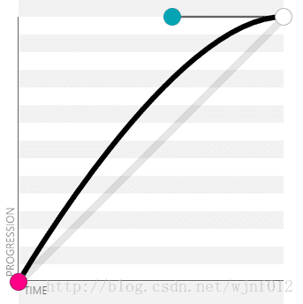

# 是最新的 CSS 标准

>其实CS3在平时我们就会经常用到，但是很多时候经常搞不懂到底那些是CS3傻傻的分不清楚，下面咱们就好好掰扯掰扯。

### 新增属性

>这些属性和用法都太过简单的，就不废话了，有些不常见的，具体说一下。

#### 边框

- `border-radius` : 边框圆角。

- `box-shadow` : 阴影

- `border-image` : 边框图片

> Internet Explorer 9+ 支持 `border-radius` 和 `box-shadow` 属性。Firefox、Chrome 以及 Safari 支持所有新的边框属性。
> 注释：对于 `border-image`，Safari 5 以及更老的版本需要前缀 `-webkit-`。Opera 支持 `border-radius` 和 `box-shadow` 属性，但是对于 `border-image` 需要前缀 `-o-`。

#### 文本字体

- `text-shadow` : 文字阴影

- `word-wrap` ： 自动换行，这个属性的常用情景在[CSS基础](基础.md)有详细介绍。

- `@font-face` : 自定义字体引入

```
/*用法：事先准备好字体文件，`.ttf`、`.eot`等。*/

@font-face{
    font-family: myFont; /*字体名字，可自定义，汉字需要家引号*/
    src:url('Sansation_Light.ttf'),
        url('Sansation_Light.eot'); /* IE9+ */
}
div{
    font-family:myFont; /*汉字需要家引号*/
}
```
> CS3的这些属性还有很多延申用法，可能平时并不常见，但思维不要紧限于此。

### transform

> 无论是2D还是3D我们都需利用`transform`属性来完成转换。Internet Explorer 10、Firefox 以及 Opera 支持`transform` 属性；Chrome 和 Safari 需要前缀 `-webkit-`，Internet Explorer 9 需要前缀 `-ms-` 。

向元素应用 2D 或 3D 转换。该属性允许我们对元素进行**旋转**、**缩放**、**移动**或**倾斜**。

```
/* 基本用法举例*/
{
    transform: rotate(30deg);
    -ms-transform: rotate(30deg);		/* IE 9 */
    -webkit-transform: rotate(30deg);	/* Safari and Chrome */
    -o-transform: rotate(30deg);		/* Opera */
    -moz-transform: rotate(30deg);		/* Firefox */
}
```
JavaScript 语法

```
object.style.transform="rotate(30deg)"
```
### 2D or 3D

> Opera 不支持 3D 转换

#### translate() 

> 移动

- translate(x,y) : 只有一个值的时候表示X轴方向，但不建议这样写。

- translate3d(x,y,z)

- translateX(x)

- translateY(y)	

- translateZ(z)

#### rotate()

> 旋转,允许负值，元素将逆时针旋转。
PS: `angle` 表示旋转角度，如：30deg ,即 30° 。

- rotate(angle)	

> 2D旋转，以**左上角**为坐标原点

下边这些则是3D转换，默认情况下以元素中心为坐标原点。

- rotateX(angle)	


- rotateY(angle)


- rotateZ(angle)


- rotate3d(x,y,z,angle)	

> x、y、z的值取 0 或 1，0表示不旋转，1表示旋转；也就是说，rotateX(angle)相当于rotate3d(1,0,0,angle)。

#### scale()

> 缩放，根据给定的宽度（X 轴）和高度（Y 轴）参数，元素的尺寸会增加或减少，值等于 1 的时候，不进行缩放转换。
PS: 1. 进行所方变换时子元素也进行相应变换；
    2. 进行缩放的元素中心点不变。

- scale(x,y)

- scale3d(x,y,z)

- scaleX(x)	

- scaleY(y)	

- scaleZ(z)

#### skew() 

> 翻转，根据给定的水平线（X 轴）和垂直线（Y 轴）参数，翻转给定的角度。

- skew(x-angle,y-angle)	

- skewX(angle)	

- skewY(angle)

#### matrix() 和 matrix3d()

> 组合方法

### 过渡 transition

> Internet Explorer 9 以及更早的版本，不支持 transition 属性;
JavaScript 语法：object.style.transition="width 2s"

- `transition` : (简写属性)

    1. `transition-property` : 属性名（width、height……）,多个属性时用‘,’隔开【必要值】。除了属性名外，它的值也可以是`all`表示所有属性；`none`表示没有属性获得过渡效果。

    2. `transition-duration` : 过度需要完成的时间,单位是秒【必要值】。

    3. `transition-timing-function` : 速度曲线

        - `linear`：匀速（cubic-bezier(0,0,1,1)）

        

        - `ease`：先慢后快（cubic-bezier(0.25,0.1,0.25,1)）

        

        - `ease-in`：慢速开始（cubic-bezier(0.42,0,1,1)）

        

        - `ease-out`：慢速结束（cubic-bezier(0,0,0.58,1)）

        

        - `ease-in-out`：以慢速开始，以慢速结束（cubic-bezier(0.42,0,0.58,1)）

        

        - `cubic-bezier(<x1>,<y1>,<x2>,<y2>)`：贝塞尔曲线，自定义生成速度(动画)曲线。

            

            可以看到上图中存在4个点，分别是P0、P1、P2、P3，其中，P0和P3是不动的，而我们也只需要控制两个点，即P1(x1,y1)，P2(x2,y2)，对应`cubic-bezier`的四个值。

            > X轴的范围是0~1，超出则失效，Y轴的取值没有规定，但是也不宜过大。


    4. `transition-delay`：开始之前需要等待的时间，以秒或毫秒计

```
div{
    width:100px;
    height:100px;
    transition:width 2s, height 2s;
    -moz-transition:width 2s, height 2s, -moz-transform 2s; /* Firefox 4 */
    -webkit-transition:width 2s, height 2s, -webkit-transform 2s; /* Safari and Chrome */
    -o-transition:width 2s, height 2s, -o-transform 2s; /* Opera */
}
div:hove{
    width:200px;
    height:200px;
    transform:rotate(180deg);
    -moz-transform:rotate(180deg); /* Firefox 4 */
    -webkit-transform:rotate(180deg); /* Safari and Chrome */
    -o-transform:rotate(180deg); /* Opera */
}
```
> `transform`【定义变换】、`translate`【平移】、`transition`【过渡效果】


#### [CSS基础](基础.md)

#### [面试](面试.md)