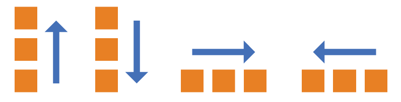

# Cascading Style Sheet （层叠样式表）基础

### CSS选择器

#### 常用选择器

```
div     //标签选择器
.       //类选择器
#       //id选择器
div a     //后代选择器，div标签下所有a标签（也可跟其它选择器）
div > a     //子代选择器，div标签下一级a标签
div + p     //相邻选择器，div临近的一级p标签
element1 ~ element2    // element1之后出现的所有element2，两种元素必须拥有相同的父元素，但不必直接紧随
```
#### 伪类和伪元素

> 伪类：一种状态；伪元素：真实（但是是被虚拟出来的）存在的元素

##### 伪类

>通过选择器，格式化DOM树以外的信息以及不能被常规CSS选择器获取到的信息,伪类弥补了CSS选择器的不足。

```
:visited                //已被访问的链接
:link                   //未被访问的链接
:hover                  //鼠标指针位于其上的链接或元素
:active                 //活动链接
:focus                  //拥有键盘输入焦点的元素
:first-child            //父元素的第一个子元素
:first-of-type          //父元素下相同类型子元素中的第一个
:last-child             //父元素的最后一个子元素
:last-of-type           //父元素下相同类型子元素中的最后一个
:nth-of-type(n)         //父元素下相同类型子元素中的第N个
:nth-last-of-type(n)    //同上，从最后一个子元素开始计数
:only-child             //父元素内唯一子元素，文本不是元素（Internet Explorer 不支持）
:nth-child(n)           //父元素的第N个子元素（n还可以是表达式）
:nth-last-child(n)      //同上，从最后一个子元素开始计数
:lang                   //带有指定lang属性的元素
:checked                //选中的 input 元素（只用于单选按钮和复选框）
:disabled               //禁用的元素（大多用在表单元素上）
:enabled                //已启用的元素（大多用在表单元素上）
:empty                  //没有子元素（包括文本节点）的每个元素。
:root                   //文档根元素（在 HTML 中，根元素始终是 html 元素。）
:not(selector)          //非指定元素/选择器的每个元素
:target                 //可用于选取当前活动的目标元素
PS：URL 带有后面跟有锚名称 #，指向文档内某个具体的元素。这个被链接的元素就是目标元素(target element)。
```
#### 伪元素

>伪元素本质上是创建了一个虚拟容器(元素)，可以在其中添加内容或样式。

```
::first-letter       //文本首字母，且只能用于块级元素
::first-line         //文本首行
::before            //在元素之前添加，如：{content:url(logo.png);}
::after             //在元素之后添加（双:是css3写法，单:是css2写法(兼容性更好些)，H5中建议用::）
::selection         //被用户选取的选取的部分（该选择器只能有少量 CSS 属性：color、background、cursor 以及 outline）
```
#### 属性选择器

```
[attribute]         //带有指定属性的元素。
[attribute = "value"]           //带有指定等值属性的元素
[attribute ~= "value"]          //属性值中包含指定词汇的元素
[attribute |= "value"]          //带有以指定值开头的属性值的元素，该值必须是整个单词
[attribute ^= "value"]          //属性值以指定值开头的每个元素
[attribute $= "value"]          //属性值以指定值结尾的每个元素
[attribute *= "value"]          //属性值中包含指定值的每个元素
[attribute ^= "value"]          //属性值以指定值开头的每个元素
[attribute $= "value"]          //属性值以指定值结尾的每个元素
```
#### 顺序总结

>同一级别中后写的会覆盖先写的样式

##### 优先级

!important > 行内样式 > ID选择器 > 类选择器 > 标签 > 通配符 > 继承 > 浏览器默认属性

##### 权重

- 内联样式表的权值为 1000

- ID 选择器的权值为 100

- Class 类选择器的权值为 10

- HTML 标签选择器的权值为 1

##### iconfont 原理

- 利用编码将图标编为一个字符

- 引入字体

- 利用 `before`（伪元素）向页面中插入一个文字

### 盒子模型

> 盒子模型是一种思维模型，可以理解为一个盒子，封装周围的 HTML 元素，包括：**外边距（margin）**、**内边距（padding）**、**边框（border）**、**内容（content）** 四个属性

#### W3C标准盒子模型（Standards）

```css
box-sizing: content-box;
```
- 元素宽度 和 高度 = 内容的宽度 和 高度

- 给<span>等行内元素设置 wdith 和 height 都不会生效

- 使用 margin:0 auto 可以使元素水平居中

- 一个元素的高度是由其包含的内容来决定的，如果父元素没有设置百分比的高度，子元素设置一个百分比的高度是无效的用

#### IE怪异盒子模型（Quirks）

```css
box-sizing: border-box;
```
- 元素宽/高 = 内容的宽/高 + padding + border

- 给<span>等行内元素设置 wdith 和 height 会生效

- 使用 margin:0 auto 会失效

PS: 如果没有定义 `box-sizing` 属性，但是定义了`DOCTYPE` 文档类型，则会触发标准模型，如果都没有定义，则由浏览器自由界定（IE9 以下会触发怪异模型）

### 常用样式

```
border: 1px dashed #F00         /*边框为虚线*/
letter-spacing                  /*字间距*/
border-spacing: 0;              /*去掉表格边距*/
resize:none ;                   /*<textarea>右下角隐藏*/
outline:none;                   /*输入框点击时边框隐藏*/
background: url() no-repeat     /*【左右】px 【上下】px;*/
text-decoration:none;           /*去掉下划线*/
cursor: pointer;                /*鼠标变成手*/
calc(100% - 500px)             /*css 宽高计算*/
/*css属性设置元素的垂直对齐方式*/
vertical-align:middle/text-bottom/text-top/bottom…… 
/*:hover可操纵该元素及其子元素，若想操作不相关两种元则要用 :hover+*/
:hover(:hover)  
```

### 文字超出隐藏

#### 单行文本溢出显示省略号

```
overflow: hidden;               /*把超出的内容进行隐藏*/
white-space: nowrap;          /*设置内容不换行*/
text-overflow: ellipsis;    /*设置超出内容为省略号*/
```
#### 多行文本溢出显示省略号

```
overflow: hidden;
text-overflow: ellipsis;
display: -webkit-box;
-webkit-line-clamp: 3;     /*设置行数*/
-webkit-box-orient: vertical;
```
#### 文字超出换行

```
word-break:break-all;     /*写一个就可以*/
word-wrap:break-word;
```

### [设置宽高比](../样例/宽高比.html)

> 设置元素宽高成比例；一般情况可以在容器内指定一个空的元素设置宽高比，该元素会将父元素撑开，父元素则获得高度，将父元素设为`position: relative;`，内容子元素设为`position: absolute;`，即可实现元素宽高成比例。

```css
/* 外层容器：用来控制宽度 */
.box {
    width: 70%;
}
/* 父元素：用来实现宽高等比例 */
.father {
    width: 100%;
    padding-bottom: 56.25%;
    height: 0;
    position: relative;
}
/* 内容子元素：用来放置全部的子元素 */
.child {
    width: 100%;
    height: 100%;
    background-color: rgb(18, 243, 74);
    position: absolute;
}
```

### flex布局

> 设为Flex布局以后，子元素的`float`、`clear`和`vertical-align`属性将失效

#### 经常使用

```css
/* 子元素垂直居中 */
.father{
    display: -webkit-flex; 
    display: flex;                      /*定位（写在父元素中，子元素居中）*/
    justify-content:center;           /*水平居中*/
    align-items:center;             /*垂直居中 */
}
/* 子元素均分父元素 */
.father{
    display: -webkit-flex;
    display: flex;  
}
.child{
    flex: 1;
}
/* 子元素占满剩余高度 */
.father{
	height: 500px;
	display:flex;
	flex-flow:column nowrap;    /* 垂直方向 */
}
.a{
	height:50px;
	background:red;
}
.b{
	flex:1;
	background:green;
}
/* 子元素占满剩余宽度 */
.father{
	height:50px;
	display:flex;
	flex-flow:row nowrap;     /* 水平方向 */
}
.a{
	width: 100px;
	background:red;
}
.b{
	flex:1;
	background:green;
}
```

#### （容器）属性详解 

1. `flex-direction`

    - `row` ：主轴为水平方向，起点在左端【默认】

    - `row-reverse` ：主轴为水平方向，起点在右端

    - `column` ：主轴为垂直方向，起点在上沿

    - `column-reverse` ：主轴为垂直方向，起点在下沿

    

2. `flex-wrap`

    - `nowrap` : 不换行【默认】

    - `wrap` : 换行，第一行在上方

    - `wrap-reverse` ：换行，第一行在下方

3. `flex-flow`

    - flex-flow属性是flex-direction属性和flex-wrap属性的简写形式

4. `justify-content` (定义了项目在主轴上(水平)的对齐方式)

    - `flex-start` ： 左对齐【默认】

    - `flex-end` ： 右对齐

    - `center` ： 居中

    - `space-between` ： 两端对齐，项目之间的间隔都相等。

    - `space-around` ： 每个项目两侧的间隔相等。所以，项目之间的间隔比项目与边框的间隔大一倍。

5.  `align-items` (定义项目在交叉轴上(垂直)对齐方式)

    - `stretch` ： 如果项目未设置高度或设为auto，将占满整个容器的高度【默认】

    - `flex-start` ： 起点对齐（上对齐）

    - `flex-end` ： 终点对齐（下对齐）

    - `center` ： 中点对齐（剧中）

    - `baseline` ： 第一行文字的基线对齐（无论字体大小）

6. `align-content` (多根轴线的对齐方式。如果项目只有一根轴线，该属性不起作用)

    - flex-start ：起点对齐（上对齐）

    - flex-end ：终点对齐（下对齐）

    - center ：居中

    - space-between ：两端对齐，轴线之间的间隔平均分布

    - space-around ：每根轴线两侧的间隔都相等，所以，轴线之间的间隔比轴线与边框的间隔大一倍

    - stretch ：轴线占满整个交叉轴【默认】

#### （子元素）属性详解

1. order ：排列顺序。数值越小，排列越靠前【默认：0】

2. flex-grow ：放大比例，如果存在剩余空间，也不放大【默认：0】

3. flex-shrink ：缩小比例，如果空间不足，改项目将缩小【默认：1】

4. flex-basis ：在分配多余空间之前，项目占据的主轴空间（main size）。浏览器根据这个属性，计算主轴是否有多余空间【默认：auto，即项目的本来大小】

5. flex ：flex-grow，flex-shrink和flex-basis的简写，后面两个属性可选【默认：0 1 auto;】

6. align-self ：允许单个项目有与其他项目不一样的对齐方式，可覆盖align-items属性（继承父元素的align-items属性），如果没有父元素，等同于stretch【默认：auto】

### BFC(块级格式上下文,脱离文档流)

> 官方解释：Block formatting context（块级格式上下文）它是一个独立的渲染区域，只有Block-level box参与， 它规定了内部的Block-level Box如何布局，并且与这个区域外部毫不相干。

简单理解为，在相同父元素内的BFC子元素形成了一个新的区域容器，这新形成的区域与父元素所在区域容器相互独立，互不干涉。可以抽象理解为在父元素容器的垂直方向上独立的区域。父元素如果想在管理子元素，也必须变为BFC元素。

#### 生成BFC元素

- float != none

- overflow != visible

- position = absolute、fixed

- display = inline-block、table-cell、table-caption、flex、inline-flex

#### 作用及规则

1. 作用：

- 利用BFC避免外边距折叠

- 清除内部浮动 （使父元素变为BFC，撑开高度）

- 避免文字环绕

- 分属于不同的BFC时，可以阻止margin重叠

- 多列布局中使用BFC

2. 规则

- 内部元素在垂直方向，一个接一个地放置。

- 属于同一个BFC的两个相邻的Box的margin会发生重叠

- BFC是页面上的一个隔离的独立容器，不会影响到外面的元素。

- BFC的区域不会与float box重叠。

- 计算BFC的高度，浮动元素也参与计算

### inline-block的间隙

>两个并列的inline-block中间会有一条裂缝，这个的原因是两个标签之间有空格，浏览器把这些空格当成文字中空格，所以这两个块中间多少有间隙。

解决方法：

- 容器元素font-size: 0 然后再在里面再重新设置字体大小

- 删除两个标签间的空格，但是这样对排版不友好

### base64

- 减少HTTP请求

- 适用于小图或简单图

- 没有跨域问题，无需考虑缓存、文件头或者cookies问题

```
//css 
background: url(data:image/gif;base64,bm5vf394uLiwAAAPyH5B…)

//html

```

#### 设置元素浮动后，该元素的 display 值自动变成 block

### rgba() 和 opacity

- rgba() 只作用于元素自身的颜色或其背景色，子元素不会继承透明效果

- opacity 作用于元素以及元素内的所有内容（包括文字）的透明度

### link 和 @import 

- link 是 HTML 标签不存在兼容性问题，不仅可以引入 CSS 文件，还可以定义 RSS、rel 连接属性，引入网站图标等； @import 是 CSS2.1 才引入的语法，因此必须要IE5+才能识别

- link 最大限度支持并行下载（标签引入时就加载），@import 过多嵌套导致串行下载（页面加载完毕后被加载），出现 FOUC（浏览器样式闪烁/无样式内存闪烁）

- link 可以通过 rel="alternate stylesheet" 指定候选样式

- 浏览器对 link 支持早于@import ，可以使用 @import 对老浏览器隐藏样式

- @import 必须在样式规则之前（必须写在文档的最前边），可以在 css 文件中引用其他文件

- 可以通过 JS 操作 DOM ，插入 link 标签来改变样式；由于 DOM 方法是基于文档的，无法使用 @import 的方式插入样式。

- 总体来说：link 优于@import

### 页面布局方式

#### 1. 静态布局（static layout）

> 传统的 Web 设计，页面上所有的元素尺寸一律使用**px**作为单位（门户网站、企业官网、宣传站……）

- **设计方法：**

居中布局，所有样式使用绝对宽度/高度（px），设计一个`Layout`，在屏幕宽高有调整时，使用滚动条来查阅被遮挡的部分。

- **优/缺点：**

CSS编写简单，一般没有什么兼容性问题；不能根据屏幕尺寸做出不同表现，影响用户体验

#### 2. 流式布局（Liquid Layout）

> 屏幕尺寸变化时，页面元素的大小会变化而但布局不变（网格系统……）

- **设计方法：**

通常情况下，将元素的高度设置为固定值（例：100px），使用**百分比**定义宽度，根据可视区域 （`viewport`）和父元素的尺寸进行调整，往往配合 `max-width`/`min-width` 等属性控制尺寸流动范围以免过大或者过小影响阅读。

- **优/缺点：**

能应对不同尺寸的PC屏幕，在移动端也是常用的布局方式；屏幕尺寸跨度太大（屏幕太大或者太小）会导致元素无法正常显示

#### 3. [自适应布局（Adaptive Layout）](./自适应.md)

>  分别为不同的屏幕尺寸定义布局，即创建多个静态布局，每个静态布局对应一个屏幕尺寸范围，当屏幕大小发生变化时切换不同的静态布局（页面元素位置可能发生变化但在每个静态布局中，页面元素不随窗口大小进行调整）

- **设计方法：**

使用 `@media` 媒体查询给不同尺寸的设备切换不同的样式。在优秀的响应范围设计下可以给适配范围内的设备最好的体验，在同一个设备下实际还是固定的布局。

- **优/缺点：**

可以应对不同设备的分辨率变化，但是需要设置多种静态布局

#### 4. 响应式布局（Responsive Layout）

> 响应式设计的目标是确保一个页面在**所有终端**上（各种尺寸的PC、手机、手表、冰箱的Web浏览器……）都能显示出令人满意的效果

- **设计方式：**

对CSS编写而言，在实现上不拘泥于具体手法，但通常是糅合了**流式布局** + **弹性布局**，再搭配**媒体查询**技术，分别为不同的屏幕分辨率定义布局，同时，在每个布局中，应用**流式布局**的理念，即创建多个流式布局，分别对应一个屏幕分辨率范围。可以把响应式布局看作是流式布局和自适应布局设计理念的融合。

#### 5. 弹性布局（rem/em布局）

> 使用 `em` 或 `rem` 单位进行相对布局，相对**百分比**更加灵活，同时可以支持浏览器的字体大小调整和缩放等的正常显示

**PS：`rem`是相对于HTML元素的`font-size`大小而言的，而`em`是相对于其父元素**

- **设计方式：**

包裹文字的各元素的尺寸采用`em`/`rem`做单位，而页面的主要划分区域的尺寸仍使用**百分比**或`px`做单位。

**PS：浏览器的默认字体高度一般为16px，即1em:16px，但是 1:16 的比例不方便计算，为了使单位em/rem更直观，CSS编写者常常将页面跟节点字体设为62.5%，比如选择用rem控制字体时，先需要设置根节点html的字体大小，因为浏览器默认字体大小16px*62.5%=10px。这样1rem便是10px，方便了计算。**

#### 结论

1. 如果只做PC端，静态布局是最好的选择。

2. 如果只做移动端，且设计对高度和元素间距要求不高，那么弹性布局`rem + js`（一份CSS + 一份JS调节`font-size`）是最好的选择。

3. 如果PC + 移动，且要求很高，响应式布局还是最好的选择，前提是根据不同的宽高做不同的设计，响应式根据媒体查询做不同的布局。

### CSS 预处理器

> 作用：增强了 CSS 语法，让我们可以在 CSS 中使用**变量**、**循环**、**嵌套**等功能，主要代表是 Sass、Less、Stylus，它们本质上就是一种编译器

#### 优点

使用最多的特性：变量（variables），代码混合（mixins），嵌套（nested rules）以及 代码模块化（Modules）

#### 缺点

1. 需要额外的编译配置

2. 每次修改代码都需要重新编译，占用CPU

3. 学习成本，不同的预处理器语法不同

4. 调试，我们通常会配置使用**SourceMap**来辅助调试，即使如此还是会碰到调试困难的情况

### 兼容性写法

```
-webkit-         /* Safari 和 Chrome */
-moz-       /* Firefox */
-o-     /* Opera */
```

### [下一篇：CSS3](CSS3.md)