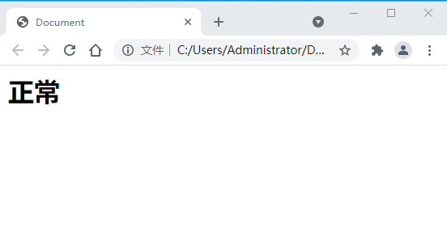
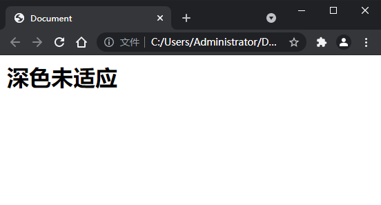
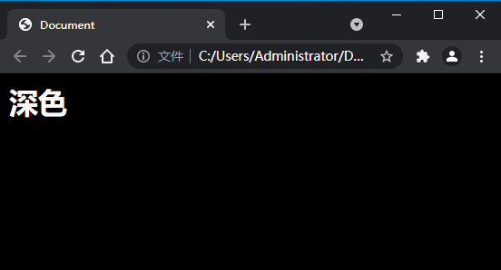

# 请记住，用户体验至上！

## 模式对比







## 解决方案

### 浏览器样式

1. 声明 

`<meta name="color-scheme" content="light dark">`

2. CSS 支持

``` css
:root {   /** :root => 伪类选择器，匹配文档树的根元素（html）。与 html 选择器相比，优先级更高 **/
    color-scheme: light dark;
}
```

PS：这两种方法都是改变浏览器的样式，并不能页面的样式发生适应性改变，事实上大部分的浏览器都不需要特殊声明，会自动跟随系统模式切换。

### 媒体查询 

> 通过`prefers-color-scheme`进行媒体查询，实现页面样式适应，查询值如下：

- `no-preference` : 表示系统未得知用户在这方面的选项。在布尔值上下文中，其执行结果为 false

- `light` ：表示用户已告知系统他们选择使用浅色主题的界面。

- `dark` : 表示用户已告知系统他们选择使用暗色主题的界面。

```css
:root {
    color-scheme: light dark;
    background: white;
    color: black;
}
@media (prefers-color-scheme: dark) {
    :root {
        background: black;
        color: white;
    }
}
```

### 图片适应

```html
<picture>
    <!-- 深色模式下的图片 -->
    <source srcset="dark.jpg" media="(prefers-color-scheme: dark)" />
    <!-- 默认模式下的图片 -->
    
</picture>

```

### JS 判断

- `Window.matchMedia()`：参数可以是任何**CSS@media**的值，返回一个新的 `MediaQueryList` 对象

- `window. MediaQueryList`（可被`addListener`监听）对象有一下两个属性：

    1. `media`：查询语句的内容。

    2. `matches`：用于检测查询结果，如果文档匹配 `media query` 列表，值为 true，否则为 false。

```js

// MediaQueryList对象，用以判断媒体查询 
const mediaQuery = window.matchMedia('(prefers-color-scheme: dark)')

// 模式改变回调方法
function darkModeHandler() {
    if (mediaQuery.matches) {
        console.log('现在是深色模式')
    } else {
        console.log('现在是浅色模式')
    }
}

// 监听模式变化
mediaQuery.addListener(darkModeHandler)
```

### 第三方库

```js
import { useDark, useToggle } from '@vueuse/core';
const isDark = useDark({
  storage: window.sessionStorage
});
useToggle(isDark);

// 可动态修改html的class
```