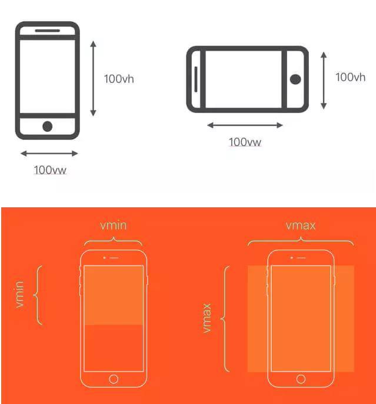

# Web App 那些不得不说的纠葛~

### 视口单位适配方案

#### flexible方案(rem布局)

> `flexible`方案是阿里早期开源的一个移动端适配解决方案，引用`flexible`后，我们在页面上统一使用`rem`来布局

rem 是相对于html节点的`font-size`来做计算的。

我们通过设置`document.documentElement.style.fontSize`就可以统一整个页面的布局标准。

#### vh、vw方案

> vh、vw方案即将视觉视口宽度`window.innerWidth`和视觉视口高度`window.innerHeight`等分为 100 份

- `vw(Viewport's width)`：1vw 等于视觉视口的1%
- `vh(Viewport's height)` :1vh 为视觉视口高度的1%
- `vmin` : vw 和 vh 中的较小值
- `vmax` : 选取 vw 和 vh 中的较大值



如果视觉视口为375px，那么`1vw = 3.75px`，这时UI给定一个元素的宽为75px（设备独立像素），我们只需要将它设置为`75 / 3.75 = 20vw`。

这里的比例关系我们也不用自己换算，我们可以使用PostCSS的 postcss-px-to-viewport 插件帮我们完成这个过程。写代码时，我们只需要根据UI给的设计图写px单位即可

#### 缺点

- px转换成vw不一定能完全整除，因此有一定的像素差
- 比如当容器使用`vw`，`margin`采用px时，很容易造成整体宽度超过100vw，从而影响布局效果。当然我们也是可以避免的，例如使用`padding`代替`margin`，结合calc()函数使用

### 1px 边框

#### 产生原因

为了适配各种屏幕，我们写代码时一般使用设备**独立像素**（逻辑像素，计算机设备中的一个点，css 像素）来对页面进行布局。而在设备**像素比**大于1的屏幕上，我们写的1px实际上是被多个**物理像素**（设备上真实的物理单元）渲染，这就会出现1px在有些屏幕上看起来很粗的现象。

#### 解决方式

##### 1. viewport 设置

**原理：** `device-width`就等于理想视口的宽度，所以设置`width=device-width`就相当于让布局视口等于理想视口。由于**initial-scale = 理想视口宽度 / 视觉视口宽度**，所以我们设置`initial-scale=1`;就相当于让视觉视口等于理想视口；这时，1个CSS像素就等于1个设备独立像素，所以呈现出来的页面布局在各种设备上都能大致相似。

```html
<meta name="viewport" content="width=device-width; initial-scale=1; maximum-scale=1; minimum-scale=1; user-scalable=no;">
```
- `width`（正整数/device-width）：以 pixels（像素）为单位， 定义布局视口的宽度。

- `height`（正整数/device-height）：以 pixels（像素）为单位， 定义布局视口的高度。

- `initial-scale`（0.0 - 10.0）：定义页面初始缩放比率。

- `minimum-scale`（0.0 - 10.0）：定义缩放的最小值；必须小于或等于`maximum-scale`的值。

- `maximum-scale`（0.0 - 10.0）：定义缩放的最大值；必须大于或等于`minimum-scale`的值。

- `user-scalable`（yes/no）：设置为 no 则表示用户将不能放大或缩小网页；默认值为 yes。

##### 2. border-image

**原理：**基于`media`查询判断不同的设备像素比给定不同的`border-image`。

```css
.border_1px{
    border-bottom: 1px solid #000;
}
@media only screen and (-webkit-min-device-pixel-ratio:2){
    .border_1px{
        border-bottom: none;
        border-width: 0 0 1px 0;
        border-image: url(../img/1pxline.png) 0 0 2 0 stretch;
    }
}
```
##### 3. background-image

**原理：**和`border-image`类似，准备一张符合条件的边框背景图，模拟在背景上。

```css
.border_1px{
    border-bottom: 1px solid #000;
}
@media only screen and (-webkit-min-device-pixel-ratio:2){
    .border_1px{
        background: url(../img/1pxline.png) repeat-x left bottom;
        background-size: 100% 1px;
    }
}
```
> PS：上面两种（2/3）都需要单独准备图片，而且圆角不是很好处理，但是可以应对大部分场景

##### 4. 伪类 + transform

> 这种方式可以满足各种场景，如果需要满足圆角，只需要给伪类也加上border-radius即可

**原理：**基于media查询判断不同的设备像素比对线条进行缩放。

```css
.border_1px:before{
    content: '';
    position: absolute;
    top: 0;
    height: 1px;
    width: 100%;
    background-color: #000;
    transform-origin: 50% 0%;
}
@media only screen and (-webkit-min-device-pixel-ratio:2){
    .border_1px:before{
        transform: scaleY(0.5);
    }
}
@media only screen and (-webkit-min-device-pixel-ratio:3){
    .border_1px:before{
        transform: scaleY(0.33);
    }
}
```

### 横屏适配

#### JS 检测横屏

```js
window.addEventListener("resize", ()=>{
    if (window.orientation === 180 || window.orientation === 0) { 
      // 正常方向或屏幕旋转180度
        console.log('竖屏');
    };
    if (window.orientation === 90 || window.orientation === -90 ){ 
       // 屏幕顺时钟旋转90度或屏幕逆时针旋转90度
        console.log('横屏');
    }  
});
```

#### CSS 检测横屏

```css
@media screen and (orientation: portrait) {
  /*竖屏...*/
} 
@media screen and (orientation: landscape) {
  /*横屏...*/
}
```

#### 实例设置

1. 对屏幕 resize 事件进行监听，当判断为竖屏时将整个根容器进行逆时针 CSS3 旋转 90 度

```js
var detectOrient = function() {
    var width = document.documentElement.clientWidth,
        height =  document.documentElement.clientHeight,
        $wrapper =  document.getElementById("J_wrapper"),
        style = "";
    if( width >= height ){ // 横屏
            style += "width:" + width + "px;";  // 注意旋转后的宽高切换
            style += "height:" + height + "px;";
            style += "-webkit-transform: rotate(0); transform: rotate(0);";
            style += "-webkit-transform-origin: 0 0;";
            style += "transform-origin: 0 0;";
    }
    else{ // 竖屏
        style += "width:" + height + "px;";
        style += "height:" + width + "px;";
        style += "-webkit-transform: rotate(90deg); transform: rotate(90deg);";
        // 注意旋转中点的处理
        style += "-webkit-transform-origin: " + width / 2 + "px " + width / 2 + "px;";
        style += "transform-origin: " + width / 2 + "px " + width / 2 + "px;";
    }
    $wrapper.style.cssText = style;
}
window.onresize = detectOrient;
detectOrient();
```
2. 解决横屏的 dom 适配问题

```css
$vw_base: 375;
$vw_fontsize: 20;
html {
    font-size: 20px; /*不支持vw单位时，回退到px单位 */
    font-size: ($vw_fontsize / $vw_base) * 100vw;
}
@media screen and (orientation: landscape) {
    html {
        font-size: 20px;
        font-size: ($vw_fontsize / $vw_base) * 100vh;
    }
}
```

### 图片模糊

#### 产生原因

我们平时使用的图片大多数都属于位图（png、jpg……），位图由一个个像素点构成的，每个像素都具有特定的位置和颜色值，理论上，位图的每个像素对应在屏幕上使用一个物理像素来渲染，才能达到最佳的显示效果。而在**dpr > 1**（屏幕比大于1）的屏幕上，位图的一个像素可能由多个物理像素来渲染，然而这些物理像素点并不能被准确的分配上对应位图像素的颜色，只能取近似值，所以相同的图片在**dpr > 1**的屏幕上就会模糊。

#### 解决方式

> 为了保证图片质量，我们应该尽可能让一个屏幕像素来渲染一个图片像素，所以，针对不同 DPR 的屏幕，我们需要展示**不同分辨率**的图片

##### 1. media查询

> 使用 `media` 查询判断不同的设备像素比来显示不同精度的图片

```css
.avatar{
    /* 原图 */
    background-image: url(conardLi_1x.png); 
}
@media only screen and (-webkit-min-device-pixel-ratio:2){
    .avatar{
        /* 二倍图 */
        background-image: url(conardLi_2x.png);
    }
}
@media only screen and (-webkit-min-device-pixel-ratio:3){
    .avatar{
        /* 三倍图 */
        background-image: url(conardLi_3x.png);
    }
}
```
##### 2. image-set

```css
.avatar {
    background-image: -webkit-image-set( "conardLi_1x.png" 1x, "conardLi_2x.png" 2x );
}
```
**PS: 以上两种方式（1/2）只适用于背景图**

##### 3. srcset

> 使用 img 标签的`srcset`属性，浏览器会自动根据像素密度匹配最佳显示图片

```html

```
##### 4. JavaScript拼接图片url

> 使用`window.devicePixelRatio`获取设备像素比，遍历所有图片，替换图片地址

```js
const dpr = window.devicePixelRatio;
const images =  document.querySelectorAll('img');
images.forEach((img)=>{
    img.src.replace(".", `@${dpr}x.`);
})
```
##### 5. 使用svg (可缩放矢量图 Scalable Vector Graphics)

> 不同于位图的基于像素，SVG 则是属于对图像的形状描述，所以它本质上是文本文件，体积较小，且不管放大多少倍都不会失真

```html


```
```css
.avatar {
    background: url(conardLi.svg);
}
```

### 网页适配 iPhoneX

iOS11 新增特性，苹果公司为了适配 iPhoneX 对现有 `viewport meta` 标签的一个扩展，用于设置网页在可视窗口的布局方式，可设置三个值：

- `contain`: 可视窗口完全包含网页内容

- `cover`：网页内容完全覆盖可视窗口

- `auto`：默认值，跟 `contain` 表现一致

```html
<!-- 需要适配 iPhoneX 必须设置 viewport-fit=cover，这是适配的关键步骤。 -->
<meta name="viewport" content="width=device-width, viewport-fit=cover">
```
```css
/* 根据情况设置padding或者margin */
padding-bottom: constant(safe-area-inset-bottom); /* 兼容 iOS < 11.2 */
padding-bottom: env(safe-area-inset-bottom); /* 兼容 iOS >= 11.2 */
```

### [上一篇：CSS3](CSS3.md)

### [下一篇：移动端适配](移动端适配.md)