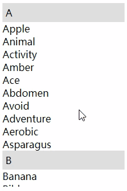
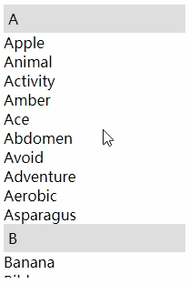
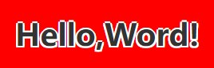
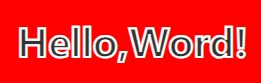
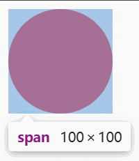
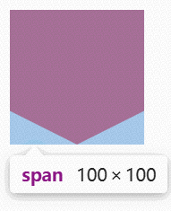

# 你知道css强大，但它比你知道的还强还大！

## 粘性定位

> 粘性定位元素必须指定`top`、`right`、`bottom`、`left`四个阈值中的一个，且仅在其父元素内生效。

PS：这种定位方式特别适用于需要**在页面滚动时保持固定位置**的元素，例如导航栏、侧边栏、广告条、提示框等。

```css
div{
  position: sticky;
  top: 0; /*相对于第一个设置 overflow 的父级元素*/
}
```
  

## 文字描边

### text-shadow

```css
  /* 给六个方向阴影 */
  {
    text-shadow: 0px 2px #fff, 0px -2px #fff, -2px 2px #fff, 2px 2px #fff, -2px 0px #fff, 2px 0px #fff;
  }
```


缺点：

1. 不够圆滑

2. 无法处理透明文字

### -webkit-text-stroke

```css
  {
    -webkit-text-stroke: 2px #fff;
  }
```


缺点：兼容性不好

## 高度过渡

```html
  <input type="text" class="text" />
  <ul class="select">
    <li>All</li>
    <li>Aunt</li>
    <li>Able</li>
    <li>Apple</li>
  </ul>
```

### height

```css
  .select {
    height: 0;
    transition: 1s;
    overflow: hidden;
  }
  .text:focus ~ .select {
    /* 100px 在css中写死，显然不是我们想要的，但我们又不知道改设置多少高度 */
    height: 100px;
    /* height: auto; 过渡效果就会消失 */
  }
```

### max-height

```css
  .select {
    max-height:0;
    transition: 1s;
    overflow: hidden;
  }
  .text:focus ~ .select {
    /* 给到一个足够大的 最大高度 */
    max-height: 300px;
  }
```

<video src="../Img/CSS/max-height.mp4" autoplay="autoplay" muted preload="auto" loop></video>

PS：如果是这样就会发现，在高度收起的时候，会出现一丝卡顿。这是因为 `transition` 是从最大高度变到0，而不是可见高度到0。

### scaleY 推荐

```css
  .select {
    overflow: hidden;
    transition: 1s;
    transform: scaleY(0); /* Y轴缩放为0 */
    transform-origin: 0 0;  /* 修改中心点为元素左上角 */
  }
  .text:focus ~ .select {
    transform: scaleY(1); /* Y轴缩放为1，没有缩放效果 */
  }

```
<video src="../Img/CSS/scaleY.mp4" autoplay="autoplay" muted preload="auto" loop></video>

## 宽高比

> 可任意指定`width` 或 `height`，`aspect-ratio`会自动计算出的对应`height` 或 `width` 的值。但计算值会被设置值覆盖。

```css
{
  width: 160px;
  /* 高度在不设置的情况下，会自动计算出对应比例的高度，也就是 90px */
  /* height: 30px; */ 
  aspect-ratio: 16 / 9; /* 经典的 16:9 比例 */
}
```

## 蒙版（类似PS）

```css
.element {
  mask-image: linear-gradient(to right, transparent, black 20%, black 80%, transparent);
  -webkit-mask-image: linear-gradient(to right, transparent, black 20%, black 80%, transparent); 
}
```

## 混合模式（类似PS）

> `mix-blend-mode`定义了元素内容如何与其直接背景（即被该元素覆盖住的区域）进行混合；原自Photoshop图层混合模式概念

### 正常类

- `normal`：（默认）元素的内容只是简单地覆盖在背景之上，完全不进行混合。

### 变暗类

- `darken`: 比较背景和元素的颜色，保留较暗的通道值。

- `multiply`：***正片叠底**，将背景色和元素色相乘。任何颜色与黑色相乘产生黑色，与白色相乘则保持不变。效果类似于用马克笔在纸上画画，非常常用。

- `color-burn`：**颜色加深**，通过增加对比度来使背景色变暗，以反映出元素色。效果比 `multiply` 更强烈。

### 变亮类

- `lighten`：比较背景和元素的颜色，保留较亮的通道值。

- `screen`：***滤色**，将背景色和元素色的反转色相乘。任何颜色与白色屏幕会产生白色，与黑色屏幕则保持不变。效果类似于将两张幻灯片投影到同一个屏幕上，是 `multiply` 的反模式。

- `color-dodge`：**颜色减淡**，通过增加对比度来使背景色变亮，以反映出元素色。效果比 `screen` 更强烈。

### 对比类

- `overlay`：***叠加**，根据背景色来决定是执行 `multiply` 还是 `screen`。模式是 `multiply` 和 `screen` 的结合，能保留背景的明暗对比。

- `hard-light`：**强光**，根据元素色来决定是执行 `multiply` 还是 `screen`。就像是元素色作为光源照射在背景上。

- `soft-light`：**柔光**，类似于 `hard-light`，但效果更加柔和，类似于漫射的光源。

### 比较类

- `difference`：***差值**，从背景色中减去元素色或从元素色中减去背景色，取决于哪个的亮度值更大。与白色混合会产生反相效果，与黑色混合则无变化。常用于产生高对比度的艺术效果。

- `exclusion`：**排除**，效果类似于`difference`，但对比度更低，结果更柔和。

### 彩色类

> 这类模式会将颜色的某些属性（色相、饱和度、亮度）进行混合。

- `hue`：**色相**，采用元素色的色相，同时保留背景色的饱和度和明度。

- `saturation`：**饱和度**，采用元素色的饱和度，同时保留背景色的色相和明度。

- `color`：***颜色**，采用元素色的色相和饱和度，同时保留背景色的明度。这个模式非常适合为单色图像上色。

- `luminosity`：**亮度**，采用元素色的明度，同时保留背景色的色相和饱和度。是 color 模式的反模式。


```css
.text {
  mix-blend-mode: difference; /* 差值模式，能产生强烈的对比效果 */
}
```

## 模糊（类似PS高斯模糊）

- `filter: blur()`：元素本身（包括其所有内容）

- `backdrop-filter: blur()`：元素背后的区域

```css
.ps-style-blur {
  filter: blur(6px); /* 完全等同于 PS 中半径为 6 的高斯模糊 */
}
```

## 裁剪

> 使用裁剪方式创建可见区域，可以裁剪出圆形、多边形或甚至自定义 SVG 路径的形状。

```css
.circle {
  /* 圆形 */
  clip-path: circle(50%);
}
```


```css
.polygon {
  /* 多边形：polygon( <x1> <y1>, <x2> <y2>, <x3> <y3>, ... ) */
  clip-path: polygon(0 0, 100% 0, 100% 75%, 50% 100%, 0 75%);
}
/* 内矩形：inset();椭圆： ellipse(); */
```


### SVG 路径裁剪

```html
<!-- 1. 在HTML中定义SVG裁剪路径 -->
<svg width="0" height="0">
  <defs>
    <clipPath id="star-clip">
      <path d="M50,0 L61,35 L98,35 L68,57 L79,92 L50,70 L21,92 L32,57 L2,35 L39,35 Z"/>
    </clipPath>
  </defs>
</svg>

<!-- 2. 要应用裁剪的元素 -->
<div class="content"></div>
```
```css
/* 3. 在CSS中通过URL引用 */
.content {
  clip-path: url(#star-clip);
}
```
