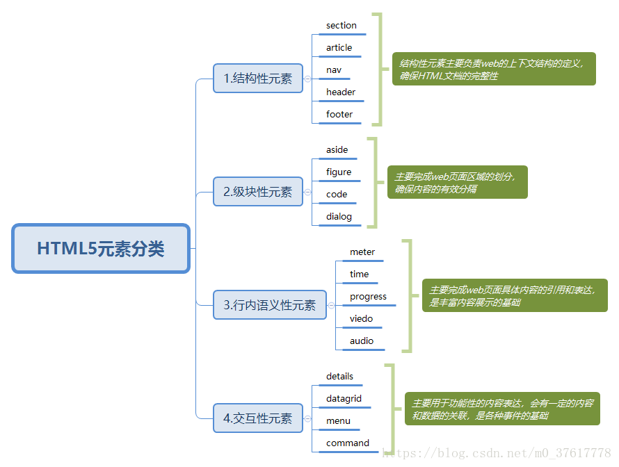

# Html最新标准——H5

## HTML5元素分类

> 新增了27个元素，废弃了16个元素



## 视/音频 —— `<audio>`/`<video>`

> `<video>`与`</video>`之间插入的内容是供不支持 video 元素的浏览器显示(audio同样)

```HTML
<video>
    Your browser does not support the video tag.
</video>
```

### 属性

- `autoplay` : 【autoplay】视频在就绪后马上播放。

- `controls` : 【controls】显示控件。

- `loop` : 【loop】循环播放播放。

- `preload` :【preload】视频在页面加载时进行加载，并预备播放，如果使用`autoplay`，则忽略该属性。

- `muted`：静音，因各浏览器限制，自动播放可能失败，但静音播放则是被允许的。

- 此外还有宽高等通用属性。

```html
<video
    :controls="false"
    autoplay="autoplay"
    muted
    preload="auto"
    data-setup="{'autoplay':true}"
    loop
   >
    <source src="test.mp4" type="video/mp4" />
</video>
```

此外，可以通过js手动控制：

```js
const vdo = document.createElement('video');
vdo.currentTime = 10;   // 当前播放时间
vdo.muted = true;
vdo.onanplay = () => {
    console.log('视频开始播放了');
}
vdo.src - URL.createObjectURL(File);    // File 为本地文件，blob地址（预览时常用）
```

> `video` 元素支持三种视频格式 --> WebM 、MPEG4 、Ogg ；要确保适用于 Safari 浏览器，视频文件必须是 MPEG4 类型。

> `audio` 元素支持三种视频格式 -->Ogg、Wav、MP3 ；IE8及以下不支持`<audio>`

### `<source>`元素

> `<video>`/`<audio>`元素允许多个`source`元素。`source`元素可以链接不同的视频文件,浏览器将使用第一个可识别的格式。

```html
<video width="320" height="240" controls="controls">
    <source src="movie.ogg" type="video/ogg">
    <source src="movie.mp4" type="video/mp4">
    该换电脑了！
</video>
```

## [Canvas](../Web图形/Canvas/基础.md)

