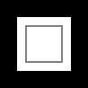

# 想绘制一个新世界吗？

### [canvas 标签理解](https://developer.mozilla.org/zh-CN/docs/Web/API/Canvas_API/Tutorial/Basic_usage)

> 就像`div` 一样，它拥有标签的全部特性，但同时，它是一个双标签，也就是说`</canvas>`不可省略，标签内的内容，为替代内容。

```html
<canvas id="myCanvas">
  当浏览器不兼容时，我将会显示
</canvas>
```

#### whidth/height

对于 `<canvas>` 来说，`whidth`和`height`两个属性是必须属性，如果不写，则会默认` width='300px' height='150px'`

> 通常情况下，尝试用`width`和`height`属性为`<canvas>`明确规定宽高，而不是使用CSS，因为如果CSS的尺寸与初始画布的比例不一致，它会出现扭曲。

#### 渲染上下文

> 这里主要介绍 2D 渲染，3D 渲染请移步[WebGL](./WebGL.md)

```js
// 获取 canvas 对象
let canvas = document.getElementById('myCanvas'); 
/**
 * 获取上下文，以获得渲染和绘画的能力
 * 这就是canvas的神奇之处，要知道，普通标签的 dom 对象，是没有getContext()方法的
 */ 
if(canvas.getContext){  // 兼容一下浏览器不支持的可能
  let ctx = canvas.getContext('2d');  // 2d，说明我们获取的是平面相关的API，不能写成2D
}
```

#### 坐标（栅格）

`canvas`元素默认被网格所覆盖。通常来说网格中的一个单元相当于`canvas`元素中的一像素。栅格的起点为左上角（**坐标为(0,0)**）。所有元素的位置都相对于原点定位，当然这个原点是可以变的。


### 图形绘制

> `<canvas>`只支持两种形式的图形绘制：**矩形**和**路径**

#### 矩形

绘制矩形`canvas`提供了三种方式（绘制后即时生效）：

1. 填充矩形 -> `fillRect(x,y,width,height)`

2. 矩形边框 -> `strokeRect(x,y,width,height)`

3. 擦拭区域 -> `clearRect(x,y,width,height)`

```js
var canvas = document.getElementById('myCanvas');
var ctx = canvas.getContext('2d');
ctx.fillRect(0, 0, 100, 100); // 从原点开始，填充一个宽高均为100的矩形，默认为黑色
ctx.clearRect(20, 20, 60, 60); // 从(20,20) 开始，擦拭一个宽高均为60的区域，露出canvas的背景色
ctx.strokeRect(30, 30, 40, 40); // 从(30,30)开始，绘制一个宽高均为40的框线
```



#### 路径

> 通过不同颜色和宽度的线段或曲线相连形成的**不同形状的点**的集合，一个路径，甚至一个子路径，都是**闭合**的。

绘制一个路径，要经过一下步骤：

1. 创建起始点

  - `beginPath()`：该函数可以理解为一条声明。

    > 配合`moveTo(x,y)`使用，设置路径起始点。

2. 使用画图命令，画出路径

  - `lineTo(x, y)`：从当前位置（moveTo()指定的位置），到指定位置（lineTo()指定的位置），绘制一条直线。

  - `arc(x,y,r,start,end,direction)`:画一个以`(x,y)`为圆心的以`r`为半径的圆弧（圆），从`start`开始到`end`结束，按照`direction`（`false`：顺时针；`true`：逆时针（默认））给定的方向来生成。

3. 闭合路径

  - `closePaht()`：闭合路径，但它不是必需的，如果图形已经闭合，即当前点为开始点，则该函数将什么也不做。

4. 通过描边或填充路径区域，来渲染图形

  - `stroken()`：描边，调用该方法时路径不会自动闭合。

  - `fill()`： 填充，调用该函数时，所有没有闭合的形状都会**自动闭合**。


