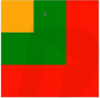

#  DOM --> Document Object Model(文档对象模型)

> DOM 定义了表示和修改文档所需的方法（对象、这些对象的行为和属性以及这些对象之间的关系。）DOM 对象即为宿主对象，由浏览器厂商定义，用来操作 html和 xml 功能的一类对象的集合。

### DOM 基本操作 -->【遍历，查找】(大部分都是类数组) 

> document 代表整个文档（如果给 html 标签上面再套一层标签就是 document）

#### 方法类操作

- `document.getElementById()` : **id**，在 Ie8 以下的浏览器，不区分 id 大小写，而且也返回匹配 name 属性的元素。

> 一般作为顶级框架的名称存在，不要写多个也不要过于依赖（写父子选择器的时候 `#father div`很可能会被后端作为接口抽取，导致出现问题。）**在 css 中一般用 `class` 选择器**


- `document.getElementsByClassName()` : **类名** ==> 常用，ie8 和 ie8 以下的 ie 版本中没有，可以多个 class 一起，不是所有浏览器都能用

> 注意:哪怕整个文档只有一个元素，也要加`[0]`，不然选出来的就是一个组

- `document.getElementsByTagName()` : **标签名**，这是一个类数组(最主流方法，兼容性很好，IE4都能用)

- `document.getElementsByName()` : **name**,只有部分标签 name 可生效（表单，表单元素，img，iframe），不是在所有的浏览器都能用——开发*一般不用*

- `document.querySelector('css选择器')` : 可以按照css 选择器的方式选择则元素，只能**选一个**，在 ie7 和 ie7 以下的版本中没有

- `document.querySelectorAll()` : css 选择器，全选，**选一组**，在 ie7 和 ie7 以下的版本中没有

- `.querySelectorAll()` 和 `.querySelector()`选出来的元素**不是实时的（是静态的）**，所以一般不用

#### 非方法类的操作

1. **遍历节点树**

> 遍历节点树：(灵活，兼容好)——关系类的选择

- `parentNode` → 父节点 (最顶端的 parentNode 为#document);

- `childNodes` → 子节点们（直接的节点数）节点包括文本节点，属性节点

- `firstChild` → 第一个子节点

- `lastChild` → 最后一个子节点

- `nextSibling` →后一个兄弟节点

- `previousSibling` → 前一个兄弟节点

2. **遍历元素节点树（不含文本节点）**

> 除`children`外，其余 ie9 及以下不兼容）

- `children` -> 只返回当前元素的元素子节点【常用】

- `parentElement` -> 返回当前元素的父元素节点 (IE9及以下 不兼容)

> `node.childElementCount` === `node.children.length` 当前元素节点的子元素节点个数(IE 不兼容)——基本不用，因为与 length 相等

- `firstElementChild` -> 返回的是第一个元素节点(IE9及以下 不兼容)

- `lastElementChild` -> 返回的是最后一个元素节点(IE9及以下 不兼容)

- `nextElementSibling` / `previousElementSibling` -> 返回后一个/前一个兄弟元素节点(IE9及以下 不兼容)

#### 节点的类型

> 后面的数字是调用`nodeType`返回的数字

- 元素节点 —— 1

- 属性节点 —— 2 （基本没用，）

- 文本节点 —— 3

- 注释节点 —— 8

- document —— 9

- DocumentFragment —— 11 

#### 节点属性

- `nodeName` : 元素的标签名，以大写形式表示,**只读，不能写**

- `nodeValue` : Text 文本节点或注释节点(`Comment`)的文本内容,可读写

- `nodeType` : 【最有用】该节点的类型，只读返回这个 div 的所有的元素节点

- `attributes` : Element 节点的属性集合

> 属性名不能改，属性值可以改，但是通常不用这种方法，一般用 `getAttribute` 和 `setAttribute`去取

> 节点的一个方法 `Node.hasChildNodes()`——他有没有子节点，返回值是 true 或 false

### DOM 基本操作 -->【增、插、删、改】

- `document.createElement('div')` : 增加或创建元素节点（标签）——常见

- `document.createTextNode()` : 创建文本节点

- `document.createComment()` : 创建注释节点

- `父节点.appendChild()` ： 向父节点内添加元素（写在括号内）；可以理解成.push

```js
var div= document.getElementsByTagName('div');
var span = document.createElement("span");
div.appendChild(span)
```
- `父节点.insertBefore(a, b)` : 在 a 前插入 b （待完善）

- `parent.removeChild()` : 将节点剪切出来

- `child.remove()` : 彻底删除

- `parent.replaceChild(new, origin)` : 用 **new** 替换 **origin**

#### DOM 节点上的方法

- `ele.innerHTML` : 可取，可写，可赋值

- `ele.innerText` : 可取，可赋值 (老版本火狐不兼容) / `textContent`(火狐使用这个，老版本 IE 不好使)

- `ele.setAttribute('属性名','属性值')` :设置行间属性

- `ele.getAttribute('属性名')` : 取属性

### DOM 事件

#### ele.on事件名 = function(形参){}

> 程序 `this` 指向是 `dom` 元素本身（指向自己）

1. 兼容性很好，但是一个元素只能绑定一个事件处理程序

2. 基本等同于写在 HTML 行间上

```html
<div onclick = 'funName()'></div>
```
> 事件解除：`ele.事件 = false/null`

#### ele.addEventListener(type, fun, false)

> 程序 `this` 指向是 `dom` 元素本身（指向自己）

> 里面三个参数：**事件类型**、**处理函数**、**false**

```js
div.addEventListener('click',function(){},false)    //匿名函数，无法解除
//function(){} 是函数引用，和外面定义一个 function test(){}直接写 test 是一样的
```
1. IE9 以下不兼容

2. 可以为一个事件绑定多个处理程序

3. 不要重复绑定同一类型的事件

> 事件解除：`ele.removeEventListener(type, fun, false)`

#### ele.attachEvent('on' + type, fun)

> 程序 `this` 指向 `window`

1. **IE 独有**

2. 一个事件同样可以绑定多个处理程序，同一个函数绑定多次都可以

> 事件解除：`ele.detachEvent('on' + type, fn)`

**PS：若绑定匿名函数，则无法解除**

### 事件处理模型：事件冒泡、捕获（不能同事存在）

> 同一个对象的同一个事件类型，上面绑定了两个事件处理函数，一个符合冒泡，一个符合捕获，触发顺序：**先捕获，后冒泡**

#### 事件冒泡

> 结构上（非视觉上）嵌套关系的元素，会存在事件冒泡的功能，即同一事件，自子元素冒泡向父元素（自底向上）。



如上图，是三个嵌套的元素，并给他们都绑定了`click`事件；那么当点击黄色元素的时候，红色和绿色也相当于被点击了，就会触发他们各自绑定的事件。

#### 取消冒泡

1. W3C 标准 `event.stopPropagation()`不支持 IE9 以下版本

2. IE 独有 `event.cancelBubble = true`（实际上谷歌也可以）


#### 事件捕获（只有谷歌有，最新火狐有）

1. 结构上（非视觉上）嵌套关系的元素，会存在事件捕获的功能，即同一事件，自父元素捕获至子元素（事件源元素）（自底向上）。

2. `obj.addEventListener(type, fn, true)`第三个参数为 `true` 就是事件捕获

3. **IE 没有捕获事件**

> 最外面先捕获，再一层层向里面捕获，最里面的是按常规执行。

#### 阻止默认事件（表单提交、<a>跳转、右键菜单……）

1. `return false` : 兼容性非常好，以对象属性的方式注册的事件才生效（这是**句柄方式**阻止默认事件，只有句柄的方式绑定事件才好使）

> `ele.onxxx = function (event) {}`是句柄的绑定方式，才能用`return false`（写在函数内）

2. `event.preventDefault()` : W3C 标注，IE9 以下不兼容

3. `event.returnValue = false` : 兼容 IE

#### 事件对象

> 非 IE 浏览器会把事件对象（记载了数据发生时的状态和信息）打包传到参数里面去。IE 浏览器在`window.event`里面储存事件对象。

1. `event` || `window.event` 用于 IE，`event` 只能用于非 IE 浏览器

2. **触发事件的地方叫【事件源】**

> 事件对象上有个专门的信息是存储事件源的

- `event.target` 火狐独有的

- `event.srcElement` IE 独有的

- 这俩 Chrome 都有

#### 事件委托

> 利用事件冒泡，和事件源对象进行处理

1. 性能 不需要循环所有的元素一个个绑定事件

2. 灵活 当有新的子元素时不需要重新绑定事件

#### 事件分类

1. 鼠标事件

    - `onmousedown` ： 鼠标按下

    - `onmouseup` ： 鼠标松开

    - `onclick` ： 单击【常用】

    - `ondblclick` : 双击

    - `onmousemove` ： 鼠标移动（每次在元素上移动都会执行该事件）

    - `onmouseover` ： 鼠标移动到（进入）元素

    - `onmouseout` ： 鼠标从某元素移开

    > 移动端`onmousedown`不能用，只能用 `touchstart`、`touchmove`、`touchend`

2. 键盘事件

    - `onkeydown` ： 某个键盘按键被按下（可以相应**任意键盘**按键）

    - `onkeypress` ： 某个键盘按键被按下并松开（只能响应**字符类键盘**按键）,返回 ASCII 码，可以转换成相应字符

    - `onkeyup` ： 某个键盘按键被松开

3. 窗体类操作事件

    - `onscroll` : 滚动条滚动触发事件
    
    - `onresize` ： 窗口或框架被重新调整大小

    - `onunload` ： 用户退出页面

    - `onabort` ： 图像的加载被中断

    - `onerror` ： 在加载文档或图像时发生错误

    - `onload` ： 一张页面或一幅图像完成加载

4. 其它

    - `onblur` ： 元素失去焦点

    - `oninput` ： 在`<input>`或`<textarea>`元素值发生改变时触发
    
    - `onchange` ： 域的内容被改变

    > `onchange` 和 `oninput`不同之处在于`oninput`事件**在元素值发生变化是立即触发**， `onchange` **在元素失去焦点时触发**。另外一点是`onchange`事件也可以作用于 `<keygen>` 和 `<select>` 元素

    - `onfocus` ： 元素获得焦点

    - `onselect` ： 文本被选中

    - `onsubmit` ： 确认按钮被点击

    - `onreset` ： 重置按钮被点击

#### 鼠标 / 键盘属性

- `altKey` ： 返回当事件被触发时，"ALT" 是否被按下

- `button` ： 返回当事件被触发时，哪个鼠标按钮被点击

>   0 左键；1 中键；2 右键

>   1 左键；4 中键；2 右键 ==> IE

> DOM3 标准规定：`click` 事件只能监听左键,只能通过 `mousedown` 和 `mouseup` 来判断鼠标键

- `clientX` ： 返回当事件被触发时，鼠标指针的水平坐标

- `clientY` ： 返回当事件被触发时，鼠标指针的垂直坐标

- `ctrlKey` ： 返回当事件被触发时，"CTRL" 键是否被按下

- `metaKey`	返回当事件被触发时，"meta" 键是否被按下

- `relatedTarget` ： 返回与事件的目标节点相关的节点

- `screenX` ： 返回当某个事件被触发时，鼠标指针的水平坐标

- `screenY` ： 返回当某个事件被触发时，鼠标指针的垂直坐标

- `shiftKey` ： 返回当事件被触发时，"SHIFT" 键是否被按下

### json

> JSON 是一种传输数据的格式（以对象为样板，本质上就是对象，但用途有区别，对象就是本地用的，json 是用来传输的）

2. `JSON.parse()` ： string — > json

> 一般情况，接受到的 json 其实是一段字符串，需要通过`JSON.parse()`转化成**json对象**使用

3. `JSON.stringify()` ： json — > string

### RegExp 正则表达式（其它语言也有）

> 正则表达式：匹配特殊字符或有特殊搭配原则的字符的最佳选择

#### 创建一个正则表达式

1. 字面量【建议】

```js
var reg = /abc/; 
var str = 'abcde';
reg.test(str);
//正则表达式测验字符串（这里检验的字符串是 str）是否含有规定的片段（这里指的是 abc）
```

2. 构造函数

`var reg = new RegExp('abc');`

#### 增加属性

- `i` ： 忽视大小写，例：`var reg = /abce/i;`

- `g` ： 全局匹配，例：`var reg = /abce/g;`

- `m` ： 多行匹配

- `^a` ： 必须是这个 `a` 开头

#### 常用方法

- `reg.test( )` ： 只能判断这个字符串有没有符合要求的片段，返回结果只有 true 和 false

- `str.match( )` ： 可以把所有东西都匹配出来，并返回，比上一种方法更直观，还能告诉返回了多少个

#### 元字符(表达式里面可以写元字符)

> 元字符（Metacharacter）是拥有特殊含义的字符

- `\w === [0-9A-z_]`

- `\W === [^\w]` 

- `\d === [0-9]`

- `\D ==== [^\d]`  

- `\D ==== [^0-9]`

- `\t` ： 制表符(tab character) 

- `\r` ： 回车符(carriage return character) 

- `\n` ： 换行符 (new line character) 

- `\v` ： 垂直换行符 (vertical tab character) 

- `\f` ： 换页符 (form feed character) 

> 正则就不多说了，需要的时候可以去查

#### [上一篇：基础进阶二](基础进阶二.md)

#### [下一篇：BOM](BOM.md)
