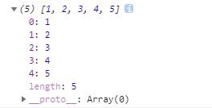

# 前端都要会的

## let 与 const [关键字]

> ES6 明确规定，代码块内如果存在 `let` 或者 `const`，代码块会对这些命令声明的变量从块的开始就形成一个封闭作用域。代码块内，在声明变量 PI 之前使用它会报错。

### let

1. `let` 声明的变量只在 `let` 所在的代码块内有效（用法上和 `var`类似）

```js
{
    let a = 0;  //如果 用 var 声明，则下边并不会报错
    console.log(a); //打印a
}
console.log(a); //报错，变量未生名
```
2. `let`只能声明一次（多声明会报错），`var`可以声明多次

> 注意：如果一个变量先用`var`声明过，在用`let`声明也是会报错的；同样，先用`let`声明，再用`var`声明也是会报错的，也就是说，`let`声明的变量只能是未被声明过的。

3. `let` 不存在变量提升，`var` 会变量提升

> 可参考[基础进阶一](基础进阶一.md)的预编译部分，了解变量提升

```js
console.log(a);  //报错，变量未定义（未经声明就调用）
let a = "apple";

console.log(b);  //undefined，预编译环节，变量提升，所以并不会报错，但未进行赋值
var b = "banana"; 
```

> 综合`let`声明变量的优点，在`for`循环语句中用`let`代替`var`可避免`bug`的出现

### const 

1. `const` 声明一个只读的常量，一旦声明，常量的值就不能被改变（如果强行改变常量的值会报错）

> `const` 如何做到变量在声明初始化之后不允许改变的？其实 const 其实保证的不是变量的值不变，而是保证变量指向的内存地址所保存的数据不允许改动。此时，你可能已经想到，简单类型和复合类型保存值的方式是不同的。是的，对于简单类型（`number` 、`string` 、`boolean`）,值就保存在变量指向的那个内存地址，因此 `const` 声明的简单类型变量等同于常量。而复杂类型（`object` 、`array` 、`functio`n），变量指向的内存地址其实是保存了一个指向实际数据的指针，所以 `const` 只能保证指针是固定的，至于指针指向的数据结构变不变就无法控制了，所以使用 `const` 声明复杂类型对象时要慎重。

## 解构赋值

> 是一种针对**数组**或者**对象**进行模式匹配，然后对其中的变量进行赋值。

###  数组模型

```js
// 基本
let [a,b,c] = [1,2,3];
/*
    a = 1
    b = 2 
    c = 3
*/
//可嵌套
let [a, [[b], c]] = [1, [[2], 3]];
/*
    a = 1
    b = 2 
    c = 3
*/
// 可忽略
let [a, , b] = [1, 2, 3];
/*
    a = 1
    b = 2 
*/
// 不完全解构
let [a = 1, b] = [];
/*
    a = 1
    b = undefined
*/
// 剩余运算符
let [a, ...b] = [1, 2, 3];
/*
    a = 1
    b = [2, 3]
*/
// 字符串
let [a, b, c, d, e] = 'hello';
/*
    a = 'h'
    b = 'e'
    c = 'l'
    d = 'l'
    e = 'o'
*/
// 默认值
let [a = 2] = [undefined]; 
let [a = 2, b = a] = [];
/*
    a = 2  （2 是 a 的默认值）
    b = 2  （但是这里不能把b = a ,写在 a = 2 前边，会报错）
    当解构模式有匹配结果，且匹配结果是 undefined 时，会触发默认值作为返回结果
*/
```

###  对象模型

```js
// 基本

let { foo, bar } = { foo: 'aaa', bar: 'bbb' };
/*
    foo = 'aaa'
    bar = 'bbb'
*/ 
let { baz : foo } = { baz : 'ddd' };
/* 
    foo = 'ddd'
*/
// 可嵌套可忽略
let obj = {p: ['hello', {y: 'world'}] };
let {p: [x, { y }] } = obj;
/*
    x = 'hello'
    y = 'world'
*/
let obj = {p: ['hello', {y: 'world'}] };
let {p: [x, {  }] } = obj;
/* 
    x = 'hello'
*/
// 不完全解构
let obj = {p: [{y: 'world'}] };
let {p: [{ y }, x ] } = obj;
/*
    x = undefined
    y = 'world'
*/
// 剩余运算符
let {a, b, ...rest} = {a: 10, b: 20, c: 30, d: 40};
/*
    a = 10
    b = 20
    rest = {c: 30, d: 40}
*/
// 解构默认值
let {a = 10, b = 5} = {a: 3};
/* 
    a = 3
    b = 5;
*/
let {a: aa = 10, b: bb = 5} = {a: 3};
/*
    aa = 3
    bb = 5;
    a,b 未定义
*/
```

## Symbol

> 一种新的原始数据类型 Symbol ，表示独一无二的值，最大的用法是用来定义对象的唯一属性名；不是对象，不能`new`，但可以接收一个字符串作为参数，为新创建的 `Symbol` 提供描述。

```js
let sy = Symbol("KK");
console.log(sy);   // Symbol(KK)
typeof(sy);        // "symbol"
 
// 相同参数 Symbol() 返回的值不相等
let sy1 = Symbol("kk"); 
sy === sy1;       // false
```

### 使用场景

1. 作为属性名

> 由于每一个 `Symbol` 的值都是**不相等**的，所以 `Symbol` 作为对象的属性名，可以**保证属性不重名**

```js
let sy = Symbol("key1");
 
// 写法1
let syObject = {};
syObject[sy] = "kk";
console.log(syObject);    // {Symbol(key1): "kk"}
 
// 写法2
let syObject = {
  [sy]: "kk"
};
console.log(syObject);    // {Symbol(key1): "kk"}
 
// 写法3
let syObject = {};
Object.defineProperty(syObject, sy, {value: "kk"});
console.log(syObject);   // {Symbol(key1): "kk"}
```
**注意：**`Symbol` 作为对象属性名时不能用 **.** ，要用 **[]** ，因为 **.** 运算符后面是字符串，所以取到的是字符串 `sy` 属性，而不是 `Symbol` 值 `sy` 属性。

```js
let syObject = {};
syObject[sy] = "kk";
 
syObject[sy];  // "kk"
syObject.sy;   // undefined
```
> `Symbol` 值作为属性名时，该属性是**公有属性**不是私有属性，可以在类的外部访问。但是不会出现在 `for...in` 、 `for...of` 的循环中，也不会被 `Object.keys()` 、 `Object.getOwnPropertyNames()` 返回。如果要读取一个对象的 `Symbol` 属性，可以通过 `Object.getOwnPropertySymbols()` 和 `Reflect.ownKeys()` 获取。

```js
let syObject = {};
syObject[sy] = "kk";
console.log(syObject);
 
for (let i in syObject) {
  console.log(i);
}    // 无输出
 
Object.keys(syObject);                     // []
Object.getOwnPropertySymbols(syObject);    // [Symbol(key1)]
Reflect.ownKeys(syObject);                 // [Symbol(key1)]
```
2. 定义常量

> 在 ES5 使用字符串表示常量，不能保证常量是**独特的**，这样会引起一些问题；而使用 `Symbol` 定义常量，就可以保证这一组常量的值**都不相等**

```js
//ES5 定义字符串常量
const COLOR_RED = "red";
const COLOR_YELLOW = "yellow";
//Symbol定义常量
const COLOR_RED = Symbol("red");
const COLOR_YELLOW = Symbol("yellow");
```

### Symbol.for()

> `Symbol.for()` 类似单例模式，首先会在全局搜索被登记的 `Symbol` 中是否有该字符串参数作为名称的 `Symbol` 值，如果有即返回该 `Symbol` 值，若没有则新建并返回一个以该字符串参数为名称的 `Symbol` 值，并登记在全局环境中供搜索。

```js
let yellow = Symbol("Yellow");
let yellow1 = Symbol.for("Yellow");
console.log(yellow === yellow1);      // false

let yellow2 = Symbol.for("Yellow");
console.log(yellow1 === yellow2);     // true
```

### Symbol.keyFor()

> `Symbol.keyFor() `返回一个已登记的 `Symbol` 类型值的 `key` ，用来检测该字符串参数作为名称的 `Symbol` 值是否已被登记。

```js
let yellow1 = Symbol.for("Yellow");
Symbol.keyFor(yellow1);    // "Yellow"
```

## 函数

### 参数默认值

> ES6规定参数默认值可以直接写在括号内，但使用函数默认参数时，**不允许有同名参数**（会报错）

```js
function(age = 18){ 
    console.log(age);
}
/*
    只有在未传递参数，或者参数为 undefined 时，才会使用默认参数
    null/false被认为是有效的值传递
*/
```
> 在函数参数默认值表达式中，还**未初始化赋值**的参数值无法作为其他参数的默认值

```js
function f(x,y=x){
    console.log(x,y);
}
f(1);  // 1 1
 
function f(x=y){
    console.log(x);
}
f();    // ReferenceError: y is not defined
```
### 不定参数

> `...变量名`，具名参数只能放在参数组的最后，并且有且只有一个不定参数

```js
function f(...values){
    console.log(values.length);
}
f(1,2);      //2
f(1,2,3,4);  //4
```
### 箭头函数

> 参数 => 函数体，**不可以作为构造函数**，也就是**不能使用 `new` 命令**，否则会报错

```js
// 基本用法
var f = v => v;
//等价于
var f = function(v){
    return v;
}
f(1);  //1
```
> **多个参数**要用()括起来；当**只有一行语句**，并且**需要返回结果**时，可以**省略 {}** , 结果**会自动返回**

```js
// 没有参数
var f = () => x + y

// 多个参数
var f = (x,y) => x + y

//当箭头函数要返回对象的时候，为了区分于代码块，要用 () 将对象包裹起来
var f = (id,name) => ({id: id, name: name});    //如果没写()会报错
f(6,2); //{id: 6, name: 2}

// 多行语句
var f = (a,b) => {
    let result = a+b;
    return result;
}
f(6,2);  // 8
```
> 箭头函数没有 `this`、`super`、`arguments` 和 `new.target` 绑定。箭头函数体中的 `this` 对象，是**定义函数时的对象**，而**不是使用函数时的对象**，通过`...`获取参数列表

## 字符串

### 新增方法

> ES6 之前判断字符串是否包含子串，用 `indexOf` 方法

1. `includes()`：判断是否找到参数字符串

2. `startsWith()`：判断原字符串是否以参数字符串开头

3. `endsWith()`：判断原字符串是否以参数字符串结尾

> 以上三个方法只返回布尔值，并且都有两个参数（参数字符串,索引起始位置n）；如果参数字符串传入正则表达式，会抛出错误（`indexOf` 和 `lastIndexOf`则会将正则表达式转换成字符串并搜索）

4. `repeat()`：将字符串重复指定次数，并返回新的字符串

```js
var str = 'Hello Word !'
console.log(str.repeat(2));  // Hello Word !Hello Word !   注意中间没有间隔
/*
    参数是大于1的小数：向下取整
    参数是 1 —— -1 之间（开区间）：进行取整运算 ==> 0 ，等同于 repeat 零次，返回一个空字符串
    参数是 NaN ：等同于 repeat 零次
    参数是 负数/Infinity（无穷） ：报错
    参数是字符串 ： 以字符串长度计算
*/
```
5. `padStart()`：用参数字符串从头部（左侧）补全原字符串，并返回新字符串

6. `padEnd()`：用参数字符串从尾部（右侧）补全原字符串，并返回新字符串

>  常用于补全位数

```js
var str  = 'Hello'
console.log(str.padStart(5,"o"));  // "ooooHello"
console.log(str.padEnd(5,"o"));    // "Hellooooo"
console.log(str.padStart(5));      // "    Hello"
/*
    以上两个放法5/6接受两个参数：
    第一个：指定生成字符串（新字符串/组合后的字符串）的最小程度；新字符串长度大于指定长度，则截去超出位数的补全字符串
    第二个：生成的字符串
    如果没有指定第二个参数，默认用空格填充
*/
```
### 模板字符串

> 利用两个[ ` ]将字符串包裹

1. 语义化：支持换行，格式化HTML标签

2. 添加变量：变量用`${变量}`包裹

3. 添加表达式：

```js
let x = 1,y = 2;
let str = `${x + y}`    // 3 字符串
```
4. 添加方法：`${方法名()}`

5. 嵌套：模板字符串内写模板字符串

```js
let arr = [1,2,3,4,5];
let resStr = `${arr.map(function(item,index){
    return `${item}:${index}`
})}`    // "1:0,2:1,3:2,4:3,5:4"
```
### 标签模板

> 函数调用的一种特殊形式，参数是模板字符串

1. ` 方法名`` ` 就相当于执行了方法，` `` ` 可以有参数，有点类似 方法名() 

```js
let name = 'xiaoMing';
let place = 'BeiJing';
function show(){
    console.log(arguments);
}
show `hello${name},welcome to ${place}`
/*
    依据以下截图,以上方法调用等价于：
    show(['hell',',welcome to ',''],name,place)
*/
```


2. 常用于**过滤HTML字符串**，防止用户输入恶意内容

```js
let name = '<script>alter("xiaoMing")</script>';
HT`<p>Hello${name},welcome!</p>`;
function HT (data){
    /*
        arguments:[['<p>Hello',',welcome!</p>'],<script>alter("xiaoMing")</script>]
        data:['<p>Hello',',welcome!</p>']     ==> 解构赋值，对应的结果
    */
    let str = data[0];
    for(let i = 1;i < arguments.length;i++){
        let arg = String(arguments[i]);
        str += arg.replace(/&/g,'amp').replace(/</g,'&lt;').replace(/>/g,'&gt');
        str += data[i];
    }
    console.log(str)//<p>Hello&lt;script&gtalter("xiaoMing")&lt;/script&gt,welcome!</p>
}
```

## 数组

### 扩展运算符（...）的应用

> 数组的扩展运算符就相当于把 `[]` 去掉，(但是不能直接写，会报错)

```js
var arr = []
var arr1 = [1,2,3,4,5]
arr.push(arr1)
console.log(arr)    //这样直接push可以看到，arr相当于一个二维数组，它的第0位是arr1
```


```js
arr.push(...arr1)   //利用扩展运算符
Array.prototype.push.apply(arr,arr1)    //不使用扩展运算符实现相同结果的方法（和上一行代码效果一样）
console.log(arr)    //arr经过调用push方法后仍为一维数组，数组长度为5
```


**利用扩展运算符可以实现数组的合并**

```js
var arr = ['abc']
var arr1 = [1,2,3]
var arr2 = [false,NaN]
var newArr = [...arr,...arr1,...arr2]   //['abc',1,2,3,false,NaN]

```
> 不利用扩展运算符拼接数组可以使用`数组.concat()`实现数组拼接，在[基础进阶二](./基础进阶二.md)有数组常用方法的介绍

**字符串也可以使用扩展运算符**

> 原理：字符串通过包装类变成了**类数组**，使用扩展运算符达到了和数组一样的效果

```js
var strArr = [...'xiaoming']
console.log(strArr) // ["x", "i", "a", "o", "m", "i", "n", "g"]
```
### 新增方法

1. `Array.from()`：将类数组对象或可迭代对象转化为数组，且有回调函数

```js
var obj = { //类数组
    '0':'a',
    '1':'b',
    '2':'c',
    length:3
}
var arr = Array.from(obj,function(item,index){
    return item + index   //回调函数，遍历类数组中的值（不包括length），执行函数体,返回一个新数组
})
console.log(arr)    //["a0", "b1", "c2"]
//利用 map 方法也可以实现同样的效果(但不完全一样)
var arr = Array.from(obj).map((item,index) => item + index)
```
> 如果参数本身就是一个数组，会返回一个新数组，但两个数组不相等

2. `Array.of()`：将（传入的）所有参数，作为元素形成新数组

```js
var arr = Array.of(1,2,3,4)
console.log(arr)    //[1,2,3,4]

//有点像 new Array()，当参数长度（个数）大于1时，两者么有什么区
var arr1 = new Array(6) //表示创建了一个长度为6，值为空的数组，而不是[6]
```
**实现 `Array.of()` 方法**

```js
function arrayOf(){
    return Array.prototype.slice.call(arguments)
    // return Array.from(argumrnts)     //也能实现Array.of()
}
console.log(arrayOf(1)) //[1]
```
3. `copyWithin()`：将一定范围索引的数组元素修改为此数组另一指定范围索引的元素

> 如果参数为负数，和以前一样，倒着数

```js
/*
    参数1：从那里（索引）开始被覆盖
    参数2：选择要覆盖索引起点
    参数3(可选)：要覆盖索引起终点（不包括），默认为数组末尾
*/
var arr = [1,2,3,4,5]
arr.copyWithin(0,3) //表示：将从索引为3的值开始复制，并替换索引为0的值
console.log(arr)    //[4, 5, 3, 4, 5]
```
4. `fill()`：按照一定规则对数组进行填充（替换）

```js
/*
    参数1：用来填充的值
    参数2：被填充的起始索引
    参数3(可选)：被填充的结束索引(不包括)，默认为数组末尾
*/
var arr = [1,2,3,4,5]
arr.fill(6,1,3)
console.log(arr)    //[1, 6, 6, 4, 5]
```
5. `entries()`：遍历键值对

6. `keys()`：遍历键名（数组下标）

7. `values()`：遍历键值（值）

```js
//如果直接使用上边三个方法，并不能直接拿到值
var arr = [1,2,3,4,5]
var a = arr.keys()  //Array Iterator {}
//需要利用迭代器去遍历，后边详细说
for(item of arr.keys()){  
    console.log(item)   //0 1 2 3 4 
}
//换成其它两个方法也是一样的，如果是entries() 则返回遍历器，同时包括键名和键值 （item,index） 两个返回值

//手动取值
a.next().value
```
8. `includes()`：数组是否包含指定值（返回一个布尔值），与 【`indexOf()` ==> 有返回数组下标，没有返回 -1 】类似，但是`indexOf()`无法判断`NaN`

```JS
var arr = [1,NaN,2]
arr.includes(NaN)   //true
arr.indexOf(NaN)    // -1(没找到)
```
> 与 Set 和 Map 的 has 方法区分；Set 的 has 方法用于查找值；Map 的 has 方法用于查找键名

```js
/*
    参数1：包含的指定值
    参数2(可选)：搜索的起始索引，默认为0
*/
```

9. `find()`：查找数组中符合条件的元素,若有多个符合条件的元素，则返回第一个元素

> 数组空位处理为 undefined

```js
var arr = [1,2,3,4,5]
arr.find(function(item){
    //查找条件
    return item > 3 //大于3的有4，5 但只返回一个4
})
```
10. `findIndex()`：查找数组中符合条件的元素索引，若有多个符合条件的元素，则返回第一个元素索引（与`find()`对应）

```js
/*
    参数1：回调函数
    参数2(可选)：指定回调函数中的 this 值
*/
```
> PS：（以上方法）从第3个开始到最后，都是数组实例方法，有关实例方法和静态方法的区别可在[常识](./常识.md)中找到

## 对象

### 属性的简洁表示

1. 属性名和属性值相同，可只写一个，且属性值可以是变量

```js
var food = 'Apple';
var obj = {
    food,
}
console.log(obj);   //{food: "Apple"}
```
2. 属性方法简写

> 如果是Generator 函数，则要在前面加一个星号，具体可查看[ES6进阶](./ES6进阶.md)

```js
// ES5
var obj = {
    name:'xiaoming',
    sayName:function (){
        console.log(this.name)
    }
}
//ES6
var obj = {
    name:'xiaoming',
    sayName(){
        console.log(this.name)
    }
}
```
3. 属性名表达式

> ES6允许用**表达式作为属性名**，但是一定要将表达式放在`[]`内；**属性的简写**和**属性名表达式**不能同时使用，否则会报错

```js
var x = 'name'
var obj = {
    [x]:'小明',
    ['a'+'ge']:18
}
console.log(obj);   //{name: "小明", age: 18}
```
### 新增方法

> 对象详细介绍及其他方法可查看[基础进阶一](./基础进阶一.md)

1. `Object.is(value1, value2)`: 用来比较两个值是否严格相等，与（===）基本类似

```js
// 与 === 的区别
// 1. NaN
Object.is(NaN,NaN)  //true
NaN === NaN //false

// 2.+0/=0
Object.is(+0,-0);  //false
+0 === -0  //true
```
2. `Object.assign(target, source_1, ···)`: 将源对象的所有可枚举属性复制到目标对象中

> 参数不能是 `null/undefine`,会报错

```js
var obj = {}    //可以为空也可以有属性,
var obj1 = {name:'xiaoMing'}
var obj2 = {age:18}
var newObj = Object.assign(obj,obj1,obj2)   //把obj1,obj2中可枚举的属性,复制到obj中
//这里最后的结果 obj = newObj
```
> 当它只有一个合法参数但不是一个引用值(例如一个数字),会进行隐式转换,变成引用值，复制到对象中。

3. `Object.keys()`：遍历属性名

4. `Object.value()`：遍历属性值

5. `Object.entrise()`：遍历对象树

```js
var obj = {
    name:'xiaoMing',
    age:18,
    say(){
        return this.name + this.age
    }
}
var keys = Object.keys(obj) // ["name", "age", "say"]
var values = Object.values(obj) // ["xiaoMing", 18, ƒ]
var entries = Object.entries(obj)   // [Array(2), Array(2), Array(2)]
/*
    0: (2) ["name", "xiaoMing"]
    1: (2) ["age", 18]
    2: (2) ["say", ƒ]
*/
```
PS：3 - 5 ，和数组的三个方法有些类似，但这三个方法返回值都是**数组**，而数组对应的三个方法返回的是**数组迭代器`Array Iterator {}`**，详细可向上查看。

### 对象的扩展运算符

> 也是三个点 `...`，,和数组扩展运算符类似，数组相当于扒掉`[]`，对象同理相当于扒掉`{}`

```js
// 和数组扩展运算符一样,可用于合并两个对象
var name = {name:'xiaoMing'}
var age = {age:'18'}
var per = {...name,...age}  //{name:'xiaoMing',age:18}
```

1. `自定义的属性`和`拓展运算符对象里的属性`相同时，谁在后边保留谁的值

    * 自定义的属性在拓展运算符后面: 拓展运算符对象内部同名的属性将被覆盖掉

    * 自定义的属性在拓展运算度前面: 拓展对象属性值覆盖自定义属性

2. 拓展运算符后面是`null`或者`undefined`，没有效果也不会报错

3. 拓展运算符后面是**空对象**`{}`，没有任何效果也不会报错。

## [下一篇：ES6基础二](./ES6基础二.md)

## [上一篇：进阶提升二](./进阶提升二.md)

## [参考连接：阮一峰-ES6入门](http://es6.ruanyifeng.com)