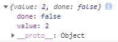

# 还没完呢

### Set/Map 数据解构

> ES6 提供的新的数据结构`Set`（类似于数组）
> ES6 还提供了`Map`数据结构（它类似于对象）

#### Set

> `Set`本身是一个构造函数，用来生成`Set`数据结构

1. Set函数可以接受一个数组（或者具有 iterable 接口的其他数据结构）作为参数，用来初始化

```js
const s = new Set()
const s1 = new Set([1, 2, 3, 4, 4]);    // {1, 2, 3, 4}
[...s1] // [1, 2, 3, 4]
```
2.  `add()`不会向`Set`结构添加重复的值

```js
// 基础用法
const s = new Set();
var arr = [2, 3, 5, 4, 5, 2, 2]
arr.forEach(x => s.add(x)); //s：{2, 3, 5, 4}

//数组去重
[...new Set(arr)]  
//Array.from方法可以将 Set 结构转为数组
const items = new Set([1, 2, 3, 4, 5]);
const array = Array.from(items);    
//封装成一个通用方法
function dedupe(array) {    //封装后的方法 dedupe
  return Array.from(new Set(array));
};

// 字符串去重
[...new Set('ababbc')].join('') // abc

// Set 内部，两个NaN是相等的
let a = NaN;
let b = NaN;
s.add(a);
s.add(b);     // Set {NaN}

// Set 内部，两个对象总是不相等的，即使看上去一样，它们也被视为是两个值
s.add({});
s.size // 1
s.add({});
s.size // 2
```
3. `Set` 实例的属性

* `Set.prototype.constructor`：构造函数，默认就是`Set`函数

* `Set.prototype.size`：返回`Set`实例的成员总数

4. `Set` 实例操作数据的方法

* `Set.prototype.add(value)`：添加某个值，返回 `Set`结构本身

* `Set.prototype.delete(value)`：删除某个值，返回一个布尔值，表示删除是否成功

* `Set.prototype.has(value)`：返回一个布尔值，表示该值是否为`Set`的成员

* `Set.prototype.clear()`：清除所有成员，没有返回值

> `Object结构`和`Set结构`的写法不同，`Object结构`也有判断是否是自己的成员，但是判断方法不同，详细可在[基础进阶一](./基础进阶一.md)中查看

```js
// 对象的写法
const obj = {
    key1:1,
    key2:2,
};

if (obj[objKey]) {  //判断 obj对象是否存在 objKey 属性
    console.log('很好，继续')
}

// Set的写法
const set = new Set();
set.add('key1');
set.add('key2');

if (set.has(setVal)) {
    console.log('干的不错')    
}
```
5. `Set` 实例遍历数据的方法

> `keys()`、`values()`、`entries()`（最好结合对象处对应的方法理解）用于遍历对象，但`Set`结构`没有键名，只有键值`（或者说键名和键值是同一个值），因此`keys()`/`values()`的行为完全一致。

* `Set.prototype.keys()`：返回键名的遍历器

* `Set.prototype.values()`：返回键值的遍历器

* `Set.prototype.entries()`：返回键值对的遍历器（返回的遍历器，同时包括键名和键值，所以每次输出一个数组，它的两个成员完全相等）

```js
let set = new Set([1, 2, 3]);
for (let item of set.keys()) {
  console.log(item);    // 1 2 3
}

for (let item of set.entries()) {
  console.log(item);    // [1, 1] [2, 2] [3, 3]
}
```
> 事实上，`Set` 结构的实例默认可遍历(不用遍历方法)，它的默认遍历器生成函数就是它的`values`方法，也就是说可以直接用`for...of`循环遍历`Set`

```js
Set.prototype[Symbol.iterator] === Set.prototype.values //true

//for...of
for (let x of set) {
    console.log(x);
}
```
* `Set.prototype.forEach()`：具体请参考[基础进阶二有关数组的部分](./基础进阶二.md)Set 结构的键名就是键值（两者是同一个值），因此第一个参数与第二个参数的值永远都是一样的

> `forEach`方法还可以有第二个参数，表示绑定处理函数内部的`this`对象。

#### WeakSet（不能遍历，强行遍历会返回undefined）

> `WeakSet 结构`与 `Set` 类似，也是不重复的值的集合。但`WeakSet`的成员**只能是对象**，否则报错

```js
const ws = new WeakSet();
ws.add(1)
// TypeError: Invalid value used in weak set
ws.add(Symbol())
// TypeError: invalid value used in weak set
```
> WeakSet 中的对象都是**弱引用**（垃圾回收机制不考虑`WeakSet` 对该对象的引用），也就是说，如果其他对象都不再引用该对象，那么垃圾回收机制会自动回收该对象所占用的内存，不考虑该对象还存在于 `WeakSet` 之中

**PS：`WeakSet`方法请参照`Set`（遍历方法除外，它不能遍历）**

#### Map   


### Class 类

> 在ES6中，`class`(类)作为**对象的模板**被引入，可以通过`class`关键字定义类；其本质就是`function`，只是它的出现让对象原型的写法更**清晰**，更像面向对象编程语法

#### 类声明/类定义

> 1. 类声明**不会提升**，也就是需要先声明，在访问，否则会报错
>
> 2. 且类声明**不可以重复**
>
> 3. 类必须使用 `new` 调用，否则会报错；普通构造函数不使用`new`也可以执行

**方式一：关键字声明**
```js
class Test{
    constructor(){
        //……
    }
}
```
**方式二：表达式定义**

```js
let Test = class{
    constructor(){
        //……
    }
}
let Test = class Test{
    constructor(){
        //……
    }
}
```
#### constructor => 构造方法

> * 看过上边我们会发现，每个类里都有一个 `constructor`的方法，其实`constructor`方法是类的默认方法，通过`new`命令生成对象实例时，自动调用该方法（默认返回实例对象 `this`）
>
> * 一个类必须有`constructor` 方法，如果没有显式定义，则会自动的将一个空的`constructor`方法添加到类中
>
> * 一个类只能拥有一个名为`constructor`的方法，如果有多个`constructor`方法，则会报`SyntaxError`错误
>
> * `constructor`中定义的属性可以称为实例属性（即定义在`this`对象上），`constructor`外声明的属性都是定义在原型上的，可以称为原型属性（即定义在`class`上)
>
> * `hasOwnProperty()`用于判断属性是否是实例属性

```js
//ES5（没有类）
function Person(name) { // 声明构造函数Person，首字母大写
    this.name = name;
}
Person.prototype.say = function(){  //在原型上定义say方法
    return "My name is " + this.name;
}
var obj = new Person("小明");   // 通过构造函数创建对象
console.log(obj.say()); // 实例对象调用原型方法say，打印：My name is 小明

//ES6（引入类）
class Person{   //定义/声明了一个名字为Person的类
    constructor(name){  //constructor是一个构造方法，用来接收参数
        this.name = name;   //this代表的是实例对象
    }   //没有‘，’ 分割，也不要加上‘，’否则会报错
    say(){  //这是一个类的方法，不能加上function
        return "My name is " + this.name;;
    }
}
var obj=new Person("小明");
console.log(obj.say()); // My name is 小明
```
#### 类中的方法

> 类的所有方法都定义在类的`prototype`属性上面，在类的实例上面调用方法，其实就是调用原型上的方法

PS：有关原型方法/静态方法/实例方法的相关了解可在[常识](./常识.md)中找到

**1. 静态方法**

> 静态方法（`class`本身的方法）可以通过**类名调用**，不能通过实例对象调用，否则会报错

```js
class Person {
    static sum(a, b) {  //静态方法,ES6 中规定，Class 内部只有静态方法，（没有）静态属性有规范，浏览器没有实现，。
        console.log(a + b)
    }
}
var p = new Person()    //p 是 Person 类的实例对象
Person.sum(1, 2)  // 3
p.sum(1,2)  //  TypeError p.sum is not a function
```
**2. 原型方法**

> 原型方法可以通过**实例对象调用**，但不能通过类名调用，会报错

```js
// 给 Person 的原型添加方法
Person.prototype.toVal = function() {
	console.log('I so cool')
}
//等同于
class Person {
    constructor(name,age){
        //……
    }
    toVal(){
        console.log('I so cool')
    }
}

//通过Object.assign为对象动态添加方法
console.log(Person.prototype);  //输出的结果是一个对象
Object.assign(Person.prototype,{
    getName:function(){
        return this.name;
    },
    getAge:function(){
        return 18;
    }
})
var obj=new Person("小明");
console.log(obj.getName());//小明
console.log(obj.getAge());//18
```
**3. 实例方法**

> 实例方法可以通过**实例对象调用**，但同样不能通过类名调用，会报错

```js
class Person {
    constructor() {
        this.sum = function() { //实例方法
            console.log('I so cool')
        }
    }
}
var p = new Person()
p.sum()       // I so cool
Person.sum()    // 报错
```
#### 继承

> 子类`constructor`方法中必须有`super`，且必须出现在`this`之前：（因为）子类没有`this`，需要使用`super`方法，调用父类的构造函数，将`this`绑定到自己身上
```js
/*
    ES5 继承 ==> 原型链继承
    B.__proto__.prototype = A.prototype  ==> 方法的继承
*/
function A (){}
var a = new A()
console.log(a.__proto__ == A.prototype) //true

/* 
    ES6 继承 ==> extends(关键字)
    B.__proto__ = A  ==> 构造函数的继承
*/
class A {
    constructor(){
        this.name = '小明'
    }
    print(){
        console.log(this.name)
    }
}
class B extends A {
    constructor(){
        super() //不写会报错，子类一定要调用super函数才能使用this
        this.name = '小红'
    }
}
var b = new B()
b.print()   //小红
```
> `super`作为对象，在普通方法中，指向**父类的原型对象**，在静态方法中，指向**父类**，此外还具有绑定子类`this`的功能

```js
class A {
    constructor(name = '默认小朋'){
        this.name = '小明'
    }
    print(){
        console.log('Father A')
    }
}
A.prototype.name = 'Name A'
class B extends A {
    constructor(){
        super() 
    }
    print(){
        console.log(super.name) //作为对象使用，在普通方法中，指向父类原型对象
    }
}
var b = new B()
b.print()  // Name A （如果没有‘A.prototype.name = 'Name A'’ 则是 undefined）
```
#### [Decorator函数](https://juejin.im/post/59f1c484f265da431c6f8940)

#### 其它

**1. 立即执行class**

```js
new class{
    //……
}
```
**2. this指向**

> 普通函数：谁调用指向谁
> 箭头函数：父级作用域


### Generator（生成器）

> 是ES6标准引入的**新的数据类型**。一个generator看上去像一个函数，但可以**返回多次**

1. `generator`由`function*`定义（注意多出的`*`号，普通函数没有），并且除了`return`语句，还可以用`yield`(关键字)返回多次

```js
function* test(x) {
    yield x + 1;
    yield x + 2;
    return x + 3;
}
```
以上就是一个简单的`generator`，按照普通函数的调用方法，我们可能会想到`test(1)`来执行函数，结果如下：


2. `generator`调用：通过上边的截图我们可以看出按照普通函数的调用方式`test(1)`，仅仅是创建了一个`generator`对象，还没有去执行它

**方法一：不断地调用`generator`对象的`next()`方法**

> `next()`方法会执行`generator`的代码，然后，每次遇到`yield`；就返回一个对象`{value: x, done: true/false}`，然后“暂停”。返回的`value`就是`yield`的返回值，`done`表示这个`generator`是否已经执行结束了。如果`done`为`true`，则`value`就是`return`的返回值。当执行到`done`为`true`时，这个`generator`对象就已经全部执行完毕，不要再继续调用`next()`了

由此，我们使用`test(1).next()`执行（这里只调用了一次），结果如下：



**方法二：直接用`for ... of`循环迭代`generator`对象**

> 这种方式不需要我们自己判断`done`

```js
for (var x of test(1)) {
    console.log(x); //2 3   (并没有返回 return 的返回值)
}
```
3. `generator`作用 ：

* `generator`可以在执行过程中**多次返回**，所以它看上去就像一个可以**记住执行状态**的函数，利用这一点，写一个`generator`就可以实现需要用面向对象才能实现的功能

* `generator`可以把**异步回调**代码变成**同步**代码

```js
// 不使用generator
ajax('http://url-1', data1, function (err, result) {
    if (err) {
        return handle(err);
    }
    ajax('http://url-2', data2, function (err, result) {
        if (err) {
            return handle(err);
        }
        ajax('http://url-3', data3, function (err, result) {
            if (err) {
                return handle(err);
            }
            return success(result);
        });
    });
});
// 使用generator
try {
    r1 = yield ajax('http://url-1', data1);
    r2 = yield ajax('http://url-2', data2);
    r3 = yield ajax('http://url-3', data3);
    success(r3);
}
catch (err) {
    handle(err);
}
```
4. 此外,作为对象属性时简写`generator`

```js
var obj = {
    * myGenerator() {
        yield 'hello world';
    }
};
//等同于
var obj = {
    myGenerator: function* () {
        yield 'hello world';
    }
};
```