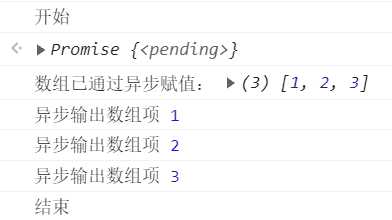
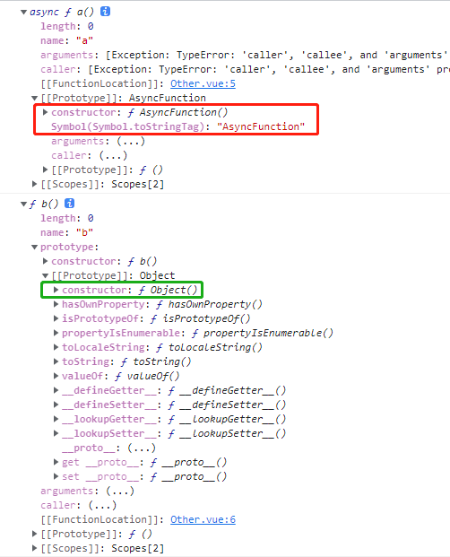
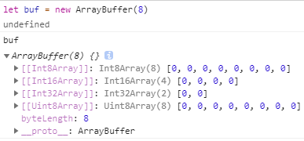
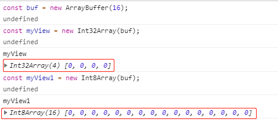

# 坚持到现在，不错~

## async 函数

> 在[ES6进阶一](./ES6进阶一.md)中我们了解到了两种异步操作解决方案（`Promise`，`Generator`），ES2017 引入的`async` 则使异步操作更加简单方便（可以将其理解为`Generator`语法糖）。

### 基本用法

> `Generator` 函数调用时，我们需要不断调用`.next()`（执行器），才能的到结果，这显得有些麻烦，`async` 函数就很好的解决了这一点（相当于自带执行器）。

1. `async` 函数声明

> 在常函数前加上`async`即可

- `async function test(){}`

- `let test = async function(){}`

-   `const test = async () => {};`

-   ```js
        let obj = { 
            async test(){} 
        };
    ```

-   ```js
        class test {
            async demo() {}
        }
        //调用时，别忘了 new test实例
    ```

2. `async` 函数调用

> 与正常函数一样，采用**函数名**.()方式即： `test()`

3. 与 `Generator`函数比较

> 可以理解为，`async`就是将`Generator`的：`*`换成了`async`；`yield`换成了`await`

- 内置执行器，执行方便（和普通函数一样）

- `async`和`await`，相较于`*`和`yield`，语义更清楚

- `await`命令后不做约束，适用性更好

    - `await`命令后可以是`Promise`对象，也可以是原始数据类型（数值、字符串、不尔值），会自动转成`resolved`的`Promise`对象

    - `yield`命令后只能是`Thunk`函数或`Promise`对象

- 返回值是 `Promise`，可以使用`then()`指定下一步操作（`Generator` 函数的返回值是 `Iterator`）

```js
// 引入node 模块（这里实现依次读取两个文件）
const fs = require('fs');
function readFile(path){
    return new Promise((resolve, reject) => {
        fs.readFile(path,function(err,data){
            if(err){
                console.log("读取文件失败！"); 
                resolve();  //方法调取，改变Promise 状态  
            }else{
                console.log("读取文件成功：",data.toString()); 
                resolve();  //方法调取，改变Promise 状态  
            }
        });
    })
}
// Generator
function* runReadFile(){
    yield readFile('./demo.txt');
    yield readFile('./index.html');
    return '结束';
}
for(var x of runReadFile()){}
// async
async function runReadFile(){
    await readFile('./demo.txt');
    await readFile('./index.html');
    console.log('执行完毕！');  //如果await 不返回一个Promise 对象，则会先执行此行
}
runReadFile();
```
> `await` **只能**配合`async`函数使用，在普通函数中会报错

### 返回值的变化理解

> 前面说到，`async`函数会返回一个`Promise`对象，所以它可以有`.then()`回调方法。而`async`函数内部的`return`的值，就是`.then（）`的参数。

```js
(async () => {
  console.log('有 async')
})()
/***华丽丽分割线***/
(() => {
  console.log('无 async')
})()
```


通过对比，可以很明显发现，`async`函数，无论有没有返回值，都会返回一个`Promise`，普通函数在未写返回值的情况下，会默认返回`undefined`

```js
async function demo(text){
    return text;
}
demo('我执行了').then(x => {
    console.log(x);
})
```
> 如果`async`函数内部抛出错误，会导致返回的`Promise`对象变为`reject`状态，抛出的错误对象会被`catch`方法回调函数接收到

```js
async function demo(){
    throw new Error('报错了！');    // new 一个错误对象
}
demo().then(    // Promise 对象
    s => {      // resolve - 成功状态执行
        console.log('执行成功');
    },
    e => {      // reject - 失败状态执行
        console.log(e);
    }
)
```
> `async`函数返回的`Promise`对象，必须等到内部所有`await`执行完，才会发生状态改变（才会执行`.then()`函数），此外，遇到`return`或**抛出错误**也会使状态发生改变。

* 因为`Sleep`对象，本身定义了`.then()`方法，所以如果`await`后边`Sleep`对象，也会当作`Promise`处理。

* 如果我们希望，一个异步操作失败，也不会影响后面的操作，这时就需要使用到`try...catch`

```js
async function test(){
    try { 
        await Promise.reject('出错了'); 
    }catch(e) {
        console.log(e);
    }
    try {
        throw new Error();  
    }catch(e) {
        console.log(e);
    }
    return await Promise.resolve('hello world');
}
test().then(s => console.log(s),e => console.log(e))
```

### 配合立即执行函数

实际应用中的异步远远不是这样简单的异步，如果在关联上循环，就会更复杂，这里有一个小技巧，利用立即执行函数，去书写异步等待，不但能减少变量定义，还能使代码更清晰。

```js
// 最外层写立即执行函数，是为了方便在控制台调用
(async function(){
  let arr = [];
  console.log('开始');
  let setTimer = new Promise(resolve1 => {
    setTimeout(() => {
      arr.push(1,2,3);
      console.log('数组已通过异步赋值：',arr);
      resolve1(arr);
    });
  });
  await setTimer.then(async res =>{
    // 在这里处理赋值后的数组
    for(let i=0;i<res.length;i++){
      // 在进行异步处理
      await (function (){
        return new Promise(async resolve2 => {
          setTimeout(() => {
            console.log('异步输出数组项',res[i]);
            resolve2();
          })
        });
      })();
    };
  });
  console.log('结束');
})();
```



### 判断函数是否标记了 async

> 要求是写一个方法`isAsyncFun`，用来判断传入的函数是否标记了**async**

分析：

1. 我们知道，**async** 函数回返回一个 `Promise`，因此可能会想到，调用传入的方法，判断返回值。这里有两个错误，首先，传入的方法作用未知，如果直接调用，可能会引起全局改变；其次即使没有标记 async 也可以返回`Promise`，比如：`function f(){ return new Promise() }`

2. 通过原型对比：



可以看到，二者构造函数不同，并且**async**标记的函数上有一个符号`Symbol(Symbol.toStringTag)`因此可以这样实现：

```js
function isAsyncFun (fun){
    return fun[Symbol.toStringTag] === 'AsyncFunction'
}
```

3. 我们在判断数组的时候经常用到`Object.prototype.toString.call()`这个方法，同理我们也可以用这个方法去判断 **async**函数，

```js
async function  a() {}
function  b() {}

console.log(Object.prototype.toString.call(a)); // [object AsyncFunction]
console.log(Object.prototype.toString.call(b)); // [object Function]
```

## [ArrayBuffer](https://es6.ruanyifeng.com/#docs/arraybuffer)

> JS没有直接处理二进制数据的能力，但可以通过一个接口 —— `ArrayBuffer`，以数组的语法处理二进制数据（二进制数组），使得JS具有了直接操作内存（更快）的能力，并有可能与操作系统原生接口进行二进制通信。

PS：这里的 `ArrayBuffer` 和`node`中的**缓存器**不完全一样哦！

### ArrayBuffer对象

> `ArrayBuffer`对象代表存储二进制数据的一段内存，不能直接读写，只能通过视图（以*指定格式*解读二进制数据）来读写。

- `ArrayBuffer`也是一个构造函数，可以通过`new`创建实例，并为其分配一段可以存放数据的连续内存区域。

```js
// 参数：所需内存大小（单位：字节）
let buf = new ArrayBuffer(32); 
```


- `ArrayBuffer.prototype.byteLength`：返回所分配的内存区域的字节长度

> 当分配内存很大时，有可能会失败（没有足够的连续的空余内存），此外分配长度不得超过`Number.MAX_SAFE_INTEGER`（超出报错）。

```js
let buf = new ArrayBuffer(888888888); 
if (buf.byteLength === n) {
    // 成功
} else {
    // 失败
}
```
- `ArrayBuffer.prototype.slice()`：将内存区域的一部分，拷贝生成一个新的`ArrayBuffer`对象。

```js
let buf = new ArrayBuffer(888);
// 参数：字节序号
let newBuf = buffer.slice(0, 33);   // 0 - 33，包含第一个，不包含第二个，如果只有一个参数，则默认至最后  
```
PS：除了`slice`方法，`ArrayBuffer`不提供任何直接读写内存的方法，只允许在其上方建立视图，然后通过视图进行读写!

- `ArrayBuffer.isView()`：（静态方法）表示参数是否为`ArrayBuffer`的视图（`TypedArray`或`DataView`）实例，返回布尔值。

### 视图

> `ArrayBuffer`对象作为内存区域，可以存放多种类型的数据。同一段内存，不同类型数据有不同的解读方式，这就叫做**视图（view）**，每一种视图类型都是一个构造函数，利用这些构造函数生成的数组，具有普通数组的属性和方法。

- `TypedArray`：存储的数据为**同一个**数据类型，连续

    - `Int8Array`：8 位有符号整数，长度 1 个字节（只能存放，8位2进制整数）。

    - `Uint8Array`：8 位无符号整数，长度 1 个字节。

    - `Uint8ClampedArray`：8 位无符号整数，长度 1 个字节，溢出处理不同。

    - `Int16Array`：16 位有符号整数，长度 2 个字节。

    - `Uint16Array`：16 位无符号整数，长度 2 个字节。

    - `Int32Array`：32 位有符号整数，长度 4 个字节。

    - `Uint32Array`：32 位无符号整数，长度 4 个字节。

    - `Float32Array`：32 位浮点数，长度 4 个字节。

    - `Float64Array`：64 位浮点数，长度 8 个字节。  

    > 不同的视图类型所能容纳二点数值范围是确定的，超出这个范围，就会出现溢出

    ```js

    ```

TypedArray 数组的溢出处理规则，简单来说，就是抛弃溢出的位，然后按照视图类型进行解释。

- `DataView`：存储的数据可以**不是同一个**数据类型。

    - `get/setInt8`：读取/写入 1 个字节，返回一个 8 位整数。

    - `get/setUint8`：读取/写入 1 个字节，返回一个无符号的 8 位整数。

    - `get/setInt16`：读取/写入 2 个字节，返回一个 16 位整数。

    - `get/setUint16`：读取/写入 2 个字节，返回一个无符号的 16 位整数。

    - `get/setInt32`：读取/写入 4 个字节，返回一个 32 位整数。

    - `get/setUint32`：读取/写入 4 个字节，返回一个无符号的 32 位整数。

    - `get/setFloat32`：读取/写入 4 个字节，返回一个 32 位浮点数。

    - `get/setFloat64`：读取/写入 8 个字节，返回一个 64 位浮点数。

```js
    // 向内存申请一块16个字节长度的连续内存
    const buf = new ArrayBuffer(16);    
    // 创建一个视图（32位有符号整数），一个32位整数占4个字节，所以这个视图可以存放（16/4）个整数
    const myView = new Int32Array(buf); // myView 就可以当成一个普通数组使用
```


PS：每种视图都有一个`BYTES_PER_ELEMENT`属性，表示这种数据类型占据的字节数。

## 装饰器[Decorator函数](https://juejin.im/post/59f1c484f265da431c6f8940)

## [上一篇：ES6进阶一](./ES6进阶一.md)

## [参考连接：阮一峰-ES6入门](http://es6.ruanyifeng.com)