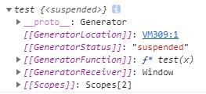

# 你以为结束了？天真！

### Generator 函数（生成器）

> 是ES6标准引入的**新的数据类型**。一个generator看上去像一个函数，但可以**返回多次**

#### generator由function*定义（注意多出的 * 号，普通函数没有），并且除了return语句，还可以用yield(关键字)返回多次

```js
function* test(x) {
    yield x + 1;
    yield x + 2;
    return x + 3;
}
```
以上就是一个简单的`generator`，按照普通函数的调用方法，我们可能会想到`test(1)`来执行函数，结果如下：



#### generator调用：

> 通过上边的截图我们可以看出按照普通函数的调用方式`test(1)`，仅仅是创建了一个`generator`对象，还没有去执行它

**方法一：不断地调用`generator`对象的`next()`方法**

> `next()`方法会执行`generator`的代码，然后，每次遇到`yield`；就返回一个对象`{value: x, done: true/false}`，然后“暂停”。返回的`value`就是`yield`的返回值，`done`表示这个`generator`是否已经执行结束了。如果`done`为`true`，则`value`就是`return`的返回值。当执行到`done`为`true`时，这个`generator`对象就已经全部执行完毕，不要再继续调用`next()`了

由此，我们使用`test(1).next()`执行（这里只调用了一次），结果如下：


**方法二：直接用`for ... of`循环迭代`generator`对象**

> 这种方式不需要我们自己判断`done`

```js
for (var x of test(1)) {
    console.log(x); //2 3   (并没有返回 return 的返回值)
}
```
#### generator作用 ：

- `generator`可以在执行过程中**多次返回**，所以它看上去就像一个可以**记住执行状态**的函数，利用这一点，写一个`generator`就可以实现需要用面向对象才能实现的功能

- `generator`可以把**异步回调**代码变成**同步**代码

```js
// 不使用generator
ajax('http://url-1', data1, function (err, result) {
    if (err) {
        return handle(err);
    }
    ajax('http://url-2', data2, function (err, result) {
        if (err) {
            return handle(err);
        }
        ajax('http://url-3', data3, function (err, result) {
            if (err) {
                return handle(err);
            }
            return success(result);
        });
    });
});
// 使用generator
try {
    r1 = yield ajax('http://url-1', data1);
    r2 = yield ajax('http://url-2', data2);
    r3 = yield ajax('http://url-3', data3);
    success(r3);
}
catch (err) {
    handle(err);
}
```
#### 此外,作为对象属性时简写generator

```js
var obj = {
    * myGenerator() {
        yield 'hello world';
    }
};
//等同于
var obj = {
    myGenerator: function* () {
        yield 'hello world';
    }
};
```