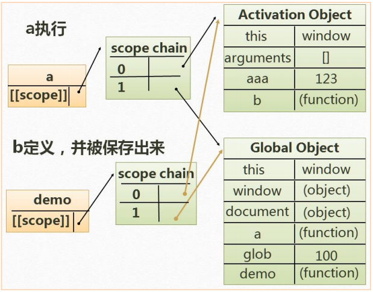

# 成为大佬的第一步

> 这里将从递归开始说起，详细分析预编译、闭包等js学习初期的重点、难点！至于什么语法啊、语句啊什么的，这里不多赘述。

### 递归(自己调用自己)

> 找规律，找出口，代码简介，效率慢。

递归最典型的例子就是阶乘，先来看一下常规写法：

```jsjs
function jc(n){
    for(var i = 1; i <= n; i ++){
        n *=i;
    }
}
```
接下来是递归写法：

```jsjs
function mul(n){
    if(n == 1 || n == 0){ //出口
        return 1;
    }
    return n * mul(n - 1); //规律
}

```
递归写**斐波那契数列**：

> 规律：从第3项开始，每一项都等于前两项之和 => 公式：n = (n-2)+(n-1)

```jsjs
function fb(n){
    if(n == 1 || n== 2){
        return 1;
    }
    return fb(n - 1) + fb(n - 2);
}
```
> 递归返回的顺序：先执行的最后被返回，最后执行完（等最底层的一层层返回）,所以慢，复杂算法不推荐使用递归。

### 预编译

> JS执行经过：语法分析 → 预编译 → 解释执行    ⬇（看下边）

> 1、检查语法错误 → 2、函数声明整体提升，变量-声明提升（不绝对）→ 3、解释执行

- **函数声明整体提升**：函数不管写到哪里，都会被提到逻辑的最前面。所以不管在哪里调用，本质上都是在后面调用

```jsjs
test(); 
function test(){
    console.log("a");
}
/**
分析：test()是函数调用，写在了函数声明前，按理来说，先执行，则函数未声明就调用因该报错，但执行结果并不会报错，就是因为函数声明提升。
*/
```
- **变量-声明提升**：把` var a `提升到最前面

如果有：`var a = 2;`,这里是变量声明加变量赋值，是两个操作，系统会把它解析为：`var a;`和`a = 2;`,前者提升，后者不变。

- **暗示全局变量[imply global ]** : 任何变量，如果变量未经声明就赋值，此变量就为全局对象(`window`)所有。

- **一切声明的全局变量，全是 window 的属性**

```jsjs
var a = 123; ==> window.a = 123;
```
#### 全局预编译

1. 生成了一个 GO 的对象 Global Object（window 就是 GO）

    - 没有声明就是赋值了，归 window 所有，就是在 GO 里面预编译

    - GO === window， GO 和 window 是一个东西

2. 找形参和变量声明，将变量和形参名作为 GO 属性名，值为 undefined

3. 在函数体里面找函数声明，值赋予函数体


#### 函数预编译[发生在函数执行的前一刻]（从这里开始可以看作是上边的详细解释）

1. 创建 AO 对象 Activation Object(执行期上下文，作用是理解的作用域，函数产生的执行空间库)

2. 找形参和变量声明，将变量和形参名作为 AO 属性名，值为 undefined

```jsjs
AO{
    a : undefined,
    b : undefined
}
```
3. 将实参值和形参统一（把实参值传到形参里）

4. 在函数体里面找函数声明，值赋予函数体（先看自己的 AO，再看全局的 GO）【到这里结束开始顺序执行】。

```jsjs
function test (a, b){ //实参 a、b
    console.log(a);
    c = 0;
    var c;
    a = 3;
    b = 2;
    console.log(b);
    function b (){};
    function d (){};
    console.log(b);
}
test(1); // 形参1 ——> a
/**
答题过程：
1. 找形参和变量声明，将变量和形参名作为 AO 属性名，值为 undefined, 
    AO{
        a : 1,
        b : undefined,
        c : undefined
    }
2. 函数声明 function b(){}和 function d(){}，
    AO{
        a : 1,  //将实参值和形参统一
        b : function b(){},
        c : undefined,
        d : function d(){}
    }
3. 开始执行（按顺序）
    执行：console.log(a);   //答案是 1
    执行：c = 0;
        AO{
            a : 1,
            b : function b(){},
            c : 0,
            d : function d(){}
        }
    var c 不用管，因为 c 已经在 AO 里面了
    执行：a = 3;改 
        AO{
            a : 3,
            b : function b(){},
            c : 0,
            d : function d(){}
        }
    执行 b = 2;
        AO{
            a : 3,
            b : 2,
            c : 0,
            d : function d(){}
        }
    执行：console.log(b);   //答案是 2
    function b () {}和 function d(){}已经提过了，不用管
    执行：console.log(b);   //答案是 2
*/
```
> 先生成 GO 还是 AO ？想执行全局，先生成 GO，在执行函数的前一刻生成 AO ；在几层嵌套关系，近的优先，从近的到远的，有 AO 就看 AO，AO 没有才看 GO 。

### 作用域链

- `[[scope]]` : 每个 javascript 函数都是一个对象，对象中有些属性我们可以访问，但有些不可以，这些属性仅供 javascript 引擎存取，`[[scope]]`就是其中一个。`[[scope]]`指的就是我们所说的作用域,其中存储了执行期上下文的集合。

- 作用域链 ：`[[scope]]`中所存储的执行期上下文对象的集合，这个集合呈链式链接，我们把这种链式链接叫做作用域链。

- 执行期上下文 : 当函数在执行的前一刻，会创建一个称为执行期上下文的内部对象。一个执行期上下文定义了一个函数执行时的环境，函数每次执行时对应的执行上下文都是独一无二的，所以多次调用一个函数会导致创建多个执行上下文，当函数执行完毕，执行上下文被销毁。

- 查找变量 ：在哪个函数里面查找变量，就从哪个函数作用域链的顶端依次向下查找。

> 在预编译的过程中，首先会生成一个GO（全局的执行期上下文），然后每个函数执行又会生成自己的AO，**作用域链**就可以理解为是这些 AO 和 GO 的集合，成链式排列。

### 闭包(凡是内部的函数被保存到外部，一定生成闭包)

> 当内部函数被保存到外部时，将会生成闭包。闭包会导致原有作用域链不释放，造成内存泄露(内存占用，内存被占用的越多，内存就变得越来越少了，就像内存被泄露了一样)。

```jsjs
function a(){
    function b(){
        var bb = 234;
        console.log(aa);
    }
    var aa = 123;
    return b;
}
var glob = 100; //这句话其实没啥用
var demo = a(); 
demo(); //如果不把 a 保存直接 a()，则无法执行b()
/**
答案：123
解析：因为没有 b()；此时 b 还是被定义的状态，和 a() 的状态是一样的。function a(){}是在 return b 之后才执行完，才销毁。return b 是把 b（包括 a 的 AO）保存到外部了（放在全局）当 a 执行完砍掉自己的 AO 时，b 依然可以访问到 a 的 AO(因为 return b)
*/
```


#### 作用

> 闭包会导致多个执行函数共用一个公有变量，如果不是特殊需要，应尽量防止这种情况发生。

1. 实现公有变量

```jsjs
functon add(){
    var cont = 0;
    function demo(){
        cont ++;
        console.log(cont);
    }
    return demo;
}
var  counter = add();
counter();  // 1
counter();  // 2 每回调用 counter 就会在原有基础上加一次

```
2. 可以做缓存（存储结构）

> 缓存是外部不可见的，但是确实有存储结构

3. 可以实现封装，属性私有化

4. 模块化开发，防止污染全局变量

> 函数调用后，其作用域和执行期上下文应该被销毁，但是因为闭包得存使得我们依然能够访问到这些本该销毁得东西，造成了内存泄漏。

### 立即执行函数

> 立即执行函数没有声明，在一次执行过后即释放（被销毁）。适合做初始化工作。针对初始化功能的函数：只想让它执行一次的函数；立即执行的函数也有参数，也有返回值，有预编译。

```jsjs
//写法一：
(functon (){}()); //建议这种写法
//写法二：
(function (){})();
```
- 只有表达式才能被执行符号执行

- 能被执行符号执行的表达式，这个函数的名字就会被自动忽略（放弃名字）

    > **函数声明**和**函数表达式**是两个东西，虽然都能定义函数;是函数声明，不能执行，报**语法错误**，

    ```jsjs
    //函数声明：
    function test (){} 

    //函数表达式：
    var test = function(){}
    ```

- 能被执行符号执行的表达式基本上就是立即执行函数

```jsjs
//1. 函数（匿名）声明，不能被立即执行，报语法错误
function (){
    var a = 123;
}()

//2.函数声明，但不会报错，也不会执行，且test()调用时并不会有实参传进去
function test (a, b, c, d){
    console.log(a + b + c + d);
}(1, 2, 3, 4);

//3. “+” 在趋势上要把他转换成数字，就是表达式，就能被执行；但名字被放弃，test()调用就会报错。
+ function test(){
    console.log("我会被执行！");
}()
```
> 放了`+`、`-`、`!` 就会放弃函数名，转换成表达式（可立即执行）；同样`*`、`/`、`&&`以及`||`前面放东西也行

```jsjs
function test(){
    var arr = [];
    for(var i = 0;i < 10;i++){
        arr[i] = function(){ //像数组中循环添加10个函数
            console.log(i);
        }
    }
    return arr;
}
var myArr = test();
for(var j = 0;j<10;j++){
    myArr[j](); //循环执行这10个函数；我们预期得结果应该是打印0~9，但真实结果却是10个10
}
/**
    解析：在给数组中赋值函数的时候，函数并未执行，打印的i等于函数调用时i的值，所以是10
*/

//解决：
function test (){
    var arr = [];
    for (var i = 0; i < 10; i ++){
        (function (j) {
            arr[j] = function () {
                console.log(j);
            }
        }(i)); //理解执行函数，执行后保存，且每次i的值都不一样，
    } 
    return arr;
} 
var myArr = test();
for (var j = 0; j < 10; j ++){
    myArr[j]();
}
```

### 构造函数

> 构造函数和函数结构上没有任何区别

#### 对象

创建对象的方法：

1.  var obj = {} 对象字面量/对象直接量 plainObject

2. 构造函数：
    - 系统自带的构造函数：`new` ——> `Object();`、`Array();`、`Number();`、`Boolean();`、`Date();`

    - 自定义：Object.create(原型)方法，自定义构造函数，new出对象

    > 构造函数必须要按照**大驼峰式**(首字母大写)命名规则，但凡是构造函数就要大写(不是说小写就不是构造函数,只是这样是一种规则,便于开发,维护)

属性的增 删 改 查

- 增 改 查 : 都可以通过 `对象名.属性名`进行操作

- 删 : 必须借助 `delete` ----> `delete 对象名.属性名`

#### 构造函数内部原理

前提必须要加 new(普通函数new后,就会产生构造函数的作用)，以下三步都是隐式的：

1. 在函数体最前面隐式的加上 `var this = {}` 空对象
```jsjs
AO {this:{}}
```
2. 执行 `this.xxx = yyy`(执行函数内容)

```jsjs
AO {this:{
    xxx : yyy
}}
```
3. 隐式的返回 `return this`

```jsjs
var this = {
    xxx : yyy
}
```
> `new`之后不能返回原始值,如果人为的写上`return`,以返回值为主,但如果人为 `return 原始值`,则还是返回`this`

#### 包装类

> 只有原始值数字是原始值，原始值不能有属性和方法

```jsjs
var num = new Number(123);  //构造函数 123 ---> 对象,仍能参与运算,运算后变成原始值(没有属性和方法) 
var str = new String(‘abcd’); //字符串类型对象
var bol = new Boolean(‘true’); //布尔类型对象
```
原始值**不可能**有*属性*和*方法*，但经过了**包装类**(加隐式)可以调用一些属性与方法。

```jsjs
var num = 4;
num.len = 3; //添加属性,原始值没有属性和方法，按理说应该报错，但实际并不会报错
//系统隐式的加上 new Number(4).len = 3; 然后 delete ---> （销毁）
console.log(num.len);
//系统隐式的加上 new Number(4).len; 但是这个 new number 和上面的 new number 不是同一个，所以返回 undefined
```
> 而上面这些隐式的过程就是包装类

```jsjs
var str = "abc";
str +=1; 
var test = typeof(str); //返回结果 ---> string (原始值)
if(test.length == 6){ 
    test.sign = "随便什么"; //原始值赋值要调用包装类
    // new String(test).sign="随便什么"; 然后delete
}
console.log(test.sign); //还是要调用包装类，重新new （隐式的）一个对象出来，这个并没有被赋值

// 答案：undefined
```

### 原型/原型链

> 绝大多数对象都会继承自`Object.prototype`（原型链终端）

#### 原型[prototype]

> 构造函数.prototype  ---> 原型属性

1. 原型是 function 对象的一个属性，它定义了构造函数制造出的对象的公共祖先。通过该构造函数产生的对象，可以继承该原型的属性和方法。原型也是对象。

2. 利用原型特点和概念，可以提取公有属性。

    > 一个对象上的会继承它的原型上的属性和方法

3. 对象属性的增删和原型上属性增删改查。

4. 每个对象都有一个隐式属性 `__proto__`，它里边存储着对象的原型。

    > `__xxx__` 这种前后两个`_`的命名方式是系统自带的，尽量不要修改。

    - （构造函数）对象.`__proto__` ==> 构造函数原型，可以被修改。

    ```jsjs
    Persong.prototype.name = "Jone"  //在原型上添加属性
    function Person(){//声明一个构造函数
        //var this = {
        //    __prptp__:Person.prototype   //隐式的就有这些
        //};
    }  

    //场景一：
    var person = new Person();  //new 一个（Person）新对象 
    prtson.name == "Jone"   //true

    //场景二：
    var obj = {
        name:'Sunny'
    }
    var person = new Person();
    person.__proto__ = obj; //改变原型
    prtson.name == "Sunny"   //true
    ```
5. 查看对象的构造函数 ==> `constructor`[构造器]，原型上的方法，可手动更改

    > （构造函数）对象.constructor  ---> 返回这个对象的构造函数(可更改)

    > 构造函数.prototype.constructor

6. `Object.create(原型/null)` 也能创建对象，原型需要自己指定,如果是`null`则该对象没有原型

    > 正因为`Object.create`的存在，才使得不是所有的对象的原型都集成自`Object.prototype`

    > 人为的给`Object.create`创建出来的对象添加`__proto__`（原型）是不好使的，系统不会读。

    > `document.write(xxx);` 这个的作用是在页面上打印括号内的东西，但实际上，它隐式的调用了`xxx.toString()`方法,也就是说如果括号内的东西没有`toString()`,就会**报错**，如果该方法**重写**会打印重写内容。

> `undefined/null`就是单纯的原始值，没有包装类，没有原型，也就没有 `toString()`方法。

### call/apply ==> 改变this指向

#### call

- `Person.call()` <==> `Person()` ==> 当`call`内的参数为空时，二者**无区别**

- `Person.call(obj)` ==> 当`call`内有参数时，**第一个参数作为方法的this指向**，后边的参数作为对应的实参。

```js
function Person(name,age){
    this.name = name;  //改变this 指向后，相当于==> obj.name = name;下同
    this.age = age;
}
var obj = {} //借用方法，实现自己的属性。
Person.call(obj,'yu',100); //this,指向obj
```
- 使用举例==>企业开发（更复杂）基础框架

> 两个方法必须是**完全涵盖**的关系，无法不使用其中某一个属性。

```js
function Person(name,age,sex){
    this.name = name;
    this.age = age;
    this.sex = sex;
}
function Student(name,age,sex,tel,grade){ //包含Person所有属性
    Person.call(this,name,age,sex); //Person方法执行，将Person的this指向改变为了this,而这里的this指的是Student
    this.tel = tel;
    this.grade = grade;
}

var student =  new Student('yu',22,'m',177,2019);
```
#### apply
 
> 和 call 作用上没有区别，但二者**传参数列表不同**

- `apply` 参数，除了第一位是this指向外，只能再有一个参数`argument`==>数组

```js
Person.call(this,[name,age,sex]);
```
#### [上一篇：常识](常识.md)

#### [下一篇：基础进阶二](基础进阶二.md)