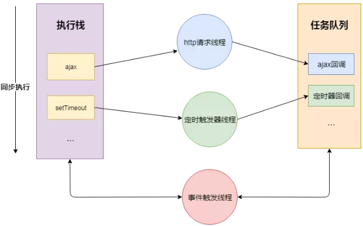
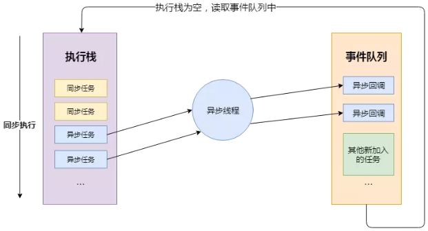

# JS基础知识了解

### 历史

> Mosaic(马赛克)，是互联网历史上第一个获普遍使用和能够显示图片的网页浏览器，于1993年问世。

> JavaScript【作者：Brendan Eich】 作为 Netscape Navigator 浏览器的一部分首次出现在 1996 年。它最初的设计目标是改善网页的用户体验。

> 期初 JavaScript 被命名为 LiveScript，后因和 Sun 公司合作，因市场宣传需要改名JavaScript。后来 Sun 公司被 Oracle 收购，JavaScript 版权归 Oracle 所有。

### 浏览器组成

1. shell 部分——用户能操作部分(壳)

2. 内核部分——用户看不到的部分

    - 渲染引擎（语法规则和渲染）

    - js 引擎

    > 2001 年发布 ie6，首次实现对 js 引擎的优化。2008 年 Google 发布最新浏览器 Chrome，它是采用优化后的 javascript 引擎，引擎代号 V8，因能把 js 代码直接转化为机械码来执行，进而以速度快而闻名。

    - 其他模块（如异步）

### JS语言特性

1. 解释性语言：看一行翻译一行，不生成特定文件（PHP、python），跨平台，但是稍微慢点。

2. 单线程：同一时间只做一件事。

### JS运行机制

> 同步：等待结果；异步：不等待结果

- JS分为同步任务和异步任务,JS代码在执行时，本身是同步任务，而其中的回调函数才是异步任务。

    > 同步任务执行完，JS引擎线程会询问事件触发线程，在事件队列中是否有待执行的回调函数，如果有就会加入到执行栈中交给JS引擎线程执行

    

- 同步任务都在JS引擎线程上执行，形成一个**执行栈**

- 事件触发线程管理一个任务队列，异步任务触发条件达成，将回调事件放到任务队列中

- 执行栈中所有同步任务执行完毕，此时JS引擎线程空闲，系统会读取任务队列，将可运行的异步任务回调事件添加到执行栈中，开始执行

    

> 通俗的讲，js将时间分割成相等的时间片段，分配到执行栈中，栈中的每个任务执行完分配到的时间后，就会挂起，执行下一个时间片，这样循环直到栈空（轮转时间片），只是时间太快，我们感受不到等待时间。

### 主流浏览器（独立内核，市场份额大于3%）

- IE ——> trident

- chrome ——> webkit/blink

- firefox ——> gecko

- opera ——> presto

- safari ——> webkit

### 原始值[primitive]（栈数据，不可改变）

> 存储在栈（stack）中的简单数据段，也就是说，它们的值直接存储在变量访问的位置。

- `Number` ：数字,例 var a = 123;

- `String` ：字符串,语言放双引号里，例 var a=”语言”，““是空串

- `Boolean` ：布尔数字,就两个值，false，true

- `Undefined` ：是没有定义的，表示还没赋值,仅一个值 underfined

- `Null` ：代表空，占位用，用空值来覆盖

> 不可改变并不是说原始值变量不可更改，已经放进去的值不可改变，只会改房间编号为 null(硬盘原理)

```
    var a = 10; //声明a,赋值10
    var b = a; //b等于a的值，10
    a = 20; //改变a的值
    console.log(b); 
    /**
    答案：10
    解析：原始值是把一个值放到另一个值里面，改了第一个值，第二个值不变
    */
```
### 引用值（堆数据）

> 存储在堆（heap）中的对象，也就是说，存储在变量处的值是一个指针（point），指向存储对象的内存处。

- 对象：数组、function、正则……

```
    var arr = [1];
    var arr1 = arr;
    arr.push(2);
    console.log(arr1);
    /**
    答案：[1,2]
    解析：引用值是把第一个值放到第二个值里面，改第一个值，第二个值也改变,arr 是 1,2;arr1 是 1,2。
    
    */
```
### 精度

> JS 精度不准，这是一个无法解决的**BUG**，所以不用做数据处理数据。

- 可正常计算的范围，小数点**前 16 位**，**后 16 位**

    > 0.1000000000000001 + 0.1000000000000001 = 0.2000000000000002

- 0.14 * 100 = 14.000000000000002  ==> 因此，再用JS计算数据时，**尽量避免小数操作**，如果需要使用尽量利用`Math.floor()`==> 向下取整，或 `Math.ceil()`==> 向上取整，减少`.toFixed(n)`==>保留*n*位小数。

