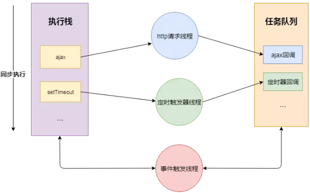
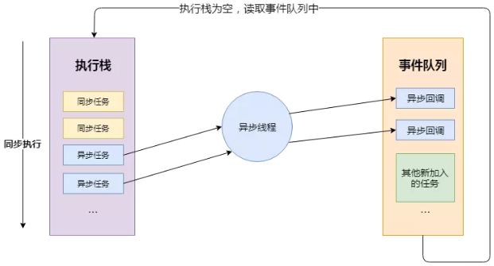
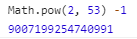

# JS基础知识了解

### 历史

> Mosaic(马赛克)，是互联网历史上第一个获普遍使用和能够显示图片的网页浏览器，于1993年问世。

> JavaScript【作者：Brendan Eich】 作为 Netscape Navigator 浏览器的一部分首次出现在 1995 年。它最初的设计目标是改善网页的用户体验。

> 期初 JavaScript 被命名为 LiveScript，后因和 Sun 公司合作，因市场宣传需要改名JavaScript。后来 Sun 公司被 Oracle 收购，JavaScript 版权归 Oracle 所有。

### JS语言特性

1. 解释性语言：看一行翻译一行，不生成特定文件（PHP、python），跨平台，但是稍微慢点。

2. 单线程：同一时间只做一件事。

### 当浏览器遇到 JS 文件

- JS 的加载、解析与执行会阻塞文档的解析，也就是说，在构建 DOM 时，HTML 解析器若遇到JS，那么它会暂停文档的解析，将控制权移交给 JS 引擎，等 JS 引擎运行完毕，浏览器再从中断的地方恢复继续解析文档。

- 如果想首屏渲染的越快，就越不应该在首屏就加载 JS 文件，这也是都建议将 script 标签放在 body 标签底部的原因。

- 这并不是说 script 标签必须放在底部，因为你可以给 script 标签添加 defer 或者 async 属性。

### async 和 defer 的作用、区别

1. `<script src="script.js"></script>`： 没有 defer 或 async，浏览器会立即加载并执行指定的脚本，也就是说不等待后续载入的文档元素，读到就加载并执行。

2. `<script defer src="script.js"></script>`：defer 属性表示延迟执行引入的 JavaScript，即这段 JavaScript 加载时 HTML 并未停止解析，这两个过程是并行的。当整个 document 解析完毕后再执行脚本文件，在 DOMContentLoaded 事件触发之前完成。多个脚本按顺序执行。

3. `<script async src="script.js"></script>`：async 属性表示异步执行引入的 JavaScript，与 defer 的区别在于，如果已经加载好，就会开始执行，也就是说它的执、行仍然会阻塞文档的解析，只是它的加载过程不会阻塞。多个脚本的执行顺序无法保证。


### JS运行机制

> 同步：等待结果；异步：不等待结果

- JS分为同步任务和异步任务,JS代码在执行时，本身是同步任务，而其中的回调函数才是异步任务。

    > 同步任务执行完，JS引擎线程会询问事件触发线程，在事件队列中是否有待执行的回调函数，如果有就会加入到执行栈中交给JS引擎线程执行

    

- 同步任务都在JS引擎线程上执行，形成一个**执行栈**

- 事件触发线程管理一个任务队列，异步任务触发条件达成，将回调事件放到任务队列中

- 执行栈中所有同步任务执行完毕，此时JS引擎线程空闲，系统会读取任务队列，将可运行的异步任务回调事件添加到执行栈中，开始执行

    

> 通俗的讲，js将时间分割成相等的时间片段，分配到执行栈中，栈中的每个任务执行完分配到的时间后，就会挂起，执行下一个时间片，这样循环直到栈空（轮转时间片），只是时间太快，我们感受不到等待时间。

#### JS 加载时间线

> 依据 js 出生的那一刻起，记录了一系列浏览器按照顺序做的事（就是一个执行顺序）

> 时间线步骤：创建 document 对象 ==> 文档解析完 ==> 文档解析完加载完执行完

1. 创建 Document 对象，开始解析 web 页面。解析 HTML 元素和他们的文本内容后添加 Element 对象和 Text 节点到文档中。这个阶段 `document.readyState ='loading'`。

2. 遇到 `link` 外部 `css`，创建线程，进行异步加载，并继续解析文档。

3. 遇到 `script` 外部 `js`，并且没有设置 `async、defer`，浏览器同步加载，并阻塞，等待 `js` 加载完成并执行该脚本，然后继续解析文档。

4. 遇到 `script` 外部 `js`，并且设置有 `async、defer`，浏览器创建线程异步加载，并继续解析文档。对于 `async` 属性的脚本，脚本加载完成后立即执行。（异步禁止使用 `document.write()`，因为当你整个文档解析到差不多，再调用 `document.write()`，会把之前所有的文档流都清空，用它里面的文档代替）

5. 遇到 `img` 等（带有 `src`），先正常解析 dom 结构，然后浏览器异步加载 `src`，并继续解析文档。 看到标签直接生产 dom 树，不用等着 `img` 加载完 `scr`。
6. 当文档解析完成（`domTree` 建立完毕，不是加载完毕），`document.readyState ='interactive'`。

7. 文档解析完成后，所有设置有 `defer` 的脚本会按照顺序执行。（注意与 `async` 的不同,但同样禁止使用 `document.write()`）;

8. `document` 对象触发` DOMContentLoaded` 事件，这也标志着程序执行从同步脚本执行阶段，转化为事件驱动阶段。

9. 当所有 async 的脚本加载完成并执行后、img 等加载完成后（页面所有的都执行加载完之后），`document.readyState = 'complete'`，`window` 对象触发 `load` 事件。

10. 从此，以异步响应方式处理用户输入、网络事件等。


### 原始值[primitive]（栈数据，不可改变）

> 存储在栈（stack）中的简单数据段，也就是说，它们的值直接存储在变量访问的位置。

- `Number` ：数字,例 var a = 123;

- `String` ：字符串,语言放双引号里，例 var a=”语言”，““是空串

- `Boolean` ：布尔数字,就两个值，false，true

- `Undefined` ：是没有定义的，表示还没赋值,仅一个值 underfined

- `Null` ：代表空，占位用，用空值来覆盖

- `Symbol` ： （ES6引入）详细请看[ES6](./ES6.md)

> 不可改变并不是说原始值变量不可更改，已经放进去的值不可改变，只会改房间编号为 null(硬盘原理)

```js
    var a = 10; //声明a,赋值10
    var b = a; //b等于a的值，10
    a = 20; //改变a的值
    console.log(b); 
    /**
    答案：10
    解析：原始值是把一个值放到另一个值里面，改了第一个值，第二个值不变
    */
```

### 引用值（堆数据）

> 存储在堆（heap）中的对象，也就是说，存储在变量处的值是一个指针（point），指向存储对象的内存处。

- 对象：数组、function、正则……

```js
    var arr = [1];
    var arr1 = arr;
    arr.push(2);
    console.log(arr1);
    /**
    答案：[1,2]
    解析：引用值是把第一个值放到第二个值里面，改第一个值，第二个值也改变,arr 是 1,2;arr1 是 1,2
    */
```

### 判断数据类型

#### typeof

> 常用的数据类型判断方法，但是不准确且存在一个错误判断，它可以得到的结果有：`boolean`，`number`，`string`，`undefined`，`symbol`，`object`，`function`，`bigint`

- 错误判断：`null`是基本数据类型，但设计的时候`null`是全**0**，而对象是**000**开头，所以有这个误判。

```js
typeof(null) => "object"
```

- 无法区分数组和对象：数组属于特殊类型的对象，使用`typeof`无法具体判断二者

```js
let arr = [1,2,3];
typeof(arr) => object
```

#### Object.prototype.toString.call()

> 该方法可以准确判断数据类型

```js
let arr = [1,2,3]
Object.prototype.toString.call(); => [object Array]
```

#### 1 与 Number(1)有什么区别

- var a = 1 是一个常量，而 Number(1)是一个函数

- new Number(1)返回的是一个对象

- a == b 为 true 是因为在求值过程中，总是会强制转为原始数据类型而非对象，

```js
var a = Number(1);  // 1
var b = new Number(1); // Number {[[PrimitiveValue]]: 1}
typeof a;   // number
typeof b;   // object
a == b;     // true
```

### 精度

> JS 精度不准，这是一个无法解决的**BUG**，所以不用做数据处理。

- 可正常计算的范围，小数点**前 16 位**，**后 16 位**

    > 0.1000000000000001 + 0.1000000000000001 = 0.2000000000000002

- 0.14 * 100 = 14.000000000000002  ==> 因此，再用JS计算数据时，**尽量避免小数操作**，如果需要使用尽量利用`Math.floor()`==> 向下取整，或 `Math.ceil()`==> 向上取整，减少`.toFixed(n)`==>保留*n*位小数。

### 最大安全整数

> JavaScript 的数字存储使用了`IEEE 754`中规定的双精度浮点数数据类型，而这一数据类型能够安全存储 `-(Math.pow(2, 53) -1)` 到 `Math.pow(2, 53) -1` 之间的数值（包含边界值），一旦超出该范围可能会出现存不下的情况（程序里可能会报错）。

- JS 中存在一个全局常量 `Number.MAX_SAFE_INTEGER` -> 最大安全整数

- 


### 三目运算符

`判断条件 ? 是 : 否`

### 程序错误

> `debugger;` --> 在代码断点

#### try catch

> 错误捕捉,它不会让其后的代码终止（try内代码报错，try内终止执行，其后边的不受影响）

```js
try{
    //不确定是否有错误的代码
}catch(e){ //参数是错误对象，只有两个信息:name/message
    //try中代码报错，执行这里的代码
}
```
#### Error.name --> 错误名称

1. `EvalError` : `eval()`的使用与定义不一致

2. `RangeErro` : 数值越界

3. `ReferenceError`：非法或不能识别的引用数值

> 未经声明就使用，没有定义就使用

4. `SyntaxError`：发生语法解析错误

> Syntax 是语法解析()

5. `TypeError`：操作数类型错误

6. `URIError`：URI 处理函数使用不当

> 引用地址错误

### es5 严格模式

> 浏览器是基于 es3.0 和 es5.0 的新增方法使用的，如果两种发生了冲突，就用 es3.0

**es5.0 严格模式是指 es3.0 和 es5.0 产生冲突部分就是用 es5.0，否则就用 es3.0**

#### 启动

`"use strict";` --> 写成字符串向后兼容

> 写在逻辑代码最前边

1. 全局严格模式

2. 局部函数内严格模式（推荐）就是一行字符串，不会对不兼容严格模式的浏览器产生影响

3. ES6 模块自动采用严格模式，不管有没有在模块头部加上`use strict`

#### 约束（不支持）

1. 不支持 `with`--> 可用于简化代码（命名空间）

> with 过于强大，可以改作用域链，失去效率，所以 es5.0 不能用

```js
var obj = {
    name : '小红'
}
function demo(){
    var name = "小明";
    with(obj){  //with 里的参数会作为这个函数作用域链的最顶端
        console.log(name);  //打印小红
    }
}

```
2. `arguments.callee`，`function.caller` 不能用

3. 变量赋值前必须声明

> 非严格模式：未声明变量就使用，暗示全局变量

4. 局部`this`必须被赋值(赋值什么就是什么)

> 严格模式下，预编译阶段 `this` 不在指向`window`,它没有指向（undefined）

5. 拒绝重复属性(不报错,后边的会覆盖前边的)和参数(会报错)

6. `eval()`(使用正确并不会报错，但**尽量不要使用**) --> 可以把字符串当代码执行

> 约定俗成在 es3.0 中都不能使用 eval

> eval 是魔鬼，因为会改变作用域

```js
var a = 123;
eval('console.log(a)'); //打印123
```
7. 不能对只读属性赋值，否则报错

8. 不能使用前缀 0 表示八进制数，否则报错

9. 不能删除不可删除的属性，否则报错

10. 不能删除变量`delete prop`，会报错，只能删除属性`delete global[prop]`

11. 增加了保留字（比如`protected`、`static`和`interface`）

### this 指向

> `this`代表函数调用相关联的对象，通常称之为**执行上下文**

- 作为函数直接调用，非严格模式下：`this`指向`window`；严格模式下：`this`指向`undefined`。

- 作为某对象的方法调用，`this`通常指向调用的对象。

- 使用`apply`、`call`、`bind`可以绑定this的指向。

> 如果对一个函数进行多次`bind`，函数中的`this`永远有第一个`bind`决定。

- 在构造函数中，`this`指向新创建的对象。

- 箭头函数没有单独的`this`值，`this`在箭头函数创建时确定，它与生明所在的上下文相同。

### 定时器

> `setInterval()`;`setTimeout()`;`clearInterval()`;`clearTimeout()`;这四个都是全局对象，都是 `window` 上的方法，内部函数 `this` 指向 `window`

#### setInterval --> 循环执行

> 计算时间非常不准

```js
//常规使用
setInterval(function (){
    //定时执行函数体
},30); //30是间隔时间，以毫秒（ms）为单位 [ 1s = 1000ms / 1ms = 0.001s ]
```

#### clearInterval --> 让 setInterval 停止

> 清除定时器，需要先给定时器绑定到一个变量上;一般写了`setInterval`就要写 `clearInterval`

```js
var timer = setInterval(function (){},500);
clearInterval(timer);  //清除定时器
```

#### setTimeout() --> 延迟执行

> 正真的定时器,隔了一段时间后再执行（起推迟作用），并且只执行一次

```js
setTimeout(function (){
    //定时执行函数体
},300);//300毫秒后执行（延迟300毫秒执行）
```

#### clearTimeout() --> 让setTimeout() 停止

```js
var timer = setTimeout(function (){
    console.log('我不会被打印……');
},1000); //延迟执行
clearTimeout(timer);    //还没等timer执行就清除了它，所以它不执行
```

### Date 对象

>  Date 是系统提供的一个构造函数，通过 new Date 的方法会给我们返回一个对象，这个对象就是一个**日期**对象。

ps：Data 有很多方法，这里就举几个常用方法

- `Date()` : 返回当日的日期和时间。

- `getDate()` : 制造出对象,从 Date 对象返回一个月中的某一天 (1 ~ 31)。

- `getDay()` : 今天是一周的第几天,如果是 2 是星期二,但是是指第三天(第一天是周日,也就是 0)。从 Date 对象返回一周中的某一天 (0 ~ 6)。

- `getMonth()` : 一月份返回值是 0，从 Date 对象返回月份 (0 ~ 11)。

- `getFullYear()` : 从 Date 对象以四位数字返回年份。

- `getTime()` : 【最有用】返回 1970 年 1 月 1 日（纪元时刻）至今的毫秒数；经常用于项目的计算时间。获取时间戳

- `setDate()` : 设置 Date 对象中月的某一天 (1 ~ 31)。

- `setMonth()` : 设置 Date 对象中月份 (0 ~ 11)。

- `setFullYear()` : 设置 Date 对象中的年份（四位数字）。

###  实例方法 / 原型方法 / 静态方法 

1. 构造函数中的`this`指向的是新创建的实例。因为在此往`this`上添加方法与属性时，其实是在往新创建的实例上添加属性与方法，所以构造函数中的实例方法可称之为**实例方法**

2. 通过 `prototype` 添加的方法，将会挂载到原型对象上，因此称之为**原型方法**（也属于实例方法）

3. 这些直接挂载到构造函数上面，我们称之为**静态方法**

**实例方法（原型方法） 和 静态方法的区别**

*  从定义上讲：实例方法要用到`function`这个对象中的`prototype`属性来定义；静态方法通过`A.`直接定义

* 从调用上讲：静态方法可以直接通过`A.`来调用；实例方法要通过先定义一个引用变量，指向构造函数定义的新对象（`new` 一个新对象）

```js
//静态方法
function A(){}
A.sayMeS=function(){
    console.log("Hello World S!");
}
A.sayMeS(); //输出Hello World S!

// 实例方法(原型方法)
function A(){}
A.prototype.sayMeE=function(){
    console.log("Hello World E!");
}
var a = new A();
a.sayMeE();//输出Hello World E!
```
> 实例方法就是只有实例可以调用，静态方法只有构造函数可以调用，原型方法是实例和构造函数都可以调用，是共享的方法。

> 像`Promise.all`和`Promise.race`这些就是静态方法，`Promise.prototype.then`这些就是原型方法，`new` 出来的实例可以调用

### [下一篇：基础进阶一](基础进阶一.md)