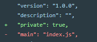
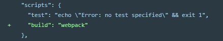

# 别停下来，才刚刚开始

### 冷知识点

1. `Function.prototype` ： 构造函数原型

### 防抖节流

> 用户行频繁的触发事件执行，对于DOM操作，资源加载等都是十分耗费性能，很可能导致**页面卡顿**甚至是**浏览器崩溃**

#### 防抖

> 在函数需要频繁触发时，预留足够的空闲时间，在执行下一次（搜索、拖拽等）

```js
function test(){
    var timer = null;//声明定时器 
    clearTimeout(timer);//清除定时器
    timer = setTimeout(function (){
        //函数体
    },1000);    //延迟执行
}
```
> 主要思想：利用定时器，使函数延迟执行（在[Currency.js](../优化/封装/Currency.js)内有封装方法）

#### 节流

> 预定一个函数只有在**大于等于**执行周期时才执行，周期内调用不执行（窗口调整、页面滚动、疯狂点击等）

> 例如点击事件，(节流后)1s 内点了10下，但事件只触发一下

```js
function test(){
    //函数体
}
oBtn.onclick = test;
//我们想点击一次执行一次，但如果我们利用控制台：
for(var i = 0;i<1000;i++){oBtn.click()} 
//这样一来就可以迅速执行1000次，远远超过点击速度（所以要节流）
```
> 主要思想：计算 **此次执行时间** - **上次执行时间** >= **等待时间** ，（在[Currency.js](../优化/封装/Currency.js)内有封装方法）

### ajax

> 用 JS **异步**操作，获取数据

> 人类：异步（你干这个就不能干那个，不能同时）

> 计算机（我干我的，你干你的，不耽误）

method : get、pust……
action : address
enctype : 规定在发送 表单数据之前如何对其进行编码

### 模块化开发

#### 模块

```js
module.exports = {
    hello:function(){
        console.log('hello word');
    }
}
```

#### 引入

```js
var tool = require('xx/xx.js'); //在需要引入模块的js文件内引入模块js
tool.hello()    //调用模块内的hello方法
```

### [webpack[4.x]](https://www.webpackjs.com/)

> 使用 webpack 前需要安装[node.js](http://nodejs.cn/)

#### 安装

1. 全局安装

```js
npm install --global webpack
```

2. 进入到项目文件夹下（命令行），初始化项目

`npm init -y`

> 安装完成后，项目文件夹下会多出一个名为 `package.json`的文件 

为了确保我们安装包是私有的(`private`)，并且移除 `main` 入口，以防止意外发布代码，需要对`package.json`文件做出修改



3. 项目文件夹下，（本地）安装webpack

```js
//安装最新版本
npm install --save-dev webpack
//安装固定版本
npm install --save-dev webpack@<version>
```
> 多出名为：`node_modules`的文件夹，和`package-lock.json`文件

4. 如果是` webpack 4+` 版本，还需要安装 CLI

```js
npm install --save-dev webpack-cli
```
> 到此，安装基本文完成，但通常情况我们还需要下面的步骤

5. 在`package.json`同路径下创建`webpack.config.js`

> `webpack.config.js`是一个配置文件，后边会单独说一下

6. 打包

`npm run build` 

> 想要使用这个指令，需要对`package.json`文件做出修改




#### loader[装载机]

> `loader` 用于对模块的源代码进行**转换**。`loader` 可以使你在 `import` 或“加载”模块时**预处理**文件。因此，`loader` 类似于其他构建工具中的“**任务(task)**”，并提供了**处理前端构建步骤的强大方法**。`loader` 可以将文件从不同的语言（如 `TypeScript`）转换为 `JavaScript`，或将内联图像转换为 `data URL`。`loader` 甚至允许你直接在 `JavaScript` 模块中 `import` CSS文件。

配置写在`webpack.config.js`内

```js
module.exports = {
    entry: '',
    output: {},
    module: {
        rules: [
            {test: /.js$/,use: ['babel-loader']}    //遇到 .js 文件用 babel-loader 解析
        ]
    }
}
```
在配置中我们使用了 `babel-loader`，但是我们并没有下载，（如果直接打包会报错）

#### 常用`loader`

**加载CSS**

```js
//可在JS模块中 import CSS文件
npm install --save-dev style-loader css-loader
```
```js
 rules: [
    {
        test: /\.css$/,
        use: [
           'style-loader',
           'css-loader'
        ]
    }
]
```

**加载图片**

```js
//背景图、图标等图片处理，使它们轻松混到CSS中,也可以import引入图片
npm install --save-dev file-loader
```
```js
{
    test: /\.(png|svg|jpg|gif)$/,
    use: [
    'file-loader'
    ]
}
```

**加载字体**

> file-loader 和 url-loader 可以接收并加载任何文件（包括字体），然后将其输出到构建目录，所以这里不需要在进行NPM安装。

```js
{
    test: /\.(woff|woff2|eot|ttf|otf)$/,
    use: [
    'file-loader'
    ]
}
```
字体文件在**CSS文件**中的使用

```css
@font-face {
    font-family: 'MyFont';
    src: url('./my-font.woff2') format('woff2'),
        url('./my-font.woff') format('woff');
    font-weight: 600;
    font-style: normal;
}
```

**加载数据**

```js
// CSV、TSV 和 XML import 引入
npm install --save-dev csv-loader xml-loader
```
```js
{
    test: /\.(csv|tsv)$/,
    use: [
    'csv-loader'
    ]
},
{
    test: /\.xml$/,
    use: [
    'xml-loader'
    ]
}
```
> JSON 文件支持实际上是内置的，直接 impport 引入即可以

```js
import Data from './data.json'
```

**管理输出（打包）**

```js
//没吃输出新的.HTML文件，并正确引入打包后的js文件
npm install --save-dev html-webpack-plugin
```
```js
//每次打包清空打包生成文件
npm install clean-webpack-plugin --save-dev
```
> 这两个一般都会方法一起用

```js
//最上边，module.exports外边
const HtmlWebpackPlugin = require('html-webpack-plugin');
const {CleanWebpackPlugin} = require('clean-webpack-plugin');

//和entry并列
plugins: [
    new CleanWebpackPlugin(['dist']),
    new HtmlWebpackPlugin({
       title: 'Output Management'
    })
]
```

#### webpack-dev-server

> 一个简单的 web 服务器，并且能够实时重新加载(live reloading)。

1. **安装**

```js
npm install --save-dev webpack-dev-server
```

2. **配置文件**

```js
//webpack.config.js,和entry并列
devServer: {
    contentBase: './dist'
},
```
```js
//package.json
"scripts": {
    //……
    "start": "webpack-dev-server --open",
    //……
},
```
> 到此，命令行执行`npm start`就会看到浏览器自动加载页面，如果现在修改和保存任意源文件，web 服务器就会自动重新加载编译后的代码。

> 为了进行更多自定义设置来实现更多的需求，还需要进行以下配置

3. `npm install --save-dev express webpack-dev-middleware`

```js
//webpack.config.js
output: {
    //……
    publicPath: '/'
    //……
}
```
新建**server.js**文件，用来配置`webpack-dev-server`相关(端口号、跨域等)

```js
//server.js 官网提供
const express = require('express');
const webpack = require('webpack');
const webpackDevMiddleware = require('webpack-dev-middleware');

const app = express();
const config = require('./webpack.config.js');
const compiler = webpack(config);

// Tell express to use the webpack-dev-middleware and use the webpack.config.js
// configuration file as a base.
app.use(webpackDevMiddleware(compiler, {
  publicPath: config.output.publicPath
}));

// Serve the files on port 3000.
app.listen(3000, function () {
  console.log('Example app listening on port 3000!\n');
});
```

在配置完下边文件，即可使用`npm run server`开启服务

```js
//package.json
"scripts": {
    //……
    "server": "node server.js",
    //……
},
```

#### 开发环境 & 生产环境

1. **开发环境** --> **development**

在开发环境中，我们需要具有强大的、具有实时重新加载(`live reloading`)或热模块替换(`hot module replacement`)能力的 `source map` 和 `localhost server`。

2. **生产环境** --> **production**

在生产环境中，我们的目标则转向于关注更小的 bundle，更轻量的 source map，以及更优化的资源，以改善加载时间。

> 具体配置省略，毕竟官网写的很清楚了

#### 卸载

> 简单粗暴的按下边顺序执行一遍基本就卸载干净了

1. 删除本地（局部）webpack-cli

```js 
npm uninstall webpack-cli
```

2. 删除全局webpack

```js           
npm uninstall -g webpack
```

3. 删除本地webpack

```js
npm un webpack
```