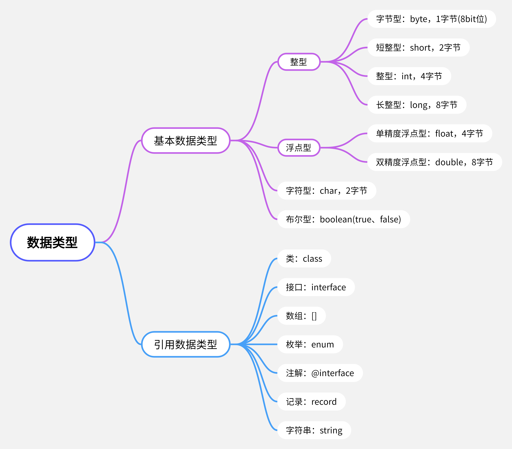

# 预备，走

## [关键字（keyword）](https://docs.oracle.com/javase/tutorial/java/nutsandbolts/_keywords.html)

> 被`Java`语言赋予了**特殊含义**，用做专门用途的字符串（或单词），目前共50个，全部由小写字母组成

### 用于定义数据类型

- `class`

- `interface`

- `enum`

- `byte`

- `short`

- `int`

- `long`

- `float`

- `double`

- `char`

- `boolean`

- `void`

### 用于定义流程控制

- `if`

- `else`

- `switch`

- `case`

- `default`

- `while`

- `do`

- `for`

- `break`

- `continue`

- `return`

### 用于定义访问权限的修饰符

- `private`

- `protected`

- `public`

### 用于定义类、函数、变量的修饰符

- `abstract`

- `final`

- `static`

- `synchronized`

### 用于定义类与类之间的关系

- `extends`

- `implements`

### 用于定义建立实例、引用实例、判断实例

- `new`

- `this`

- `super`

- `instanceof`

### 用于异常处理

- `try`

- `catch`

- `finally`

- `throw`

- `throws`

### 包相关

- `package`

- `import`

### 其它修饰符

- `native`

- `strictfp`

- `transient`

- `volatile`

- `assert`

- `const`：保留字

- `goto`：保留字

### 用于定义数据类型值的字面值（不是关键字）

- `true`

- `false`

- `null`

## 标识符（identifier）

> Java中变量、方法、类等要素命名时使用的字符序列，称为标识符（凡是自己可以起名字的地方都可以叫标识符）。

### 命名规则

1. 由26个英文字母大小写、0-9 、_ 或 $ 组成  

2. 数字不可以开头

3. 不可以使用关键字和保留字，但能包含关键字和保留字

4. 严格区分大小写，长度无限制

5. 不能包含空格

### 命名规范

- 包名：多单词组成时所有字母都小写

- 类名、接口名、变量名、方法名：大驼峰
    
- 常量名：所有字母都大写，多单词时以`_`链接
  
## 变量

> 内存中的一个存储区域，该区域的数据可以在同一类型范围内不断变化

### 基本概念

- 变量构成的三个要素：数据类型、变量名、存储的值

- 变量声明的格式：数据类型 变量名 = 变量值

- 变量的作用：用于在内存中保存数据

### 使用注意

- 必须先声明，后使用，不能重复定义

- 使用变量名来访问这块区域的数据

### 数据类型

#### 浮点类型特殊说明

- 单精度（`float`）：尾数可以精确到**7**位有效数字，该类型变量赋值时需要以`f`或`F`作为后缀

- 双精度（`double`）：精度是`float`的**两倍**，Java 默认的浮点类型

- 并不是所有的小数都能精确的用二进制浮点数表示，二进制浮点数不能精确的表示`0.1`、`0.01`、`0.001`这样10的负次幂

- 更精确数字计算或保留指定位数的精度，需要使用`BigDecimal`类

### 基本数据类型变量间转换

1. 自动类型提升：把存储范围小的值赋值给了存储范围大的变量时，由Java自己完成

2. 强制类型转换：将取值范围大的类型强制转换成取值范围小的类型，需要手动执行，否则编译报错

> 强制类型转换时可能会`损失精度`或`溢出`