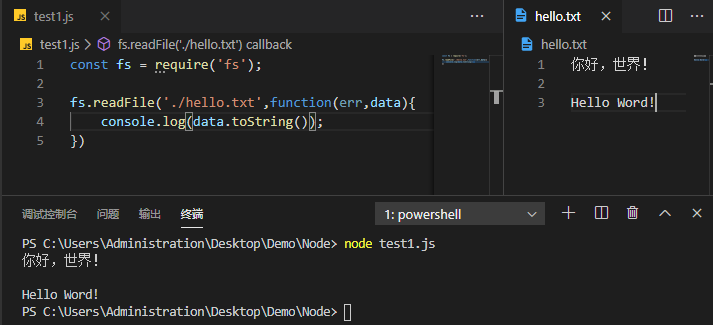

# [fs - 文件系统](http://nodejs.cn/api/fs.html)

> 要知道浏览器中的 JS 是没有文件处理能力的。<br>
  文件模块引入： <br>
  `const fs = require('fs');`

### 简单说明

> `fs` 模块提供了与文件系统进行交互的API

* `fs.isFile / fs.isDirectory`：检测是文件还是目录

* `fs.mkdir`：创建目录

* `fs.writeFile`：写入文件（会覆盖文件原有内容）

* `fs.appendFile`：追加文件

* `fs.readFile`：读取文件

* `fs.readdir`：读取目录

* `fs.rename`：重命名文件（如果文件路径有改变会移动文件）

* `fs.rmdir`：删除目录（不可用作是删除文件，目录下有文件会删除失败）

* `fs.unlink`：删除文件（不可用来删除目录）

#### 同步异步

> `fs` 模块下所有的方法都分为同步和异步两种形式：

- 异步：把（完成后的）回调函数作为最后一个参数，而回调函数的参数往往取决与具体方法，但通常将**第一个参数**预留给**异常**。

- 同步：同步操作时出现异常可以使用`try…catch`处理，也可以冒泡。

#### 路径

> 对于文件系统来说，路径无疑是一个重要的因素，在`fs`模块中，路径的写法可以有多种形势

- 指定字符串：常见的绝对路径（`/…/…`）；相对路径（`…/…/`），相对于当前工作路径。

- Buffer：（也可以是相对或绝对）主要用于将文件路径视为不透明字节序列的而某些操作系统。

- URL 对象支持：仅支持使用` file:`协议的 URL 对象，且URL始终是绝对路径。

#### 文件描述

> 可以立即为一个用于描述文件的对象，POSIX（可移植操作系统接口，在这里就理解为操作系统）系统上，每打开一个文件，都会为这个文件分配一个简单的数字标识（文件描述），Node.js抽象出操作系统之间的差异，并为所有打开的文件分配一个数字型的文件描述符。

`fs.open()`方法用于分配新的文件描述符。 一旦被分配，则文件描述符可用于从文件读取数据、向文件写入数据、或请求关于文件的信息。

```js
//导入模块
let fs = require('fs');

fs.open('./demo.txt','r',(err,fd) => {
    if(err) throw err;  // 抛出异常 
    console.log('文件标识：',fd);
    fs.fstat(fd,(err,stat) => {
        if(err) throw err; //抛出异常
        console.log('相关属性：',stat);
        // 始终关闭文件描述
        fs.close(fd,err => {
            console.log('cc',fd)
            if(err) throw err;
        })
    })
})
```
> 大多数操作系统都会限制在*任何给定时间内*，可能打开的文件描述数量，因此，操作完成时，关闭文件描述至关重要，否则将导致**内存泄露，程序崩溃**。

### 文件读写

#### 读文件

```js
const fs = require('fs');   // 引入fs模块

// 读文件
fs.readFile('./xxx/xxx.xx',function(err,data){
    if(err){
        console.log("读取文件失败！");  //可能文件不存在   
    }else{
         console.log("读取文件成功：",data.toString());   //若不toString()则读到的是二进制->十六进制的字符
    }
})
```


#### 写文件

> 这里的写文件方法呢，是将原文件内容**覆盖**，并不是追加内容

```js
const fs = require('fs');   // 引入fs模块

//写文件
fs.writeFile('./xxx/xxx.xx','写入内容',function(err){
    if(err){
        console.log("写入文件失败！");  //可能有错误字符
    }else{
        console.log("写入文件成功！");   
    }
})
```

### 目录读取

```js
fs.readdir(path,function(err,files){});  //读取目录(files:文件夹名，文件名组成的数组)
fs.rmdir(path,function(err){}); //删除空目录（不能删除文件），如果目录下有文件则无法删除，删除后回收站无保存
```