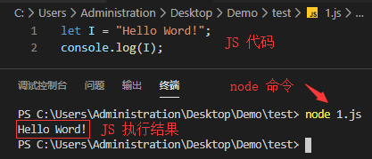
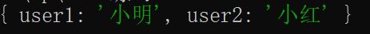

# Node基础知识了解

### [Node](https://nodejs.org/en/) 是什么？

> Node.js 诞生于2009年，作者：Ryan Dahl

- 首先，Node.js 不是一门语言，也不是一个框架

- 【官网】：Node.js 是一个基于 Chrome V8 引擎的 JavaScript 运行时（环境）。

#### 浏览器中的 JS 

- ECMAScript

    - 基本语法

    - if 、for 

    - function

    - Objsect

    - Array

    - ……

- BOM

- DOM

#### Node 中的 JS

- **没有 DOM 、BOM**

- ECMAScript

- 执行 JS 的操作API

    - 文件读写

    - 网络服务的构建

    - 网络通信

    - Http 服务器

    - ……

#### Node.js 特性

- event-driven -> 事件驱动

- non-blocking I/O model -> 非阻塞 IO 模型（异步）

- lightweight and efficient -> 轻量和高效

#### Node.js 能做什么

- Web 服务器后台

- 命令行工具

    - npm（node开发）

    - git（C语言开发）

    - hexo（node开发）

    - ……

### Node 的简单使用

#### 安装

> 官网下载，傻瓜式下一步、下一步安装

安装完成后，打开命令行工具，输入 `node -v` 会打印当前安装版本号

#### 单独执行 JS 文件 

> 脱离浏览器运行，且文件名不能叫 **node** 

1. 编写好 Js 代码（js文件）

2. 打开**命令行工具**，进入要执行的 JS 文件路径下

3. 使用 `node`命令，执行 JS 文件

    ```
    C:xxx/xxx/ node 要执行文件名.js 
    ```
    

> 由于 Node 中没有 DOM 和 BOM，所以输出 `window` 和 `docment` 会报错

#### node 初始化构建

> 安装了 node 之后，会自动安装 [npm（node package  manager）](https://www.npmjs.cn/)  

1. 新建一个普通的文件夹，并通过命令行工具打开所在目录

2. 执行命令 `npm init` 初始化构建

    - 构建时需要手动输入一些信息

    

    - 完成后文件夹下会自动生成一个`package.json`的文件，此文件尽量不要手动更改

3. 初始化之后即可利用 npm 安装第三方包，安装好之后便可以通过模块化引入了

    ```
    npm install jquery
    ```

### Node 中的类(class)

> Node 中的类与Java类似，同样包括了类的**继承**、**静态**方法等，通过关键字`class`声明
> 注意：class 并不是 node 独有，而是ES6引入，属于原生JS范畴，在[ES6基础二](../JS/ES6基础二.md)中有提到，这里重提加深印象

#### 类的基本使用

```js
class User {
    //构造函数，对类的属性进行了初始化
    constructor(name,age){  
        this.name = name;
        this.age = age;
    };
    //属性方法：通过 new 实例调用
    getUser(){
        return `${this.name}:${this.age}`; 
    };
    //静态方法：可通过类名直接调用
    static callUser(x){ 
        return x;
    }
}
// 属性方法调用（通过new实例调用）
let person = new User('小明','18');
console.log(person.getUser());
// 静态方法调用（类名直接调用，不能用实例调用，会报错）
console.log(User.callUser('我就是一个没用的静态方法'));
```
> `constuctor` 构造函数可以不写，如果不写，类的属性则会变为`undefined`，并不会报错！

#### 类的继承

```js
class Student extends User{
    constructor(name,age,major){
        super(name,age);
        this.major = major;
    };
    getStudent(){
        return `${super.getUser()},${this.major}`
    }
}
// 属性方法调用
let person = new Student('小明','18','计算机专业');
console.log(person.getStudent());
```

### Node 模块化

> 在以前呢，前端通常会利用[闭包](../JS/基础进阶一.md)的特性来缓解全局作用域命名冲突等问题，但开发者并不能以此来组织拆分代码，秉承着**一个文件，一个模块**的理念，认识模块化开发。<br>
在[ES6进阶一](../JS/ES6进阶一.md)中也有对模块化的提及，主要讲述的是 ES6 的 `import`，node 在 [13+](https://nodejs.org/api/esm.html) 以后的版本也开始支持`import`。

#### 模块化发展

- 最开始：全局 Function 模式：所有方法、变量都定义在一个文件。

> 为解决这个问题，我们将不同的 Function 写道不同的文件中，最后在引入到 Html 页面里，但是这样依文件引入顺序成了大问题，同变量名时后边的引入文件的变量会覆盖前边的，而且引入的文件过多，会引起网络加载问题

- 命名空间：所谓的命名空间，就是将不同的模块写在一个对象里，通过对象去调用（解决了变量重复定义），但是这样不够安全，变量不是私有的（不但可以用，还可以改）

```js
let module1 = {
    name:'小明'
}
let module2 = {
    name:'小红'
}
module1.name = '张三';
console.log(module1.name);  //张三（对象内容被修改）
```
- IIFE模式：匿名函数自调用，为了解决命名空间不安全我们想到了 —— [闭包](../JS/基础进阶一.md)，外部只能通过暴漏的方法操作

```js
((w) => {
    //内部私有数据，不允许修改
    function test1(){
        console.log('方法一')
    },
    function test2(){
        console.log('方法二')
    },
    w.module1 = {test1,test2}   //将方法挂载（暴漏）到window
})(window)
```

- IIFE 增强模式：（现在的模块化基石）引入依赖

```js
((w,$) => {
    /**********/
})(window,jQuery)   //事先引入jquery
```

#### 模块分类

- 核心模块：Node 已经封装好的内置模块（Node API）

- 自定义模块：开发者自己编写的模块

- 第三方模块：通过 npm 等工具下载的模块

#### 模块化规范

##### CommonJS(require/exports)：支持浏览器、node 两种环境（双端）

- export：ES6 语法

- exports：CommonJS 语法

1. 服务端（node）：模块在运行时**同步**加载

> `require()`用于模块引入。参数可以是导出的模块名，也可以是 path 路径（文件扩展名可省略），它返回一个模块对象（如果引入的模块没有导出，则返回一个空对象）

```js
// main.js
exports.test1 = {
    name:'小明',
    age:'18',
    getUser:function(){
        return `${this.name}:${this.age}`
    },
    getStudent: res => {
        return `${this.name}:${this.age},${res}`;
    }
}

exports.test2 = {
    name:'小红',
    age:'17',
}
// index.js
let aa = require('./main'); //同步加载,引入并接收

// 也可以这样引入
let {test1,test2} = require('./main');  //ES6 解构赋值

console.log(aa.test1.getUser());
console.log(aa.test2.name);

```
> `module.exports` = `exports` = {}，`exports`只能设置单个属性；`module.exports` 赋值整个属性。<br>
`export.xx`相当于往导出的对象中**追加**属性  

```js
// main.js
exports.test1 = { //被覆盖,不会被导出
    name:'小明',
    age:'18',
}
exports.test2 = {   //被覆盖,不会被导出
    name:'小红',
    age:'17',
}
module.exports = {  //导出部分
    user1:'小明',
    user2:'小红',
}
// index.js
let aa = require('./main');

console.log(aa);    
```


> 在CommonJS中`module.exports` 和 `exports` 不要一起写(写在一起也不会报错)。

PS: 注意上边说的都是在node环境下执行的, `node xx.js`

2. 浏览器端：模块需要提前编译打包处理

> 浏览器端与 node 端的语法一样，但是如果直接使用`require()`会报错，浏览器并不是认识它，我们需要通过安装第三方工具，使得浏览器认识它

```
npm install browserify -g
``` 
安装完成后就可以使用了

```js
// browserify 需要编译的js文件路径 -o 编译后输出地址

browserify ./src/js/index.js -o ./dist/js/index.js

// html 页面引入的是编译后的输出文件
```

##### [ES6](../JS/ES6进阶一.md) 模块化：浏览器端

### [下一篇：文件系统](./File.md)
