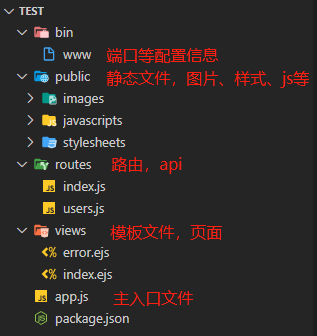

# 框架用起来，一切更简单

### [Express](https://expressjs.com/) [中文](http://expressjs.jser.us/)

#### 全局安装 Express 脚手架

```
npm install express-generator -g
```

#### cd 指定目录，创建项目

```
express 项目名（可以是中文）
```


#### 安装依赖

```
npm install 
```

#### 运行/启动

```
npm start
```

> 默认监听 `3000` 端口 -> loaclhost:3000

### [Koa](https://koajs.com) [中文](https://www.koajs.com.cn)

> 目前 Koa -> Koa2

#### 全局安装 Koa 脚手架

```
npm install koa-generator -g
```

#### cd 指定目录，创建项目

```
koa2 -e 项目名
```


#### 运行/启动 同 Express