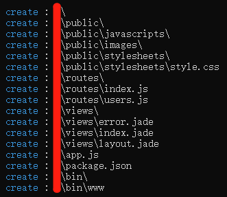

# 框架用起来，一切更简单

### 链接数据库（MySql）

> 数据库对必不可少，我们可以使用第三方包，快速链接数据库，这里以**MySql**为例

#### 安装第相应依赖包 

```js
// mysql
npm install mysql

// mongodb
npm install mongodb

//……
```

#### 数据库配置文件

> 可以在项目跟目录下新建一个文件夹 -> `config`，用来存放配置文件

```js
// config/db.js

var mysql = require('mysql');

function __connection() {
    var connection = mysql.createConnection({
        host: 'localhost',
        port: '3306',
        user: 'root',
        password: '密码',
        database: '数据库名'
    });
    connection.connect();
    return connection;
};
// 封装
exports.query = (sql, parmas = null) => {
    //1.获取数据库连接对象
    var connection = __connection();
    return new Promise((reject, resolve) => {
        //2执行sql语句
        connection.query(sql, parmas, (error, results, fields) => {
            if error throw error;
            if (error) {
                console.log(error);
            }else{
                reject(results);
            } 
        });
        //3关闭连接
        connection.end();
    })
};

// 路由文件引用 db.js
const db = require('../../config/db');

db.query('sql 语句'); //查询数据库
```

#### 数据库链接报错


错误原因：mysql8.0 以上加密方式，Node 暂不支持

解决办法：修改数据库加密方式，命令如下

```c
alter user 'root'@'localhost' identified with mysql_native_password by '123456';

flush privileges;
```


### [Express](https://expressjs.com/) [中文](http://expressjs.jser.us/)

#### 全局安装 Express 脚手架

```
npm install express-generator -g
```

#### cd 指定目录，创建项目

```
express 项目名（可以是中文）
```



#### 安装依赖

```
npm install 
```

#### 运行/启动

```
npm start
```

> 默认监听 `3000` 端口 -> loaclhost:3000

### [Koa](https://koajs.com) [中文](https://www.koajs.com.cn)

> 目前 Koa -> Koa2

#### 全局安装 Koa 脚手架

```
npm install koa-generator -g
```

#### cd 指定目录，创建项目

```
koa2 -e 项目名
```


#### 运行/启动 同 Express