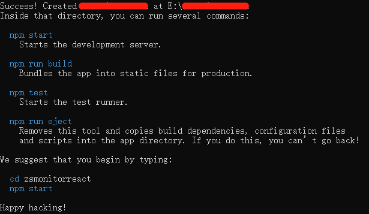
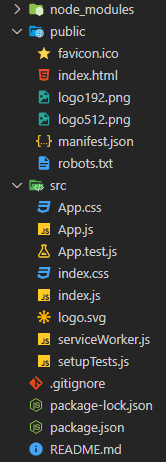
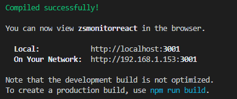
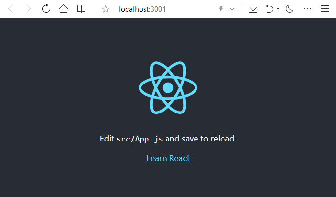
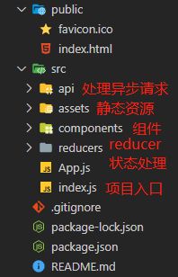

# 项目搭建更轻松

## 脚手架快速安装

1. 在安装全局*React* 

```
npm install create-react-app -g
//或
npm install  -g create-react-app
//或
npm i  -g create-react-app
```

查看安装版本

```
create-react-app -V
```
2.（进入项目文件夹）安装react(demo是文件名，自取，但注意不能有大写，可以使用 `-`/`_`)

```
create-react-app demo
```



当然了，如果就想要项目文件夹有大写也简单，将创建好的项目内容整个剪切过去就好了(●'◡'●)



3. 安装完成之后即可进入项目目录，启动该项目

```
cd xx  //进入项目目录
npm statrt  // 启动项目，常用vue 的小伙伴不要搞混了 vue 默认: npm run serve
```




PS：刚创建的项目会有很多冗杂的文件，可以根据需求进行删减，这里给出自己常用的目录结构，仅供参考~




