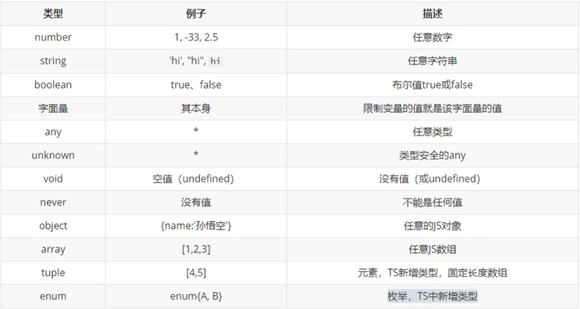

# 糖果吼咸 ∩_∩ 

## 运行环境搭建

### 全局安装（ts 编译器）

```
npm install typescript -g
```

检查

`tsc`

有输出，则说明 ts 环境安装成功

### ts 文件编译

```
tsc xx.ts
```

## 类型



```ts
// 简单理解
let a = 10;             // 数字类型 
let b:1;                // b 的值只能等于 1
let c:number
let d:number|string     // 数字 或 字符串类型
// 参数类型
function sum(x:number,y:number){
    return x + y;
}
```

### any 类型

> 任意的类型，可以赋值给任意类型的变量，不建议使用；`let a;` <=> `let a:any;`

``` ts
// any 与 unknow 对比
let a;           // any 类型
let b:number;    // number 类型
let c:unknown;   // 未知类型
a = '123';       // 给 a 赋值了一个字符串
b = a;           // 把 a 的值赋给 b，不会报错；但实际上 b 的类型已经发生了改变
b = c;           // 类型报错
```

### unknown 和 类型断言

语法：`变量 as 类型` 或 `<类型> 变量`

```ts
let a:string|number;    // 字符串 或 数字类型
let d:unknown;          // 未知类型
let e:string;           // 字符串
e = a;                  // error
e = d;                  // error
// 类型断言（写法一）
e = a as string;        // 不会报错
e = d as string;        // 不会报错
// 类型断言（写法二）
e = <string> a          // 不会报错
e = <string> d          // 不会报错
```

### 返回值类型

```ts
/**
 * 常规：
 * 可以没有返回值
 * 自动判断返回值类型
 */ 
function re(){} 
/**
 * 规定返回值类型：
 * 1. 必须有返回值
 * 2. 类型必须一致
 */ 
function re():number|string{
    return 123
}
/**
 * void:
 * 1. 可以有返回值，但返回值只能是 undefined 或 null
 * 2. 可以只写一个 return; 
*/
function re():void{
    if(new Date().getSeconds() > 30){
        return '当前时间大于 30'    // error
    }else{
        return;     // 没有返回值，不报错
    }
}   
/**
 * never:
 * 永远不会有返回结果
*/
function re():never{
  if(new Date().getSeconds() > 30){
      console.log('其实你返回了一个空')  // 可访问的终结点，报错，但不是这里报错，而是 never 报错 
  }else{
      throw new Error('一个错误对象')   // 正确，没有返回结果
  }
}    
```

### {} 类型

> 用来指定对象中可以包含那些属性，并指定属性类型

#### 对象类型的结构声明

```ts
// 语法样例：
let a : {name:string}                         // 只能有一个 name 属性
let b : {name:string,age?:number}             // 属性后边加 ? 表示可选属性
let c : {name:string,[propName:string]:any}   // 必须有一个 name 属性
let d : {name:string} | {age:number}            // 具有 name 或 age
let e : {name:string} & {age:number}            // 同时具有name 和 age

a = {name:'小明',age:18}    // error ，必须和声明时结构一致
a = {name:'小明'}           // 正确
```

#### 函数结构的类型声明

```ts
// 语法样例：
let d : (a:number,b:number)=>number;
// error 
d = function fund (a:string,b){
    return a + b
}
// 正确
d = function fund (a,b){
    return a + b
}
```

#### Object

> `let a : Object` <=> `let a : {}`

因为 js 中万物皆对象，所以一般不用该写法

```ts
let a : Object
let b : Function

a = function aa(){}
a = [1,2,3]
a = 123
a = '123'

b = {}  // error
```

### 数组类型

```ts
let a : Array<number|string>    // 数组类型可包括 数字 和 字符串
let b : number[]|string[]
let c : number[]

a = [1,2,3,'12']
b = [1,2,3]
b = ['123']
b = [1,2,3,'12']    // error ，数组内的值只包含数字 或 只包含字符串
c = [1,2,3,'12']    // error ，数组内的值只能是数字
```

### 元组

> 固定长度的数组

```ts
let a : [string,number]

// 正确赋值
a = ['123',123] 

//错误赋值，必须与声明的结构、类型保持一直 
a = ['123',123,123]
a = ['123']
```

### enum 枚举

> 值在多个值之间进行选择的时候，适用该类型

```ts
enum Gender {
  Male = 1,
  Female = 2
}

let a : {
  name:string,
  gender:Gender // 枚举类型
}
let b : Gender

a = {
  name:'小明',
  gender:Gender.Male
}
b = Gender.Female

// 以下并不会报错
a = {
  name:'小明',
  gender:3
}
b = 3
```

### 类型别名

> 如果多个变量类型一样，且类型过长，每次都写一遍就会很麻烦，这时就用到 -> 别名

```ts
type myType = Array<number|string|boolean|{name:string,[propName:string]:any}>

let a : myType
let b : myType
let c : myType
```