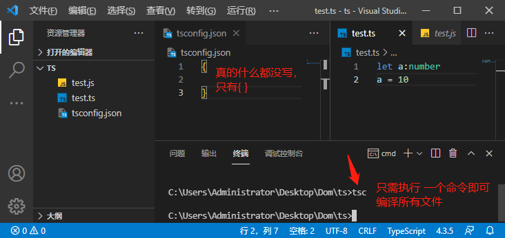

# 配置，配置一下

### 简单说明

`ts` 配置文件 -> `tsconfig.json`

当我们通过 `tsc` 命令编译 `.ts` 文件时，想相应目录下创建一个`tsconfig.json` 文件，即可对`.ts` 进行配置，即使文件内只写了一对大括号`{}`，也可以实现对`.ts`文件进行监听，自动将其编译为对应的`.js`文件。



### [（常用）配置选项](https://www.tslang.cn/docs/handbook/compiler-options.html)

#### include、file、exclude

1. 使用`include`引入的文件可以使用"exclude"属性过滤。 然而，通过 `files`属性明确指定的文件却总是会被包含在内，不管`exclude`如何设置。

2. 任何被`files`或`include`指定的文件所引用的文件也会被包含进来；

  - 举例说明：`A.ts`引用了`B.ts`，因此`B.ts`不能被排除，除非引用它的`A.ts`在`exclude`列表中。

```json
{
    /**
     * 指定需要编译的 ts 文件
     * ** -> 任意目录
     * * -> 任意文件
     * 可被 exclude 过滤
     */ 
    "include": [
        "./src/**/*"
    ],
    /**
     * 指定一个包含相对或绝对文件路径的列表（与 include 类似）
     * 不可被 exclude 过滤
     */
    "files": [],
    /**
     * 不需要编译的 ts 文件
     * 默认：node_modules,bower_components,jspm_packages 和 <outDir> 目录
     * 没有特殊情况可以省略该项
     */
    "exclude": [
        "node_modules",
        "bower_components",
        "jspm_packages"
    ]
}
```

#### compilerOptions

```json
{
    "compilerOptions": {
        // 指定编译的 js 版本，默认ES3
        "target": "ES6",
        // 指定使用的模块化规范
        "module": "system",
        // 指定编译文件所在目录
        "outDir": "./dist",
        // 将所有需要编译的ts文件编译为一个js文件（很少使用）
        "outFile": "./dist/app.js",
        // 是否编译 js 文件，默认false
        "allowJs": false,
        // 是否检查 js 文件，符合ts语法规范，默认false
        "checkJs": false,
        // 是否移除注释，默认false
        "removeComments": false,
        // 不生成编译后的文件，默认false
        "noEmit": false,
        // 当有错误的时候不生成编译文件，默认false
        "noEmitOnError": false,
        // 编译后的文件是否使用严格模式，默认false
        "alwaysStrict": true,
        // 不允许隐式any 类型，默认false
        "noImplicitAny": true,
        // 不允许不明确类型的this，默认false
        "noImplicitThis": true,
        // 严格检查空值 null undefined
        "strictNullChecks": true,
        // 所有严格检查(上边设置为true 的检查)总开关，默认false，建议设置为true
        "strict": true,
        // 指定使用的库，浏览器环境无特殊续期不用指定，node 中可能修改
        "lib": ["ES6","DOM"],
    }
}
```