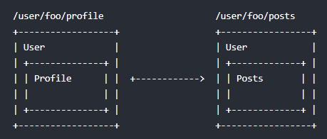
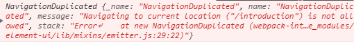

### 嵌套路由

嵌套路由其实就是在一个页里去显示匹配路由地址的内容，在实际需求中很常见，参考官网给出示意图就很容易理解了。



其实要实现起来很容易,直接上代码：

```js
export default new Router({
    routes: [
        {
            path: '/',
            name: 'home',
            component: Home,
            children: [{
                path: '/login',
                component: Login
            }]
        },
    ]
})
```
可以看出，写在children中的路由，就是要被嵌套的子路由了，当可以写多个，匹配到的内容就会显示在父路由模板中的`<router-view></router-view>`内了。

### push/replace、go

通常我们在想要路由的跳转的时候都会写一个`<router-link to='…'></router-link>` 其中 to 的值便是将要跳转的路由地址。如果不写router-link，还可以通过编程式路由的放法达到同样的效果。

```js
//字符串
this.$router.push('login') 
//对象
this.$router.push({ path: 'home' })
//命名路由（通过路由名称跳转），params参数并不会显示在url上
this.$router.push({ name: 'home', params: { userId: '123' }})
// 带参数，变成 /login?id=123
this.$router.push({ path: '/login', query: { id: '123' }})
```
`replace`和`push`很像，不同的是`push`会在*history栈*中添加一条新记录，而```replace```是替换当前路由，并不会重新添加记录。`router-link`的用法也是与此类似，不明白的小伙伴可以去[官网](https://cn.vuejs.org/)了解更多。

>注意：如果提供了 path，params 会被忽略，

```js
//跳转路由，n可以是任意整数（正数/负数）
this.$router.go(n)
```
### 命名视图

不同于嵌套路由，命名视图是同时 (同级) 展示多个视图如下布局：

```js
<router-view class="view one"></router-view>
<router-view class="view two" name="a"></router-view>
<router-view class="view three" name="b"></router-view>
```
路由配置

```js
components:{
  default: Home, //未命名试图为默认试图
  a: View1,  //名为 a 的视图展示View1组件
  b: View2  //名为 b 的视图展示View2组件
},
```
>注意：这里的是`components`,多了个**s**

### 重定向

```js
{
  path:'/login',
  //重定向
  redirect: { name: 'home' } ，
  //或者写成
  redirect: '/b'，
  //也可以写成
  redirect: to => {
      // 方法接收 目标路由 作为参数
      // return 重定向的 字符串路径/路径对象
  }
}
```
### 别名

```js
{
  path:'/login',  
  alias: '/Login'  //别名，
  component: Login,  //访问别名地址也会展示此内容
}
```
### Hash/History模式

vue-router默认是**Hash模式**—— 使用 URL 的 hash 来模拟一个完整的 URL，于是当 URL 改变时，页面不会重新加载。hash 模式下，  URL会变丑，也就是多了一个**#**号。

如果不想使用hash模式， 也可以使用**History模式**——利用 history.pushState API 来完成 URL 跳转而无须重新加载页面。

```js
export default new Router({
    mode:'history',
    routes: []
})
```
使用 history 模式时，URL 会变得正常，但车中模式一般需要后台配置支持，否则当用户直接访问的时候就会返回 404。

所以，需要在服务端增加一个覆盖所有情况的候选资源：如果 URL 匹配不到任何静态资源，则应该返回同一个 index.html 页面，这个页面就是你 app 依赖的页面。

但是这样做服务器就不再返回 404 错误页面，因为对于所有路径都会返回 index.html 文件。为了避免这种情况，应该在 Vue 应用里面覆盖所有的路由情况，然后在给出一个 404 页面。

```js
export default new Router({
    mode:'history',
    routes: [
      { 
        path: '*',
        component: NotFoundComponent 
      }
    ]
})
```
### 路由监听

有时候会遇到路由地址只改变参数的时候页面不跟着刷新，这种情况可通过监听路由的方法解决。

```js
    watch: {
        '$route' (to,from) {
            //data 数据处理
        }
    },
```
### 路由懒加载

像vue这种单页面应用，在进入首页时，需要加载的内容过多，如果文件过大可能会出现**白屏**，不利于用户体验，利用懒加载可以将页面进行划分，需要的时候加载页面，可以有效的分担首页所承担的加载压力，减少首页加载用时。

```js
export default new Router({
    routes: [
        {
            path: '/',
            name: 'home',
            component:resolve => require(['./views/Home.vue'],resolve),
        }
    ]
})
```
### 二次点击相同路由报错


遇到这个问题很简单，只要在引入`vue-router`的文件下加入下面代码：

```js
import Router from 'vue-router' //引入vue-router，vue-cli3下是**router.js**文件

const originalPush = Router.prototype.push
Router.prototype.push = function push(location) {
    return originalPush.call(this, location).catch(err => err)
}
```