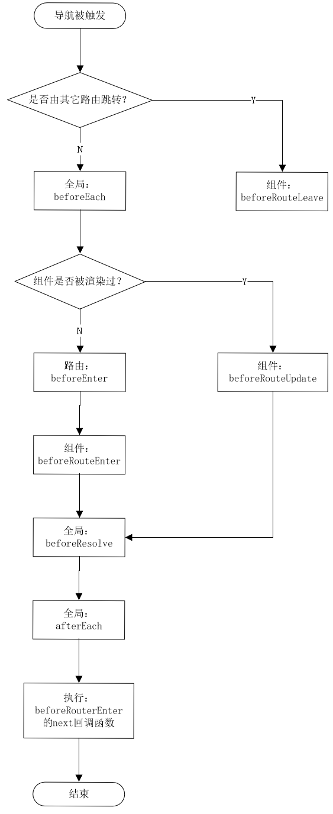

## hash / history 原理及区别

### 原理 

-  hash 模式：用hash值模拟路由变化，通过监听`hashchange`事件，动态更新页面。

- history 模式：通过H5的`pushState`和`resplaceState`，这个两个API 可以改变url，但是不会发送请求。 

### 区别

 - url 展示上，hash 模式有 "#"，

- 刷新页面时，hash 模式可以正常加载到 hash 值对应的页面，而 history 没有处理的话，会返回 404，一般需要后端将所有页面都配置重定向到首页路由兼容性。

- hash 可以支持低版本浏览器和 IE。

## 路由守卫

1. 全局守卫：路由实例上直接操作的钩子函数，即，所有路由都会触发。
    ```
      const router = new VueRouter({ ... })
      router.beforeEach((to, from, next) => {
          // 守卫，守住底线
      })
    ```
    - `beforeEach(to,from,next)`：路由**跳转前**触发，常用于登录验证

    - `beforeResolve(to,from,next)`：与`beforeEach`类似，也在路由**跳转前**触发，区别在于，导航被确认之前，同时在所有组件内守卫和异步路由组件被解析之后，解析守卫就被调用（即在 `beforeEach` 和 组件内`beforeRouteEnter` 之后，`afterEach`之前调用）。

    - `afterEach(to,from)`：在路由**跳转完成**后触发，它发生在`beforeEach`和`beforeResolve`之后，`beforeRouteEnter`之前。

2. 路由守卫：在单个路由配置的钩子函数
    ```
      const router = new VueRouter({
          routes:[{
              path:'/index',
              component:index,
              beforeEnter:(to,from, next) => {
                  // 随便写点什么了
              }
          }]
      })
    ```
    - `beforeEnter(to,from,next)`：与`beforeEach`完全相同，如果两个都设置了，则此守卫**后执行**。

3. 组件守卫：在组件内执行的钩子函数，类似于组件内的生命周期，相当于为配置路由的组件添加的生命周期钩子函数。
    ```
    <script>
    export default{
       beforeRouteEnter (to, from, next) {
              // 我想不想一个钩子？
       },
    }
    </script>
    ```
    - `beforeRouteEnter(to,from,next)`：组件实例创建前，不能调用`this`。

    - `beforeRouteUpdate(to,from,next)`：当前路由改变，组件被重复调用，可以使用`this`。

    - `beforeRouteLeav(to,from,next)`：导航离开该组件的对应路由时调用可以访问组件实例 `this`

