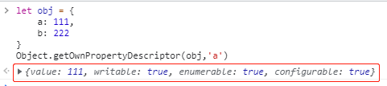

# 数据响应式原理：数据变，视图跟着变（MVVM）

## [Object.defineProperty()](https://developer.mozilla.org/zh-CN/docs/Web/JavaScript/Reference/Global_Objects/Object/defineProperty)

> 此方法会直接在一个对象上定义一个新属性，或者改变对象的现有属性，并返回此对象。

```js
let obj = {};

Object.defineProperty(obj, "a", {
  value: 3, // 改变 obj.a，此时obj对象本身已经发生改变，（默认 undefind ）
  writable: false, // 是否可以被改变（默认false，不可以改变）
  enumerable: true, // 是否可以被枚举（默认false，不可以枚举），循环对象（for...in...）时忽略该属性
  configurable: false, // 当且仅当该属性（这里指obj 的属性 a）为configurable 为 true 时，该属性的描述符才能够被改变；同时该属性也能从对应的对象上被删除。
});

// 劫持
Object.defineProperty(obj, "b", {
  get() {
    console.log("访问 b 属性");
    return 1; // b 的值
  },
  set(newValue) {
    console.log("改变 b 属性", newValue);
  },
});

// value 和 get() 不共存，否则报错
```

PS：vue 响应式非侵入式（不用掉特定 api）

### 默认属性描述符

> `Object.getOwnPropertyDescriptor()` : 返回指定对象上一个自有属性（直接赋予该对象，不需要从原型链上进行查找的属性）对应的属性描述符。

```js
// 自有属性 描述符默认都为 true
let obj = {
  a: 111,
  b: 222,
};
Object.getOwnPropertyDescriptor(obj, "a");
Object.defineProperty(obj, "b", { value: 333 }); // 即使通过defineProperty 改变，描述符依旧为true
Object.getOwnPropertyDescriptor(obj, "b");
```



```js
// defineProperty 添加的属性
let obj = {
  a: 111,
  b: 222,
};
Object.defineProperty(obj, "c", {}); // 通过 defineProperty 添加的属性
Object.getOwnPropertyDescriptor(obj, "c"); // 描述符如上述所说，均为false
```

## 封装 defineReactive()

> 直接使用`Object.defineProperty`会发现并不能直接改变属性值，这是因为，经过`set()`设置的值依旧会经过`get()`，若想实现改变，就需要一个公共变量，存储一下 `newValue`，并在`get()`中返回该变量。

```js
let temp;
Object.defineProperty(obj, "b", {
  get() {
    console.log("访问 b 属性");
    return temp; // b 的值
  },
  set(newValue) {
    console.log("改变 b 属性", newValue);
    temp = newValue;
  },
});
```

鉴于此，利用**闭包**将其封装

```js
let obj = {};
/**
 * @param {Object} data 数据对象
 * @param {String} key 键名
 * @param {*} val 值
 */
function defineReactive(data, key, val) {
  Object.defineProperty(data, key, {
    // 可枚举
    enumerable: true,
    // 可配置（比如：删除）
    configurable: true,
    get() {
      return val;
    },
    set(newValue) {
      if (val === newValue) {
        return;
      } else {
        val = newValue;
      }
    },
  });
}
defineReactive(obj, "a", 10);
```

## 数组响应式

> 遍历数组，对部分方法进行监听；递归遍历对象

### push()：从后插入

### pop()：从后删除

### shift()：从前删除

### unshift()：从前插入

### splice()：删除并添加

### sort()：排序

### reverse()：倒序

## 双向绑定（v-bind/:）

> 数据变化更新视图，视图变化更新数据

### 依赖

> 在`getter`中收集依赖，在`setter`中触发依赖


1. 依赖就是`Watcher`。只有`Watcher`触发了`getter`才会收集依赖，哪个`Watcher`触发了`getter`，就把哪个`Watcher`收集到`Dep`中。

2. `Dep`使用发布-订阅模式，当数据发生变化时，回循环依赖列表，把所有的`Watcher`都通知一遍。

3. `Watcher` 把自己设置到全局的一个指定位置，然后读取数据，因为读取了数据，所以会触发这个数据的`getter`，在`getter`中就能得到正在读取数据的`Watcher`，并发这个`Watcher`收集到`Dep`中。

### Dep - 依赖收集类

> 每个`Observer`实例成员中都有一个`Dep`的实例

### Watcher - 数据发生改变，通知组件

### 实现原理

Vue 主要通过以下 4 个步骤来实现数据双向绑定的：

- 实现一个**监听器** `Observer`对数据对象进行遍历，包括子属性对象的属性，利用 `Object.defineProperty()` 对属性都加上 `setter` 和`getter`。这样的话，给这个对象的某个值赋值，就会触发 `setter`，那么就能监听到了数据变化。

- 实现一个**解析器** `Compile`解析 Vue 模板指令，将模板中的变量都替换成数据，然后初始化渲染页面视图，并将每个指令对应的节点绑定更新函数，添加监听数据的订阅者，一旦数据有变动，收到通知，调用更新函数进行数据更新。

- 实现一个**订阅者** `Watcher`：`Watcher` （订阅者）是 `Observer` 和 `Compile` 之间通信的桥梁 ，主要的任务是订阅 `Observer` 中的属性值变化的消息，当收到属性值变化的消息时，触发解析器 `Compile` 中对应的更新函数。

- 实现一个**订阅器** `Dep`订阅器采用 发布-订阅 设计模式，用来收集订阅者 `Watcher`，对监听器 `Observer` 和 订阅者 `Watcher` 进行统一管理。

### v-model - 双向绑定语法糖

> `v-model` 指令在表单（`input`、`textarea`、`select`）元素上创建双向数据绑定，本质上依旧是双向绑定， 但是它在内部为**不同的输入元素**使用不同的属性并抛出**不同的事件**。

- `text` 和 `textarea` 元素使用 `value` 属性和 `input` 事件

- `checkbox` 和 `radio` 使用 `checked` 属性和 `change` 事件

- `select` 字段将 `value` 作为 `prop` 并将 `change` 作为事件
