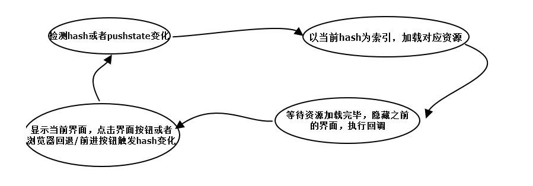
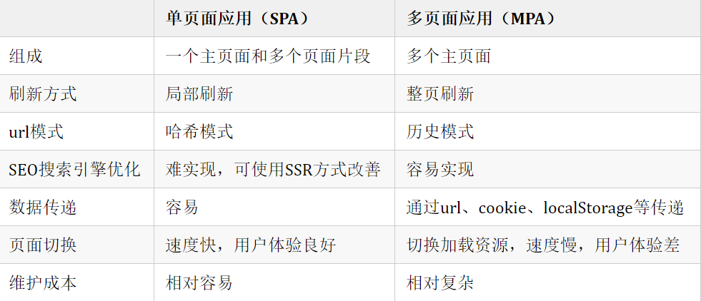

# 你很懂哟~

## 对 vue 理解

> vue 是一个用于构建用户界面的**渐进式**的JavaScript开源框架。

1. 渐进式 ：不强求（一次性）使用全部功能、特性，可以根据需求，选择性的使用部分功能（如：指令、双向绑定……）

2. 单页面应用（SPA：single-page application）: 一种网络应用程序或网站的模型，它将所有的活动都在限定在一个WEB页面中，仅在页面初始化时加载相应的HTML、CSS、JS。一旦页面加载完成，页面不会在重新加载或跳转，它通过动态重写（div的切换，显示/隐藏）当前页面与用户进行UI交互。

    * 原理（代码实现见：[SPA实现](../../../优化/封装/SPA实现.js)：

        * 监听地址栏中[hash](https://blog.csdn.net/yt618121/article/details/81162836)变化，驱动页面变化。

        * 利用[pushSate](https://www.jianshu.com/p/145d353de37a)（H5中history的方法）记录浏览器历史，驱动页面发送变化。

        

    * 优点：

        * 避免页面跳转或重载，提高了户体验。

        * 良好的前后端分离，分工明确，提高开发效率。

    * 缺点（相关优化见：[SPA优化总结](../../../优化/SPA优化总结.md)）：

        * 不利于搜索引擎抓取。

        * 首页渲染速度相对较慢
    
    * 单页面 vs 多页面

        

## 组件中 data 为什么是一个函数

> 组件中`data`必须是一个函数，通过`return`返回一个对象；在 `new Vue`实例中，`data`可以直接是一个对象

**原因：**一个组件被**复用**多次，就会创建多个实例，但这些实例都源于同一构造函数，如果`data`是对象，属于引用类型，如果其中一个发生改变，就会影响到所有的实例，因此，为了保证组件不同的实例之间`data`**不冲突**，将data设置成一个函数，函数调用会分配一个新的内存地址，在由函数返回一个对象，这样组件之间就不会相互影响，可以独立维护。

PS：`new Vue` 的实例，是不会被复用的，因此不存在引用对象的问题。

## 组件缓存 - keep-alive

> `keep-alive` 是 `Vue` 中的内置组件，可以（组件切换过程中）保留**被包含的组件状态**，**避免重新渲染**。

```html
<keep-alive>
    <!-- 需要缓存的视图组件,当x的值发生改变，会缓存视图组件，而不会再次加载渲染 --> 
    <router-view v-if="x"></router-view>
</keep-alive>
```

PS：使用场景：**列表页 –> 商详页 –> 列表页**

- 一般结合路由和动态组件一起使用，用于缓存组件；

- 提供 `include` 和 `exclude` 属性，两者都支持字符串或正则表达式：

    - `include` ：只有名称匹配的组件会被缓存；
    
    - `exclude` ：任何名称匹配的组件都不会被缓存；

    PS：其中 `exclude` 的优先级比 `include` 高

    - `max`：最多可以缓组件实例个数

### 生命周期

1. `activated`： `keep-alive` 缓存的组件**激活**时调用；页面第一次进入的时候，钩子触发的顺序是`created -> mounted -> activated`

2. `deactivated`：`keep-alive` 缓存的组件**停用**时调用；页面退出的时候会触发`deactivated`，当再次前进或者后退的时候只触发`activated`

### 原理

> 该组件没有`<template>`，而是在组件渲染的时候自动执行`render()`

1. 在`mounted`钩子函数中观测 `include` 和 `exclude`变化，判断是缓存规则，调用`pruneCache()`

2. 在`pruneCache()`内对`this.cache`对象进行遍历，取出每一项的`name`值，与新的缓存规则进行匹配，如果匹配不上，则表示在新的缓存规则下该组件已经不需要被缓存，直接删除即可（利用`pruneCacheEntry()`将`this.cache`中对应对象删除）

    - `this.cache` : 用来存储需要缓存的组件

    ```js
    this.cache = {
        'key1':'组件1',
        'key2':'组件2',
        // ...
    }
    ```
3. （精髓） `render()`：先获取组件的`key`值，在`this.cache`中寻找是否有该值，有表示该组件有缓存，直接从缓存中拿去`vnode`组件实例，调整该组件`key`的顺序，将其从原来的位置删除，并重新放在（push）`this.keys`中最后一个；没有表示该组件没有被缓存过，则以该组件的`key`为键，组件的`vnode`为值，将其存入`this.cache`中，并把`key`存入`this.keys`中，如果此时`this.keys`数量超过了最大缓存数，则把**第一个**缓存组件删掉

### 缓存后组件获取数据

- `beforeRouteEnter`：每次组件渲染的时候，会执行

- `actived`：缓存的组件被激活时，会执行（服务器端渲染期间不被调用）

## 父组件监听子组件生命周期

1. 事件触发

```js
    // 父组件
    <Child @mounted="doSomething"/>

    // 子组件
    mounted() {
        this.$emit("mounted");
    }
```

2. `@hook` 监听

```js
    // 父组件
    <Child @hook:mounted="doSomething" ></Child>
    doSomething() {
        console.log('父组件监听到 mounted 钩子函数 ...');
    },
    // 子组件
    mounted(){
        console.log('子组件触发 mounted 钩子函数 ...');
    },  
    /**
     * 输出顺序为：
     *   子组件触发 mounted 钩子函数...
     *   父组件监听到 mounted 钩子函数 ... 
     */   
```

## 给数组项直接赋值

> 首先，在`Vue`里，如果通过数组下标直接给数组赋值，`Vue`是**无法检测**到该数组变动的！

```js
// vue.set
Vue.set(obj,indexOfItem,newValue);
// 要改变的对象，改变的项，新值

// 改变数组长度(obj是数组)
obj.splice(newLength)
```

## 递归组件的理解

- 组件中使用`name`属性，给组件自己定义个名字，这样在组件中就可以自己调用自己了。就像在函数中直接调用函数名来来递归。

- 数据获取：将嵌套的数据重新赋值给`prop`设置的属性

- 递归结束：判断数据中是否存在属性，以及该属性的值不为空。

## 启动项目的执行命令（如：npm run dev）都做了什么

1. 匹配 `pack.json`对应的行命令去执行，执行脚本的时候都会创建一个`shell`，然后在`shell`中执行指定的脚本

2. `shell`会将当前项目的可执行依赖目录（`node_modules/.bin`）添加到环境变量`path`中，当执行之后之后再恢复原样

## 计算属性 与 数据监听

`computed`（计算属性）： 名称不能与 data 里对象重复，只能用**同步**，必须有 `return`； 是多个值变化引起一个值变化，是**多对一**。

`watch`（监听）: 名称必须和 `data` 里对象一样，可以用于**异步**，没有 `return`；监听一个值，一个值变化引起多个值变化，是**一对多**。