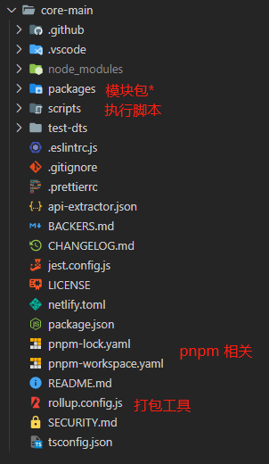

# 对比一下在开始吧(*^_^*)


## 项目构建

### Monorepo 项目管理方式



> vue3 采用 **Monorepo**项目管理方式，所有模块被分开管理放在 `packages`目录下，各模块可以各自打包，又能相互引用

- 单仓库管理维护多个项目，模块间相互引用方便

- 各个模块单独打包，可独立使用，减少破坏性更新，便于扩展

### TS 编写

Vue3 使用 TS 重写，因此它对TS有着天生的支持

## 性能优化

###  减少源码体积

- 移除一些冷门的API：`$on`、`$off`、`$once`、`$children`、`$destory`；不再支持`keycode`作为`v-on`的修饰符；不再支持`config.keyCode`等

- 引入`tree-shaking`技术：简单理解为模块代码使用时才打包，不使用不打包

### 数据劫持（响应式）

> DOM 是数据一种映射，数据改变时自动更新DOM

- `vue1`、`vue2` 都是通过 `Object.defineProperty`这个API实现的数据劫持，对于**层次较深**的数据结构，需要通过递归将每一层都变成相应式的

```js
// Object.defineProperty 必须要事先知道检测属性的key，因此不能检测对象的添加删除（vue为了解决这个问题提供了$set 和 $delete 实例方法）
Object.defineProperty(data,'a',{
  get(){
    // ……
  },
  set(){
    // ……
  }
})
```

- vue3 使用 `Proxy` API做数据劫持： `Proxy` API并不能检测到内部深层次的对象变化，因此`vue3` =在`getter`中去递归响应式，这样只有在真正访问到内部对象时才会变成响应式，而不是无脑递归

```js
new Proxy(data,{
  get(){
    // ……
  },
  set(){
    // ……
  }
})
```

### 编译优化

> 通过在编译阶段优化编译结果，实现运行时**patch过程**的优化

vue2 通过数据劫持 和 依赖收集 vue2从