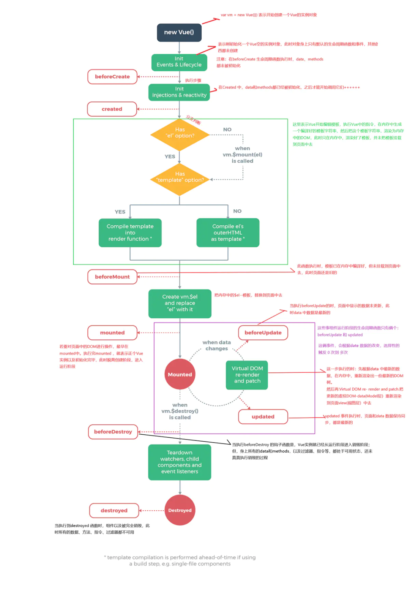

# VUE 来喽~

### 简单使用

> 想要是用 vue 首先要引入，三种方法，怎样都可以的

#### CDN 引入

```js
<script src="https://cdn.jsdelivr.net/npm/vue/dist/vue.js"></script>
```

#### npm 安装

```js
npm install vue
```
#### 原生 ES Modules

```js
<script type="module">
    import Vue from 'https://cdn.jsdelivr.net/npm/vue@2.6.12/dist/vue.esm.browser.js'
</script>
```

### Vue 实例

```js
var vm = new Vue({
    el:'#app',  //绑定dom
    data:{},    //数据，变量
    computed:{
        //计算属性
    }
    methods:{
        // 自定义方法
    },
    watch:{
        // 监听属性、路由等变化
    }
    mounted(){
        //生命周期，dom 元素创建完毕，可执行 ajax 请求
    },
    dectroyed(){
        //生命周期，实列销毁
    }
})
```


### 常用指令 —— `v-`

- `v-if:`：元素是否存在

- `v-show:`：元素是否显示

- `v-bind:` 或 `:`：属性绑定

- `v-model:`：双向绑定

- `v-on:` 或 `@`：事件绑定 -> `@click`

- `v-for:`：循环，`v-for='(item,i) of dataArr'`，通常需要配合`:key=i`

- `v-else:`：搭配 `v-if:` 使用

- `v-else-if:`：搭配v-if使用

- `v-style:`：通过`v-bind:`实现`style`的绑定

- `v-class:`：通过`v-bind:`实现`class`的绑定

- `v-text:`：文本（纯文本填充）

- `v-html:`：html标签（html 片段填充）

- `v-pre`：跳过编译（原始信息填充）

- `v-once`：只渲染一次，即数据修改页面不发生改变

- `v-slot:`：插槽

- `v-cloak`防止页面显示 vue 源代码抖动，但是在工程化的项目中，数据根据路由加载，基本是用不到的该指令。

- 自定义指令

