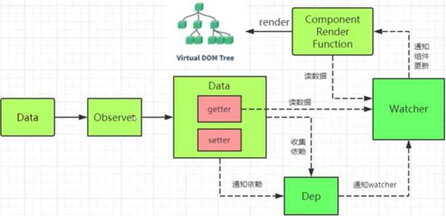

# Vue2 数据响应式原理：数据变，视图跟着变（MVVM）

## [Object.defineProperty()](https://developer.mozilla.org/zh-CN/docs/Web/JavaScript/Reference/Global_Objects/Object/defineProperty)

>  此方法会直接在一个对象上定义一个新属性，或者改变对象的现有属性，并返回此对象。

```js
let obj = {};

Object.defineProperty(obj,'a',{
    value:3,            // 改变 obj.a，此时obj对象本身已经发生改变，（默认 undefind ）
    writable:false,     // 是否可以被改变（默认false，不可以改变）
    enumerable:true,    // 是否可以被枚举（默认false，不可以枚举），循环对象（for...in...）时忽略该属性
})

// 劫持
Object.defineProperty(obj,'b',{
    get(){
        console.log('访问 b 属性');
        return 1;   // b 的值
    },
    set(newValue){
        console.log('改变 b 属性',newValue);
    }
})

// value 和 get() 不共存，否则报错
```
PS：vue 响应式非侵入式（不用掉特定api）


## defineReactive()

> 直接使用`Object.defineProperty`会发现并不能直接改变属性值，这是因为，经过`set()`设置的值依旧会经过`get()`，若想实现改变，就需要一个公共变量，存储一下 `newValue`，并在`get()`中返回该变量。

```js
let temp;
Object.defineProperty(obj,'b',{
    get(){
        console.log('访问 b 属性');
        return temp;   // b 的值
    },
    set(newValue){
        console.log('改变 b 属性',newValue);
        temp = newValue;
    }
})
```
鉴于此，利用**闭包**将其封装

```js
let obj = {};
/**
 * @param {Object} data 数据对象 
 * @param {String} key 键名
 * @param {*} val 值 
 */
function defineReactive(data,key,val){
    Object.defineProperty(data,key,{
        // 可枚举
        enumerable:true,
        // 可配置（比如：删除）
        configurable:true,
        get(){
            return val;
        },
        set(newValue){
            if(val === newValue){
                return;
            }else{
                val = newValue;
            }
        }
    })
}
defineReactive(obj,'a',10);
```

## 数组响应式

### push()：从后插入

### pop()：从后删除

### shift()：从前删除

### unshift()：从前插入

### splice()：删除并添加

### sort()：排序

### reverse()：倒序

## 依赖

> 在`getter`中收集依赖，在`setter`中触发依赖



1. 依赖就是`Watcher`。只有`Watcher`触发了`getter`才会收集依赖，哪个`Watcher`触发了`getter`，就把哪个`Watcher`收集到`Dep`中。

2. `Dep`使用发布-订阅模式，当数据发生变化时，回循环依赖列表，把所有的`Watcher`都通知一遍。

3. `Watcher` 把自己设置到全局的一个指定位置，然后读取数据，因为读取了数据，所以会触发这个数据的`getter`，在`getter`中就能得到正在读取数据的`Watcher`，并发这个`Watcher`收集到`Dep`中。

### Dep - 依赖收集类

> 每个`Observer`实例成员中都有一个`Dep`的实例

### Watcher - 数据发生改变，通知组件