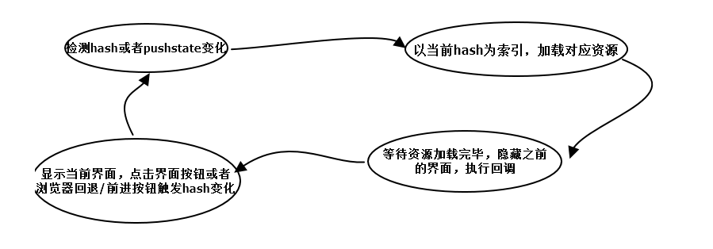
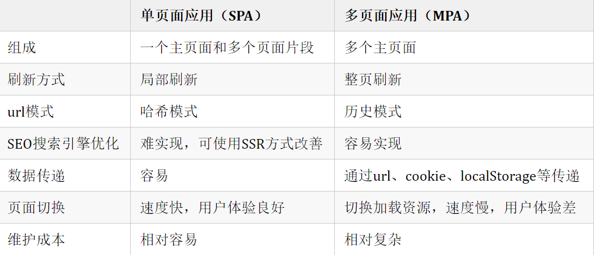

# 你很懂哟~

### 对 vue 理解

> vue 是一个用于构建用户界面的**渐进式**的JavaScript开源框架。

1. 渐进式 ：不强求（一次性）使用全部功能、特性，可以根据需求，选择性的使用部分功能（如：指令、双向绑定……）

2. 单页面应用（ASP）: 一种网络应用程序或网站的模型，它将所有的活动都在限定在一个WEB页面中，仅在页面初始化时加载相应的HTML、CSS、JS。一旦页面加载完成，页面不会在重新加载或跳，它通过动态重写（div的切换，显示/隐藏）当前页面与用户进行UI交互。

    * 原理（代码实现见：[SPA实现](../../碎片整理/封装/SPA实现.js)：

        * 监听地址栏中[hash](https://blog.csdn.net/yt618121/article/details/81162836)变化，驱动页面变化。

        * 利用[pushSate](https://www.jianshu.com/p/145d353de37a)（H5中history的方法）记录浏览器历史，驱动页面发送变化。

        

    * 优点：

        * 避免页面跳转或重载，提高了户体验。

        * 良好的前后端分离，分工明确，提高开发效率。

    * 缺点（相关优化见：[SPA优化总结](../../优化/SPA优化总结.md)）：

        * 不利于搜索引擎抓取。

        * 首页渲染速度相对较慢
    
    * 单页面 vs 多页面

        