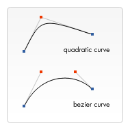

# 想绘制一个新世界吗？

## [canvas 标签理解](https://developer.mozilla.org/zh-CN/docs/Web/API/Canvas_API/Tutorial/Basic_usage)

> 就像`div` 一样，它拥有标签的全部特性，但同时，它是一个双标签，也就是说`</canvas>`不可省略，标签内的内容，为替代内容。

```html
<canvas id="myCanvas">
  当浏览器不兼容时，我将会显示
</canvas>
```

### 获取`Canvas`对象

  1. 通过`getElementById()`方法获取`Canvas`对象

  ```JS
  let canvas = document.getElementById('myCanvas');
  ```

  2. 通过`createElement()`方法创建`Canvas`对象

  ```JS
  let canvas = document.createElement('canvas');
  ```

### `Canvas`对象方法（渲染上下文）

> `Canvas`**2D**和**3D**绘图功能，平时说的`Canvas`指的是**2D绘图**功能（本文介绍），通过`Canvas`元素实现的**3D绘图**功能，也就是所谓的[WebGL](../WebGL.md)

1. 2D `canvas.getContext('2d')`

```js
// 获取 canvas 对象
let canvas = document.getElementById('myCanvas'); 
/**
 * 获取上下文，以获得渲染和绘画的能力
 * 这就是canvas的神奇之处，要知道，普通标签的 dom 对象，是没有getContext()方法的
 */ 
if(canvas.getContext){  // 兼容一下浏览器不支持的可能
  let ctx = canvas.getContext('2d');  // 2d，说明我们获取的是平面相关的API，不能写成2D
}
```

2. 3D `canvas.getContext('webgl')`

```js
let canvas = document.getElementById('myCanvas'); 
let gl = canvas.getContext('webgl');
// 不可同时具有2D相关API
let ctx = canvas.getContext('2d');  // ctx 结果 为 null
```

### whidth/height

对于 `<canvas>` 来说，`whidth`和`height`这是两个必须属性，如果不写，则会默认` width='300px' height='150px'`

> 通常情况下，尝试用`width`和`height`属性为`<canvas>`明确规定宽高，而不是使用CSS，因为如果CSS的尺寸与初始画布的比例不一致，它会出现扭曲。

### 坐标（栅格）

`canvas`元素默认被网格所覆盖。通常来说网格中的一个单元相当于`canvas`元素中的一像素（1px）。栅格的起点为左上角（**坐标为(0,0)**）。所有元素的位置都相对于原点定位，当然这个原点是可以变的。


## 图形绘制

> `<canvas>`只支持两种形式的图形绘制：**矩形**和**路径**

### 矩形

绘制矩形`canvas`提供了几种方式（绘制后即时生效）：

1. 填充矩形 -> `fillRect(x,y,width,height)`

2. 矩形边框 -> `strokeRect(x,y,width,height)`

3. 擦拭区域 -> `clearRect(x,y,width,height)`

4. 直接绘制 -> `rect(x,y,width,height)`

```js
var canvas = document.getElementById('myCanvas');
var ctx = canvas.getContext('2d');
ctx.fillRect(0, 0, 100, 100); // 从原点开始，填充一个宽高均为100的矩形，默认为黑色
ctx.clearRect(20, 20, 60, 60); // 从(20,20) 开始，擦拭一个宽高均为60的区域，露出canvas的背景色
ctx.strokeRect(30, 30, 40, 40); // 从(30,30)开始，绘制一个宽高均为40的框线
```


### 路径

> 通过不同颜色和宽度的线段或曲线相连形成的**不同形状的点**的集合，一个路径，甚至一个子路径，都是**闭合**的。

绘制一个路径，要经过以下步骤：

1. 创建起始点

  - `beginPath()`：该函数可以理解为一条声明。

    > 配合`moveTo(x,y)`使用，设置路径起始点。

2. 使用画图命令，画出路径

  - `lineTo(x, y)`：从当前位置（moveTo()指定的位置），到指定位置（lineTo()指定的位置），绘制一条直线。

  - `arc(x,y,r,start,end,direction)`:画一个以`(x,y)`为圆心的以`r`为半径的圆弧（圆），从`start`开始到`end`结束，按照`direction`（`false`：顺时针；`true`：逆时针（默认））给定的方向来生成。

  > 在`arc()`函数中角的单位是**弧度**；js中: `弧度 = ( Math.PI / 180 ) * 角度`。

  - `arcTo(x1,y1,x2,y2,r)`：以`r`为半径，在`(x1,y1)`与`(x2,y2)`画一段圆弧。
  

3. 闭合路径

  - `closePaht()`：闭合路径，但它不是必需的，如果图形已经闭合，即当前点为开始点，则该函数将什么也不做。

4. 通过描边或填充路径区域，来渲染图形

  - `stroken()`：描边，调用该方法时路径不会自动闭合。

  - `fill()`： 填充，调用该函数时，所有没有闭合的形状都会**自动闭合**。

```js
  // 填充三角形
  ctx.beginPath();
  ctx.moveTo(0, 0);
  ctx.lineTo(80, 15);
  ctx.lineTo(15, 80);
  ctx.fill();

  // 描边三角形
  ctx.beginPath();
  ctx.moveTo(105, 105);
  ctx.lineTo(90, 25);
  ctx.lineTo(25, 90);
  ctx.closePath();
  ctx.stroke();

  // 描边一个整圆
  ctx.beginPath();
  ctx.arc(150, 30, 20, 0, Math.PI * 2);
  ctx.stroke();

  // 填充一个半圆
  ctx.beginPath();
  ctx.arc(150, 80, 20, 0, Math.PI);
  ctx.fill();
```


### [Path2D()](https://developer.mozilla.org/zh-CN/docs/Web/API/Path2D/Path2D) 

> 用来缓存或记录绘画命令，暂且把它想像成svg 的 psth；它在方便绘制的同时，它的兼容性并不是很好，目前 IE 及 Safari 均不支持。

1. 克隆路径

```js
var ctx = canvas.getContext('2d');

var rectangle = new Path2D(); // 创建一个空路径
rectangle.rect(0, 0, 50, 50); // 克隆路径

ctx.stroke(rectangle);  // 描边路径
```

2. 从SVG 初始化路径

> `Path2D` 可以通过 SVG 的 `path` 路径来初始化路径

```js
var ctx = canvas.getContext('2d');

var p = new Path2D('M10 10 h 80 v 80 h -80 Z');
ctx.stroke(p);
```

### 贝塞尔曲线

> 用于绘制复杂有规律的图形。



PS：这个东西看上去有点像PS，这里就不详细说了，它实用性不强，如果需要绘制复杂的路径可以考虑上边的方法。

### 文本绘制

- `fillText(text, x, y [, maxWidth])` ：在指定的(x,y)位置填充指定的文本，绘制的最大宽度是可选的

- `strokeText(text, x, y [, maxWidth])` ： 在指定的(x,y)位置绘制文本边框（空心文字），绘制的最大宽度是可选的

## 颜色

> 通过上边的介绍，可以发现绘制出来的图形，*非黑即白*，现在，就让我们来点颜色瞧瞧吧。

这里主要涉及到两个 API：

1. `fillStyle = color` : 填充颜色

2. `strokeStyle = color` : 不用多说，它一定是描边（轮廓）颜色

PS：上边的 `color` 是颜色值，可以是你能想到任何 css 的颜色，比如：rgba、16进制、颜色英文、渐变等等

```js
let ctx = canvas.getContext('2d');
ctx.rect(10, 10, 50, 50);
ctx.fillStyle = '#FFA500';
ctx.strokeStyle = 'red';
ctx.fill();
ctx.stroke();
```


3. `globalAlpha = num` ：透明度

这个属性影响到 `canvas` 里所有图形的透明度，有效的值范围是 [ 0,1 ]，默认是 1，完全不透明。

```js
ctx.globalAlpha = 0.2;
```


PS：这个属性可以用`rgba`代替

## （线）样式

1. `lineWidth`：宽度

2. `lineCap`：线条端点样式，可能值：`butt`（默认），`round` 和 `square`


3. `lineJoin`：线条与线条链接处样式，可能值：`round`，`bevel` 和 `miter`（默认）。


## 虚线

1. `setLineDash`：该方法接收一个数组，来指定**线段**与**间隙**的长度


2. `lineDashOffset`：设置起始偏移量，可以配合`setTimeout`实现一些简单的动画

## 渐变

- `createLinearGradient(x1, y1, x2, y2)`：[线性渐变](https://developer.mozilla.org/zh-CN/docs/Web/API/CanvasRenderingContext2D/createLinearGradient)

- `createRadialGradient(x1, y1, r1, x2, y2, r2)`：[径向渐变](https://developer.mozilla.org/zh-CN/docs/Web/API/CanvasRenderingContext2D/createRadialGradient)，由中心点向外围的圆形扩张

- `addColorStop(position, color)`：[颜色添加](https://developer.mozilla.org/zh-CN/docs/Web/API/CanvasGradient/addColorStop)

```js
  //线性
  let lingrad = obj.ctx.createLinearGradient(10, 10, 10, 100);
  //径向
  var radgrad = obj.ctx1.createRadialGradient(45, 45, 10, 52, 50, 30);  
  
  lingrad.addColorStop(0, 'red');
  lingrad.addColorStop(1, 'green');

  radgrad.addColorStop(0, 'rgb(167,211,12,1)');
  radgrad.addColorStop(0.9, 'rgba(1,159,98,1)');
  radgrad.addColorStop(1, 'rgba(1,159,98,0)');
  // 样式设置
  obj.ctx.fillStyle = lingrad;
  obj.ctx1.fillStyle = radgrad;
  // 填充
  obj.ctx.fillRect(200, 10, 100, 100);
  obj.ctx1.fillRect(10, 10, 100, 100);
```

## 阴影

## 图案样式