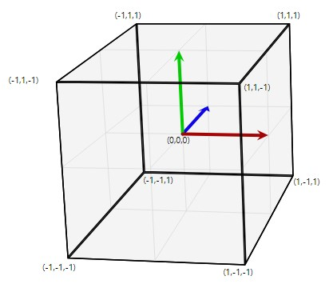
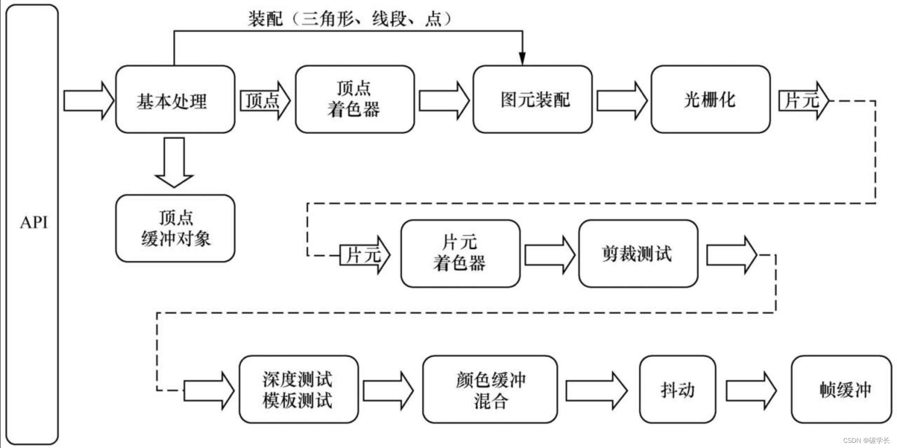
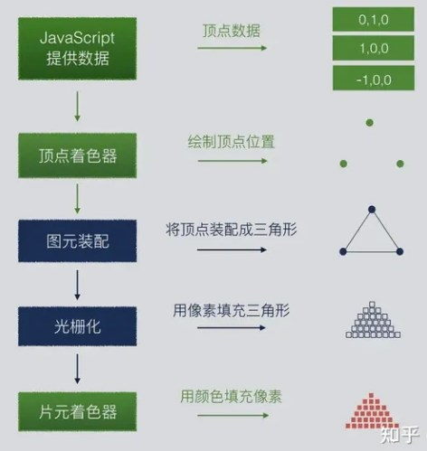

# 来吧，展示

## 前情提要

>其实在学习[canvas](../Canvas/基础.md)的时候我们已经接触过了`WebGL`了，当时重点学习了`canvas`的2d能力，这里则主要介绍[WebGL](https://developer.mozilla.org/zh-CN/docs/Web/API/WebGL_API/Tutorial/Getting_started_with_WebGL)相关。

```js
// *.html
<canvas id="myCanvas"></canvas>
// *js
let canvas = document.getElementById('myCanvas');
let gl = canvas.getContext('webgl') // 这样就可以通过变量 gl 调用 Wbegl 的 API 了
```

## 发展历史

>WebGL起源于Mozilla员工**弗拉基米尔·弗基西维奇**的一项称为**Canvas 3D**实验项目。

- **2006年**，弗基西维奇首次展示了`Canvas 3D`的原型。

- **2007年底**在`Firefox`和`Opera`被实现

- **2009年初**，非营利技术联`盟Khronos Group`启动了`WebGL`的工作组

- **2011年3月**发布`WebGL 1.0`规范

- **2013年**`WebGL 2`规范开始发展，该规范基于`OpenGL ES 3.0`，并于**2017年1月**完成

## 不足

1. 起步略晚，受web引擎所限，相较于桌面端开发API（`Direct3D`、`OpenGL`、`UE`、`Unity`）渲染效果略差

2. 开发成本高，需要掌握一些数学知识，比如线性代数、图形几何等

3. 硬件要求（尤其是`GPU`）较高

## 坐标系（裁剪空间）

>WebGL采用**正交右手**坐标系，切每个方向都有可以使用值的区间，即 **-1** 至 **1**，超出该区间的图像则不会被绘制。



PS：坐标系值的范围**与Canvas的尺寸无关**，无论Canvas长宽比是多少，WebGL的区间值都是**一致的**

## 着色器

>着色器是使用`OpenGL ES `着色语言（GLSL）编写的程序，它携带着绘制形状的**顶点信息**以及构造绘制在屏幕上像素的**所需数据**，换句话说，它负责记录着像素点的**位置**和**颜色**。

1. `gl.createShader(type)`：创建着色器，接收一个参数：`gl.VERTEX_SHADER` 或 `gl.FRAGMENT_SHADER`

```js
let shader = gl.createShader(gl.VERTEX_SHADER)
```

2. `gl.shaderSource(shader, source)`：将源代码发送到着色器，参数1为着色器对象；参数2为着色器源代码

### 顶点着色器（vertex shader）

>

>渲染一个形状时，顶点着色器会在形状中的每个**顶点**运行。它将顶点从**原始坐标系**转换到 WebGL 使用的**裁剪空间坐标系**，其中每个轴的坐标范围从 `-1.0 `到 `1.0`，并且**不考虑**纵横比，实际尺寸或任何其他因素。

### 片段（片元）着色器（fragment shader）

>在顶点着色器处理完图形的顶点后，会被要绘制的每个图形的**每个像素点**调用一次。它的职责是确定像素的颜色，通过指定应用到像素的纹理元素（也就是图形纹理中的像素），获取纹理元素的颜色，然后将适当的光照应用于颜色。

## [渲染管线（流水线）](https://blog.csdn.net/yinweimumu/article/details/128859011)

>渲染管线一般是由显示芯片（`GPU`）内部处理图形信号的并行处理单元组成。WebGL 2.0中渲染管线实质上指的是**一系列的绘制过程**；向程序中输入3D物体相关的描述信息数据，经过渲染管线处理后，输出想要的图像




