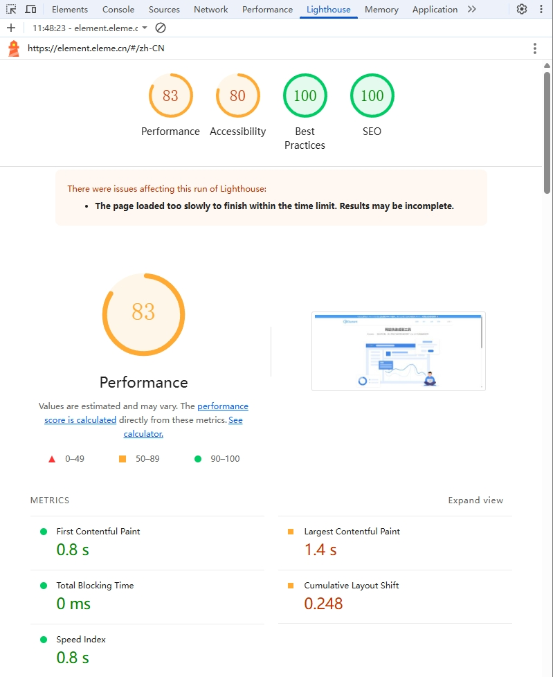

# 通用优化

## 性能指标（待完善）

1. 加载性能指标： 

- 首次内容绘制 `FCP - First Contentful Paint`（通常应 < 1.8 秒）：浏览器首次将任意内容（如文本、图像、SVG 或非白色画布）渲染到屏幕上的时间。

- 最大内容绘制`LCP - Largest Contentful Paint`（`LCP`）（良好 < 2.5 秒）：测量视窗内最大内容元素可见时间。

- 总阻塞时间`TBT - Total Blocking Time`：FCP 和 TTI 之间主线程被阻塞时间之和，TBT 反映了页面加载过程中主线程的阻塞情况，较短的 TBT 时间意味着页面加载过程更加流畅。

- 可交互时间`TTI - Time to Interactive`（通常应 < 5 秒）：页面从开始加载到主要子资源完成渲染，能够快速、可靠地响应用户输入所需的时间。

PS：258原则

## 性能监控

### 浏览器控制台 - Lighthouse

> 实验室指标，只做参考




### 第三方库，收集数据

- Web Vitals

## HTML & CSS

### 缩减 DOM 规模

尽量保持 HTML DOM 中较少的元素数量

### 延迟/异步 加载 .js 文件，（.js文件）阻塞页面渲染

> HTTP 规范定义浏览器不应该并行下载超过两种要素,脚本在下载时，浏览器不会启动任何其他的下载。此外所有解析和渲染活动都可能会被阻塞。

把脚本放在页面底部，使浏览器首先加载页面

### 减少CSS选择器的复杂程度，复杂度越高浏览器解析时间越长

### 使用css渲染合成层如transform、opacity、will-change等，提高页面相应速度减少卡顿现象

### 动画使用CSS3过渡，减少动画复杂度，还可以使用硬件加速

## JS

### 减少 DOM 访问，避免在JS代码中使用CSS表达式

若频繁访问某 DOM 元素，将它作为本地变量来使用，会更好

```js
var obj;
obj = document.getElementById("demo");
obj.innerHTML = "Hello"; 
```

### 尽量使用原生方法，执行效率高

### 合理使用缓存，避免重复请求数据

### 合理使用事件委托，减少事件绑定次数

> 事件委托利用了DOM事件的冒泡机制（事件从最深的节点向外传播）。基本思想是：不在每个子元素上单独绑定事件，而是在它们的父元素上绑定一个事件处理程序，通过事件对象的`target`属性来判断实际触发事件的元素


```js
// 假设你有一个包含100个列表项(<li>)的无序列表(<ul>):
// 传统方式：为每个<li>绑定点击事件 → 100次绑定
const items = document.querySelectorAll('li');
items.forEach(item => {
  item.addEventListener('click', function() {
    console.log('Item clicked:', this.textContent);
  });
});
// 事件委托：只在<ul>上绑定一次点击事件 → 1次绑定
document.querySelector('ul').addEventListener('click', function(e) {
  if (e.target.tagName === 'LI') {
    console.log('Item clicked:', e.target.textContent);
  }
});

/**
 * PS：
 * 需要正确识别目标元素（使用e.target或e.currentTarget）
 * 某些事件不冒泡（如focus、blur等），不能使用事件委托
 * 事件委托层级不宜过深，否则可能影响性能
 */
```

### [避免使用 with（严格模式下被禁用）](/JS/常识.md)

- 性能优化方面

   1. 破坏作用域链的可预测性：with 会动态改变作用域链，导致 JavaScript 引擎无法在编译阶段进行静态分析

   2. 阻止变量访问优化：引擎无法提前确定变量位置，必须进行动态查找，显著降低访问速度

   3. 无法应用内联缓存(Inline Caching)：这种重要的优化技术无法在 with 作用域内使用

- 代码质量方面

    1. 导致代码难以理解和维护：难以确定变量来自哪个对象

    2. 可能意外覆盖变量：容易与外部作用域的变量名冲突

### [避免使用 eval（严格模式下被禁用）](/JS/常识.md)

> eval 可以把字符串当函数执行

- 性能优化方面

    1. 阻止JS引擎优化：包含 `eval` 的作用域会使整个作用域的`JIT`编译优化失效

    2. 动态解析开销：需要运行时解析字符串为可执行代码，消耗额外资源

    3. 无法预编译：无法像普通代码那样被提前编译优化

- 安全性和可靠性

    1. `XSS`攻击风险：执行任意字符串代码是严重的安全隐患

    2. 调试困难：错误堆栈跟踪不清晰，难以定位问题

    3. 代码不可预测：运行时才能知道执行内容，违反静态分析原则

### 在顶部声明

把所有声明放在每段脚本或函数的顶部

### 初始化变量

声明变量时对其进行初始化是个好习惯

### 请勿使用 new Object()

- 请使用 `{}` 来代替 `new Object()`

- 请使用 `""` 来代替 `new String()`

- 请使用 `0` 来代替 `new Number()`

- 请使用 `false` 来代替 `new Boolean()`

- 请使用 `[]` 来代替 `new Array()`

- 请使用 `/()/` 来代替 `new RegExp()`

- 请使用 `function (){}`来代替 `new Function()`

### 设置默认值

调用函数时缺少一个参数，那么这个缺失参数的值会被设置为 `undefined`，`undefined` 值会破坏代码，所以尽量为参数设置默认值

### 减少循环中的活动

能够放在循环之外的语句或赋值会使循环运行得更快

```js
// 差
var i;
for (i = 0; i < arr.length; i++) {}
//更好
var i;
var l = arr.length;
for (i = 0; i < l; i++) {}

```

### 用 default 来结束 switch

### 使用 === 比较

### 防抖节流（闭包应用）

> 用户行频繁的触发事件执行，对于DOM操作，资源加载等都是十分耗费性能，很可能导致**页面卡顿**甚至是**浏览器崩溃**

#### 防抖

* 原理：在事件被触发 N 秒后在执行回调，如果在这 N 秒内又被触发，则重新计时

* 使用场景：搜索联想、拖拽（resize）……

```js
function test(){
    var timer = null;//声明定时器 
    clearTimeout(timer);//清除定时器
    timer = setTimeout(function (){
        //函数体
    },1000);    //延迟执行
}
```
> 主要思想：利用定时器，使函数延迟执行（在[Currency.js](../优化/封装/Currency.js)内有封装方法）

#### 节流

* 原理： N 秒内只运行一次，若在 N 秒内重复触发，只有一次执行一次

* 使用场景：连续点击（持续提交）

```js
function test(){
    //函数体
}
oBtn.onclick = test;
//我们想点击一次执行一次，但如果我们利用控制台：
for(var i = 0;i<1000;i++){oBtn.click()} 
//这样一来就可以迅速执行1000次，远远超过点击速度（所以要节流）
```
> 主要思想：计算 **此次执行时间** - **上次执行时间** >= **等待时间** ，（在[Currency.js](../优化/封装/Currency.js)内有封装方法）

### 函数柯里化

> 把接受多个参数的函数，转变为接受一个参数的函数，并且返回接受余下参数且返回结果的新函数。

```js
    // 简单粗暴版(参数长度固定)
    function add(a){
        return function(b){
            return function(c){
                return a + b + c;
            }
        }
    }
    // 调用
    add(1)(2)(3);   // 6
```
PS:在[Currency.js](../优化/封装/Currency.js)内有精细封装

### 链式调用

## 网络优化

1. 使用HTTP/2

2. 减少、合并HTTP请求：使用雪碧图，减少图片加载

3. 压缩文件， 开启nginx，Gzip对静态资源压缩

4. 使用HTTP缓存，如强缓存、协商缓存

5. 使用CDN，将网站资源分布到各地服务器上，减少访问延迟

## Webpack/Vite 优化（待完善）

代码切割，使用code splitting将代码进行分割，避免将所有代码打包到一个文件，减少响应体积

按需加载代码，在使用使用的时候加载代码

压缩代码体积

使用Tree Shaking 删除未被引用的代码

小文件转Base64
