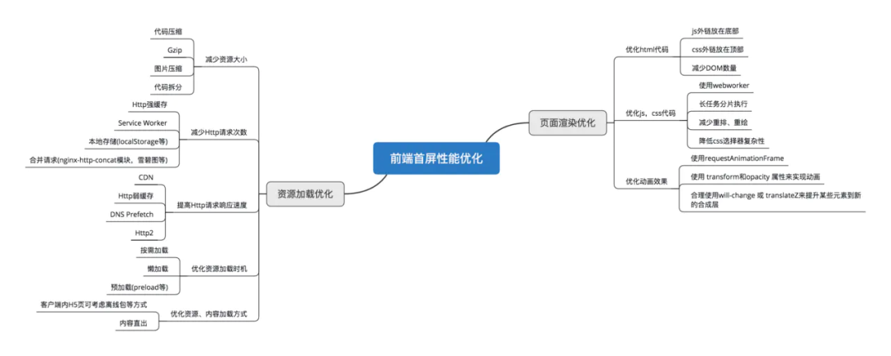

## 首屏加载

> 首屏加载时间：浏览器相从相应用户输入网址，到首屏内容渲染完成的时间；通常，2s以内优秀，5s以内可以接受，10s以上不可容忍！！！

### 加载时间计算

> 通过**DOMContentLoad**或**performance**来计算出首屏时间

```js
// 方案一：
document.addEventListener('DOMContentLoaded', (event) => {
    console.log('first contentful painting');
});
// 方案二：
performance.getEntriesByName("first-contentful-paint")[0].startTime

// performance.getEntriesByName("first-contentful-paint")[0]
// 会返回一个 PerformancePaintTiming的实例，结构如下：
{
    name: "first-contentful-paint",
    entryType: "paint",
    startTime: 507.80000002123415,
    duration: 0,
};

```

### 加载慢原因

1. 网络延迟

2. 资源文件体积过大

3. 重复发送请求

4. 加载脚本时，渲染内容堵塞

### 解决方案

1. 减小入口文件体积（路由懒加载）

2. 静态资源本地缓存

    * Http 缓存，设置**Cache-Control**，**Last-Modified**，**Etag**等响应头

    * **Service Worker**离线缓存

    * 前端利用**localStorage**实现缓存

3. UI框架按需加载

4. 图片资源压缩

5. 组件重复打包（同文件多路由重复下载）

    * 在webpack的config文件中，修改**CommonsChunkPlugin**配置为：`minChunks: 3`（把使用3次及以上的包抽离出来，放进公共依赖文件，避免了重复加载组件）

6. 开启GZip压缩

    * icon 换成在线字体图标

    * 众多小图标合成雪碧图（合并到同一张图上）

7. 使用SSR（服务端渲染，搜索引擎优化的关键）

