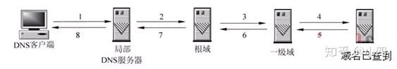
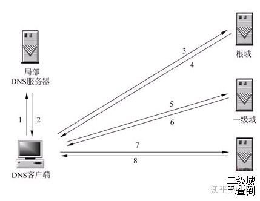

# 前端唯一真神

> World Wide Web -> www

### 对浏览器的理解

- 浏览器是用来检索、展示以及传递Web信息资源的应用程序，它可以根据用户选择，向服务器请求相应的资源并显示在浏览器的窗口中。

- 浏览器通过 url (Uniform Resource Identifier 统一资源定位器)来确定请求资源的位置。

- HTML 和 CSS 规范中规定了浏览器解释 html 文档的方式，由 W3C 组织对这些规范进行维护，W3C（万维网联盟） 是负责制定 web 标准的组织。

### 浏览器组成

1. shell 部分——用户能操作部分(壳)，菜单、工具栏等用户操作界面。

2. 内核部分——用户看不到的部分，是基于标记语言显示内容的程序或模块。

    - 渲染引擎（语法规则和渲染）：渲染页面，即在浏览器窗口中显示所请求的内容。

    - js 引擎：解析和执行 javascript 来实现网页的动态效果。

    > 2001 年发布 ie6，首次实现对 js 引擎的优化。2008 年 Google 发布最新浏览器 Chrome，它是采用优化后的 javascript 引擎，引擎代号 V8，因能把 js 代码直接转化为机械码来执行，进而以速度快而闻名。

    - 其他模块（如异步）

### 主流浏览器及其内核介绍（独立内核，市场份额大于3%）

#### IE ——> Trident

在早期 IE 占有大量的市场份额，那时 Trident 内核比较流行，以前有很多网页也是根据这个内核的标准来编写的，但是实际上这个内核对真正的网页标准支持不是很好。但是由于 IE 的高市场占有率，微软也很长时间没有更新 Trident 内核，就导致了 Trident 内核和 W3C 标准脱节。还有就是 Trident 内核的大量 Bug 等安全问题没有得到解决，加上一些专家学者公开自己认为 IE 浏览器不安全的观点，使很多用户开始转向其他浏览器。

#### Chrome ——> Webkit（以前）/Blink（现在）

其实 Blink 引擎就是 Webkit 的一个分支，就像 webkit 是KHTML 的分支一样。Blink 引擎现在是谷歌公司与 Opera Software 共同研发，上面提到过的，Opera 弃用了自己的 Presto 内核，加入 Google 阵营，跟随谷歌一起研发 Blink。

#### Firefox ——> Gecko

Gecko内核的优点就是功能强大、丰富，可以支持很多复杂网页效果和浏览器扩展接口，但是代价是也显而易见就是要消耗很多的资源，比如内存。

#### Opera ——> 最初是自己的 Presto（废弃） 内核，后来Webkie -> Blink

Presto 内核被称为公认的浏览网页速度最快的内核，这得益于它在开发时的天生优势，在处理 JS 脚本等脚本语言时，会比其他的内核快3倍左右，缺点就是为了达到很快的速度而丢掉了一部分网页兼容性。

#### Safari ——> Webkit

Webkit 的优点就是网页浏览速度较快，虽然不及 Presto 但是也胜于 Gecko 和 Trident，缺点是对于网页代码的容错性不高，也就是说对网页代码的兼容性较低，会使一些编写不标准的网页无法正确显示。WebKit 前身是 KDE 小组的 KHTML 引擎，可以说 WebKit 是 KHTML 的一个开源的分支。

### 浏览器的渲染原理

> 浏览器渲染过程是逐步完成的，为了更好的用户体验，渲染引擎将会尽可能早的将内容呈现到屏幕上，并不会等到所有的 html 都解析完成之后再去构建和布局 render 树。它是解析完一部分内容就显示一部分内容，同时，可能还在通过网络下载其余内容。

1. 首先解析收到的文档，根据文档定义构建一棵 DOM 树，DOM 树是由 DOM 元素及属性节点组成的。

2. 然后对 CSS 进行解析，生成 CSSOM 规则树。

3. 根据 DOM 树和 CSSOM 规则树构建渲染树。渲染树的节点被称为渲染对象，渲染对象是一个包含有颜色和大小等属性的矩形，渲染对象和 DOM 元素相对应，但这种对应关系不是一对一的，不可见的 DOM 元素不会被插入渲染树。还有一些 DOM 元素对应几个可见对象，它们一般是一些具有复杂结构的元素，无法用一个矩形来描述。

4. 当渲染对象被创建并添加到树中，它们并没有位置和大小，所以当浏览器生成渲染树以后，就会根据渲染树来进行布局（也可以叫做回流）。这一阶段浏览器要做的事情是要弄清楚各个节点在页面中的确切位置和大小。通常这一行为也被称为“自动重绘”。

5. 布局阶段结束后是绘制阶段，遍历渲染树并调用渲染对象的 paint 方法将它们的内容显示在屏幕上，绘制使用 UI 基础组件。

### 浏览器输入url按下回车后发生了什么

#### 1. URL 解析

首先判断你输入的是一个合法的 URL 还是一个待搜索的关键词，并且根据你输入的内容进行自动完成、字符编码等操作。

（所谓的其它操作（不限于）：浏览器会通过历史记录、书签等地方智能匹配可能得到的url，然后给出提示，让用户可以补全url）

#### 2. DNS查询 

> 根据域名查找 IP 地址

##### DNS 查询过程

1. 浏览器缓存：浏览器会先检查缓存中是否存在我们输入的url，如果没有，则调用系统库函数进行查询。

2. 浏览器查看本地的 Hosts 文件，查看其中有没有和这个域名**对应**的规则，如果有的话就直接使用 Hosts 文件里面的 ip 地址，如果没有，浏览器会法送一个 DNS 请求，到本地的 DNS 服务器。

3. 本地的 DNS 服务器首先会查询自己的缓存记录，有就直接返回，这是一个递归的过程，没有就要向**根服务器**进行查询

4. 根DNS服务器**没有**记录具体的域名和IP地址的对应关系，而是告诉本地 DNS 服务器，你可以到域服务器上去继续查询，并给出域服务器的地址，这种过程是迭代的过程。

5. 本地 DNS 服务器继续向域服务器发出请求，得到一个域名和 IP 地址的对应关系，本地DNS 服务器将 IP 地址返回给用户电脑，同时将这个对应关系保存在缓存中，以备下次用户查询时快速返回结果。

##### DNS 查询的方式

1. 递归

当局部DNS服务器自己不能回答客户机的DNS查询时，它就需要向其他DNS服务器进行查询。此时有两种方式，如图所示的是递归方式。局部DNS服务器自己负责向其他DNS服务器进行查询，一般是先向该域名的根域服务器查询，再由根域名服务器一级级向下查询。最后得到的查询结果返回给局部DNS服务器，再由局部DNS服务器返回给客户端。

2. 迭代

当局部DNS服务器自己不能回答客户机的DNS查询时，也可以通过迭代查询的方式进行解析，如图所示。局部DNS服务器不是自己向其他DNS服务器进行查询，而是把能解析该域名的其他DNS服务器的IP地址返回给客户端DNS程序，客户端DNS程序再继续向这些DNS服务器进行查询，直到得到查询结果为止。也就是说，迭代解析只是帮你找到相关的服务器而已，而不会帮你去查。

##### [前端 DNS 优化](https://zhuanlan.zhihu.com/p/65434058) 

##### [DNS 劫持](https://zhuanlan.zhihu.com/p/86538629)

#### 3.TCP（传输控制协议）连接

> 浏览器通过DNS解析得到了目标服务器的IP地址后，与服务器建立TCP连接

##### TCP 三次握手

1. 客户端发送数据包到服务器，等待服务端确认。

2. 服务端收到数据包，同意建立连接，并发送数据包返回给客户确认。

3. 客户端收到确认数据包，再向服务端发送一个数据包（确认已接受），客户端与服务端TCP连接建立完成，开始通信。

#### 4.（浏览器）发送 Http 请求

浏览器向主机发送 Http 请求（包含：要访问的URL、请求方法post/get……、浏览器/操作系统信息、编码……）。如果是第一此访问，会提示服务器简历用户缓存信息，如果不是可以利用 Cookies 对应键值找到相应缓存（缓存离存放着用户名、密码和一些用户设置项）。

#### 5.（服务主机）返回 Http 响应

服务器接受并处理完请求，返回 Http 相应（一个响应报文格式基本等同于请求报文，由相应行、响应头、空行、实体组成）。

#### 6.（浏览器）解析渲染页面

##### Html 解析，构建 DOM 树

1. 解码：传输回来的都是二进制字节数据，浏览器根据文件指定编码（例：UTF-8）转换成字符串，即 Html 代码。

2. 预解析：识别一些资源请求（例：img 标签的 src），添加到请求列队中

3. 词法解析，构建 DOM 树（并行操作，解析到一个标签，就会创建一个 DOM 节点） 

> 解析完成后，浏览器会通过 `DOMContentLoaded` 事件，通知 DOM 解析完成。

#####  CSS 解析，构建渲染树

CSS 解析器会根据语法解析规范解析CSS 文件，并进行标记；再通过 CSS 匹配规则，构建出渲染树。

##### 布局渲染（过程比较复杂）

浏览器开始布局渲染树，并将其绘制到屏幕上。

1. 回流（reflow）：DOM 节点中各个元素都是以盒子模型的形式存在，这就需要浏览器去计算其位置和大小，这个过程称为回流。

2. 重绘（repain）：当盒子模型的位置、大小、颜色等属性确定下来之后，浏览器开始绘制内容，这个过程称为重绘。

> 回流必定触发重绘，重绘不一定触发回流。重绘的开销较小，回流的代价较高。

#### 7. 断开连接（TCP 四次挥手）

> 客户端和服务端均可主动发起挥手

（假设客户端发起）

1. 客户端发送一个 FIN 报文，报文中指定一个序列号，等待服务端确认。

2. 服务端 接收 FIN 之后，发送 ACK 报文，且把客户端的序列号值 +1 作为 ACK 报文序列号，表明已经收到客户端报文。

3. 服务端发送 FIN 报文……

4. 客户端接收 FIN ……

### Cookies