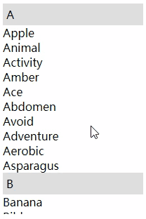
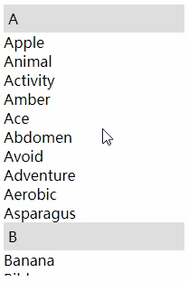

# 你知道css强大，但它比你知道的还强还大！

## 粘性定位

> 粘性定位元素必须指定`top`、`right`、`bottom`、`left`四个阈值中的一个，且仅在其父元素内生效。

PS：这种定位方式特别适用于需要**在页面滚动时保持固定位置**的元素，例如导航栏、侧边栏、广告条、提示框等。

```css
div{
  position: sticky;
  top: 0; /*相对于第一个设置 overflow 的父级元素*/
}
```
  

## 文字描边

### text-shadow

```css
  /* 给六个方向阴影 */
  {
    text-shadow: 0px 2px #fff, 0px -2px #fff, -2px 2px #fff, 2px 2px #fff, -2px 0px #fff, 2px 0px #fff;
  }
```


缺点：

1. 不够圆滑

2. 无法处理透明文字

### -webkit-text-stroke

```css
  {
    -webkit-text-stroke: 2px #fff;
  }
```


缺点：兼容性不好

## 高度过渡

```html
  <input type="text" class="text" />
  <ul class="select">
    <li>All</li>
    <li>Aunt</li>
    <li>Able</li>
    <li>Apple</li>
  </ul>
```

### height

```css
  .select {
    height: 0;
    transition: 1s;
    overflow: hidden;
  }
  .text:focus ~ .select {
    /* 100px 在css中写死，显然不是我们想要的，但我们又不知道改设置多少高度 */
    height: 100px;
    /* height: auto; 过渡效果就会消失 */
  }
```

### max-height

```css
  .select {
    max-height:0;
    transition: 1s;
    overflow: hidden;
  }
  .text:focus ~ .select {
    /* 给到一个足够大的 最大高度 */
    max-height: 300px;
  }
```

<video src="../../Img/碎片/max-height.mp4" autoplay="autoplay" muted preload="auto" loop></video>

PS：如果是这样就会发现，在高度收起的时候，会出现一丝卡顿。这是因为 `transition` 是从最大高度变到0，而不是可见高度到0。

### scaleY 推荐

```css
  .select {
    overflow: hidden;
    transition: 1s;
    transform: scaleY(0); /* Y轴缩放为0 */
    transform-origin: 0 0;  /* 修改中心点为元素左上角 */
  }
  .text:focus ~ .select {
    transform: scaleY(1); /* Y轴缩放为1，没有缩放效果 */
  }

```
<video src="../../Img/碎片/scaleY.mp4" autoplay="autoplay" muted preload="auto" loop></video>
